# Lernwissen EG - überarbeitete Seitenfassung

Aktueller Inhalt des 39-seitigen Lernbuchs nach den Nutzerkorrekturen. Die markierten Originaldetails sind Lernbeispiele; die Farbkonturen sind keine originale CAD-Geometrie.

## EG-01 - Außen beginnen: linker Hallenbereich

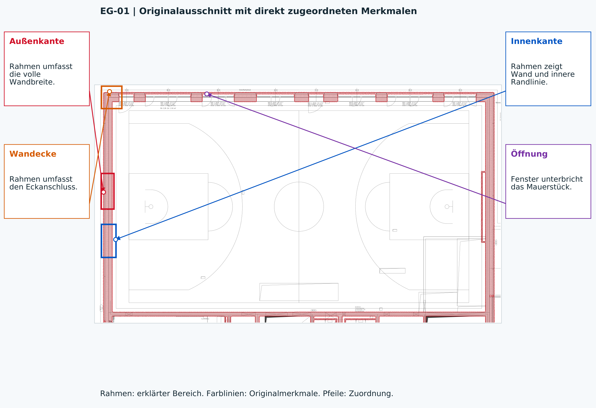

Original-PDF, Seite 1. Suchbereich in pt: [880, 20, 2470, 950]

### Was ist rot?

Die massiven Außenwandbereiche und die Wand unterhalb der Halle. Die Umrandung folgt dem Wandaufbau einschließlich der erkennbaren Bekleidung und Dämmung. Öffnungen bleiben unterbrochen.

### Woran erkenne ich die Wand?

Zwei begrenzende Seiten, Materialschraffuren und durchgehende Eckanschlüsse ergeben zusammen einen Wandkörper. Die Breite kann sich entlang der Fassade ändern. Eine einzelne dünne Linie wäre dafür kein ausreichender Beleg.

### Was folgt daraus?

Durch einen Wandkörper führt kein normaler Fußweg. Die Fenster und der dargestellte Sportboden müssen zusätzlich nach Höhe und Geschoss gelesen werden. Die Sportlinien erzeugen keine Räume und beweisen hier keinen Boden auf EG-Niveau.

### Direkt im Bild zugeordnete Merkmale

- Außenkante: Rahmen umfasst die volle Wandbreite. (Farbe: red)
- Innenkante: Rahmen zeigt Wand und innere Randlinie. (Farbe: blue)
- Wandecke: Rahmen umfasst den Eckanschluss. (Farbe: orange)
- Öffnung: Fenster unterbricht das Mauerstück. (Farbe: purple)

## EG-02 - Nach innen: Verwaltung und Stiege 2

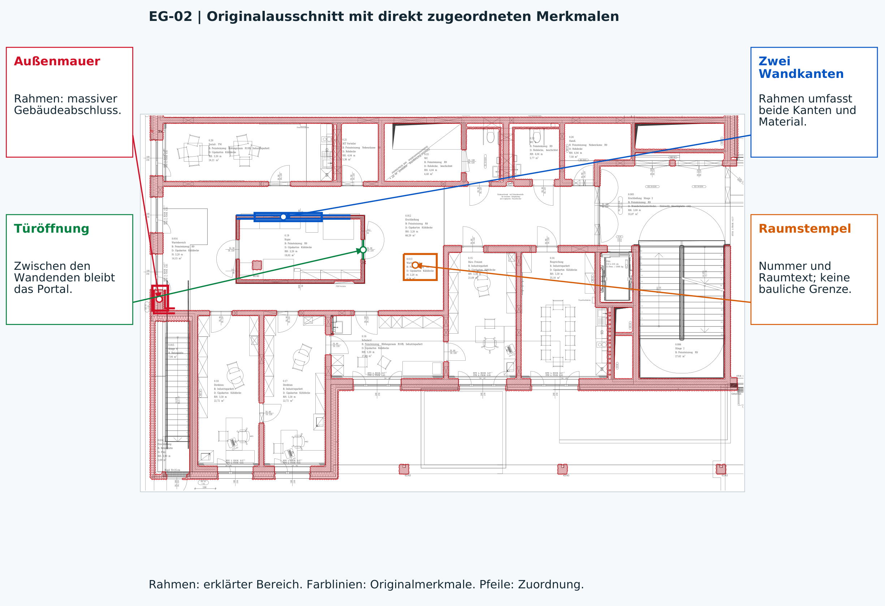

Original-PDF, Seite 1. Suchbereich in pt: [890, 905, 2460, 1885]

### Außenwand: zwei Seiten zeigen

Die beiden roten Linien verfolgen einen Abschnitt am linken Gebäudeabschluss. Zwischen den Randlinien liegen Schraffur und Wandaufbau. Deshalb ist der ganze Streifen eine Mauer und keine begehbare Fläche.

### Innenwand und Tür unterscheiden

Am Kopierraum zeigen zwei blaue Linien die gegenüberliegenden Wandkanten. An der grün markierten Türstelle endet dieses Materialband. Türblatt und Bogen gehören zur Öffnung; sie füllen die Wandlücke nicht aus.

### Was der orange Rahmen bedeutet

Der Rahmen umfasst den Raumstempel des Wartebereichs 0.013. Nummer, Name und Flächenangaben beschreiben den Bereich. Der Rahmen ist nur eine Lernmarkierung: Im Original verläuft hier keine geschlossene Raumwand.

### Direkt im Bild zugeordnete Merkmale

- Außenmauer: Rahmen: massiver Gebäudeabschluss. (Farbe: red)
- Zwei Wandkanten: Rahmen umfasst beide Kanten und Material. (Farbe: blue)
- Türöffnung: Zwischen den Wandenden bleibt das Portal. (Farbe: green)
- Raumstempel: Nummer und Raumtext; keine bauliche Grenze. (Farbe: orange)

## EG-03 - Mitte: Mauern, Pfeiler und Glas

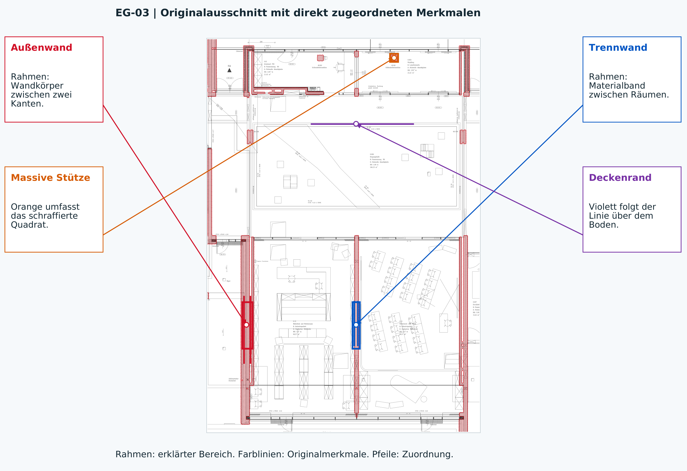

Original-PDF, Seite 1. Suchbereich in pt: [2410, 810, 3490, 2370]

### Wand und Stütze konkret erkennen

Rot und Blau verfolgen jeweils zwei Wandseiten. Das Material dazwischen begrenzt Räume. Der orange Rahmen liegt direkt um die schraffierte Stütze im Windfang; der danebenstehende Text 40/40 ist nur ihre Beschriftung.

### Die Deckenlinie liegt über dem Boden

Die violett nachgezogene Linie gehört zum großen Rechteck in der Eingangshalle. Die Angaben VK RD und STUK liefern den Höhenbezug. Ein Deckenrand allein ist keine bodenstehende Mauer.

### Was für den Weg zählt

Die Stütze ist ein einzelnes Hindernis. Eine durchgehende Wand trennt Flächen; das Deckenrechteck dagegen zerteilt den Hallenboden nicht. Glasfelder und Türöffnungen am Rand müssen zusätzlich unterschieden werden.

### Direkt im Bild zugeordnete Merkmale

- Außenwand: Rahmen: Wandkörper zwischen zwei Kanten. (Farbe: red)
- Trennwand: Rahmen: Materialband zwischen Räumen. (Farbe: blue)
- Massive Stütze: Orange umfasst das schraffierte Quadrat. (Farbe: orange)
- Deckenrand: Violett folgt der Linie über dem Boden. (Farbe: purple)

## EG-04 - Rechts: Hallenwand und Nebenräume

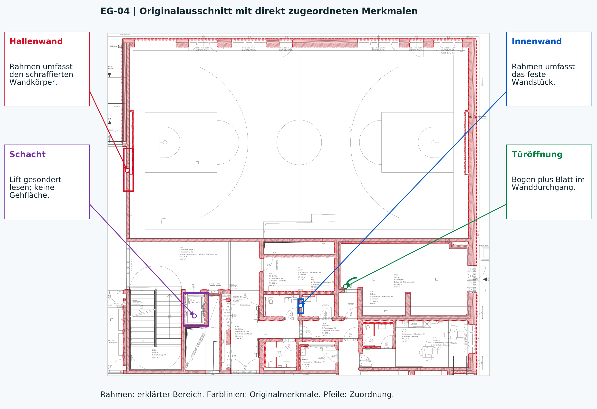

Original-PDF, Seite 1. Suchbereich in pt: [3500, 550, 5145, 2025]

### Von der Fassade zum Kern

Die obere und rechte Fassade, die untere Hallenbegrenzung und die Mauern um Nebenräume sind rot markiert. Der rote Rechteckrahmen umfasst ein konkretes Stück der Hallenwand. Blau umrahmt das schraffierte Innenwandstück unter der Halle; der Pfeil endet jetzt darin.

### Räumliche Verbindung prüfen

Der violette Rahmen zeigt den abgegrenzten Liftbereich. Der grüne Türbogen macht die echte Öffnung sichtbar. Benachbarte Bereiche sind nur dort verbunden, wo eine passende Öffnung durch den Wandaufbau führt.

### Dünn bleibt ein Hindernis

Auch dünne Trennwände zählen für die Bewegungsprüfung. Weder geringe Dicke noch eine andere Schraffur erlaubt es, eine Wand zu übergehen.

### Direkt im Bild zugeordnete Merkmale

- Hallenwand: Rahmen umfasst den schraffierten Wandkörper. (Farbe: red)
- Innenwand: Rahmen umfasst das feste Wandstück. (Farbe: blue)
- Schacht: Lift gesondert lesen; keine Gehfläche. (Farbe: purple)
- Türöffnung: Bogen plus Blatt im Wanddurchgang. (Farbe: green)

## EG-05 - Rechts unten: breite Außenwand und Stiege 5

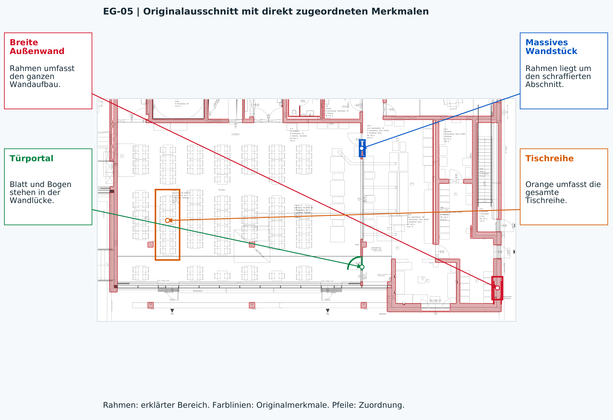

Original-PDF, Seite 1. Suchbereich in pt: [3360, 1920, 5150, 2870]

### Außenwand vollständig erfassen

Die roten Linien markieren Innen- und Außenseite des breiten Fassadenaufbaus rechts unten. Dazwischen liegen Kern und weitere Schichten. Für die Raumgrenze zählt die gesamte feste Ausdehnung.

### Pfeile treffen jetzt das konkrete Bauteil

Blau zeigt das kurze, schraffierte Wandstück an der Küche. Die lange benachbarte Liniengruppe darf man nicht allein wegen ihrer Richtung pauschal als massive Mauer lesen. Grün bezeichnet die tatsächliche Türöffnung weiter unten.

### Möbel und Treppe getrennt behandeln

Der orange Rahmen ist auf die von dir markierte vollständige Tischreihe versetzt und vergrößert. Tisch und Sitzplätze sind Möbelhindernisse, keine Raumtrennwand. Rechts bleiben Stiege 5 und ihr Vorbereich mit den Stufenkanten getrennt lesbar.

### Direkt im Bild zugeordnete Merkmale

- Breite Außenwand: Rahmen umfasst den ganzen Wandaufbau. (Farbe: red)
- Massives Wandstück: Rahmen liegt um den schraffierten Abschnitt. (Farbe: blue)
- Türportal: Blatt und Bogen stehen in der Wandlücke. (Farbe: green)
- Tischreihe: Orange umfasst die gesamte Tischreihe. (Farbe: orange)

## EG-06 - Das schräge Nebengebäude gehört dazu

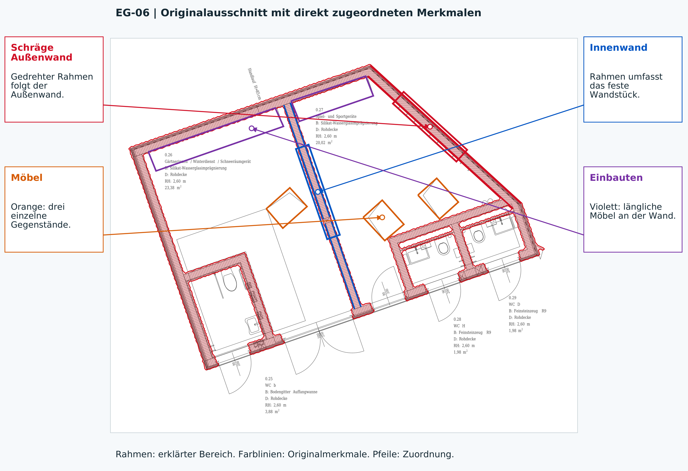

Original-PDF, Seite 1. Suchbereich in pt: [0, 3110, 730, 3727]

### Schräger Verlauf ist kein Sonderfall

Die rote Außenwand und die blaue Innenwand haben jeweils zwei Begrenzungen mit Material dazwischen. Ihre schräge Lage auf dem Blatt ändert ihre Funktion nicht. Anschlüsse und Schraffur bestätigen den Wandverlauf.

### Deine markierten Möbel

Die drei orange umrandeten Gegenstände und die violett umrandeten länglichen Einbauten sind keine Mauern. Ihre Grundflächen werden im grünen Plan weiß ausgespart. Ein Möbel kann einen Weg blockieren, ohne einen eigenständigen Raum zu begrenzen.

### Was im grünen Detail zu sehen ist

Auch die Waschbecken und WC-Gegenstände bleiben als Hindernisse weiß; ihre Originalumrisse bleiben sichtbar. Grün liegt dazwischen auf dem Boden. Die Türstellen bleiben lokale Zugänge zum jeweiligen Bereich.

### Direkt im Bild zugeordnete Merkmale

- Schräge Außenwand: Gedrehter Rahmen folgt der Außenwand. (Farbe: red)
- Innenwand: Rahmen umfasst das feste Wandstück. (Farbe: blue)
- Möbel: Orange: drei einzelne Gegenstände. (Farbe: orange)
- Einbauten: Violett: längliche Möbel an der Wand. (Farbe: purple)

## EG-07 - Was macht eine breite Wand zur Wand?

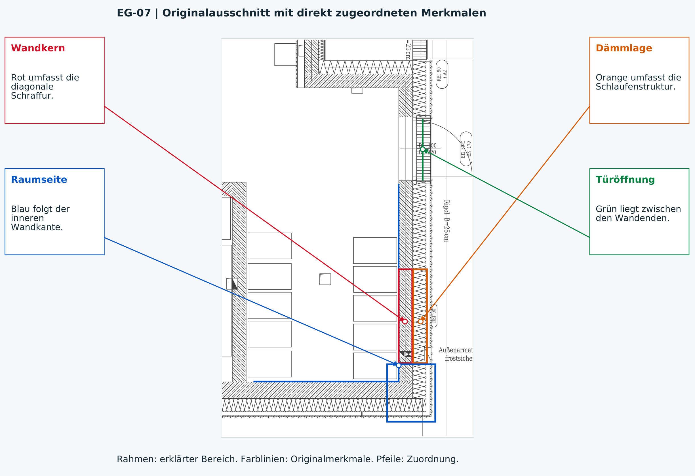

Original-PDF, Seite 1. Suchbereich in pt: [4890, 2470, 5130, 2850]

### Welche Markierung zeigt was?

Rot umrandet einen Ausschnitt des diagonal schraffierten Kerns. Orange umrandet die benachbarte Schicht mit Schlaufen. Blau liegt auf der raumseitigen Kante und folgt ihr bis um die Ecke. Die Markierungen sind jetzt direkt an den jeweiligen Originalmerkmalen.

### Warum ist das insgesamt eine Wand?

Die Schichten verlaufen zusammen, besitzen zwei Außengrenzen und setzen sich um die Ecke fort. Zwischen Raum und Außenbereich liegt ein zusammenhängender Aufbau. Ein heller Streifen innerhalb des Aufbaus ist kein Weg.

### Wo liegt die echte Unterbrechung?

Oben rechts unterbricht die grün markierte Türstelle den Aufbau. Türblatt, Schwenkbogen und DL 100/220 gehören zu dieser Öffnung. Die Tragfunktion des Kerns wird aus der Schraffur allein nicht festgelegt.

### Direkt im Bild zugeordnete Merkmale

- Wandkern: Rot umfasst die diagonale Schraffur. (Farbe: red)
- Dämmlage: Orange umfasst die Schlaufenstruktur. (Farbe: orange)
- Raumseite: Blau folgt der inneren Wandkante. (Farbe: blue)
- Türöffnung: Grün liegt zwischen den Wandenden. (Farbe: green)

## EG-08 - Auch eine sehr dünne Trennwand sperrt

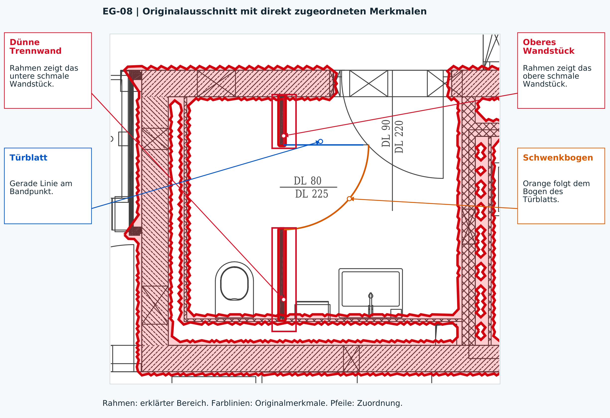

Original-PDF, Seite 1. Suchbereich in pt: [4140, 1850, 4335, 2025]

### Konkretes Beispiel

Im Bereich 0.10 ist eine schmale feste Kabinentrennwand zu sehen. Zwei geschlossene rote Rahmen zeigen ihr oberes und unteres Wandstück. Dazwischen liegt die Türöffnung. Das blaue Türblatt und der vollständig orange nachgezogene Bogen gehören zur Tür, nicht zur Mauer.

### Warum das wichtig ist

Eine Mindestdicke für tragende Mauern ist kein allgemeiner Filter für Hindernisse. Leichte Trennwände und Verglasungen können für eine Person genauso sperren wie eine dicke Außenwand.

### Was hier nicht untersucht wird

Waschbecken, WC-Nutzung und Sanitärausstattung werden nicht klassifiziert. Die Darstellung ist nur wegen der festen Trennwand und ihrer echten Türöffnung relevant.

### Direkt im Bild zugeordnete Merkmale

- Dünne Trennwand: Rahmen zeigt das untere schmale Wandstück. (Farbe: red)
- Oberes Wandstück: Rahmen zeigt das obere schmale Wandstück. (Farbe: red)
- Türblatt: Gerade Linie am Bandpunkt. (Farbe: blue)
- Schwenkbogen: Orange folgt dem Bogen des Türblatts. (Farbe: orange)

## EG-09 - Eine Drehtür vollständig lesen

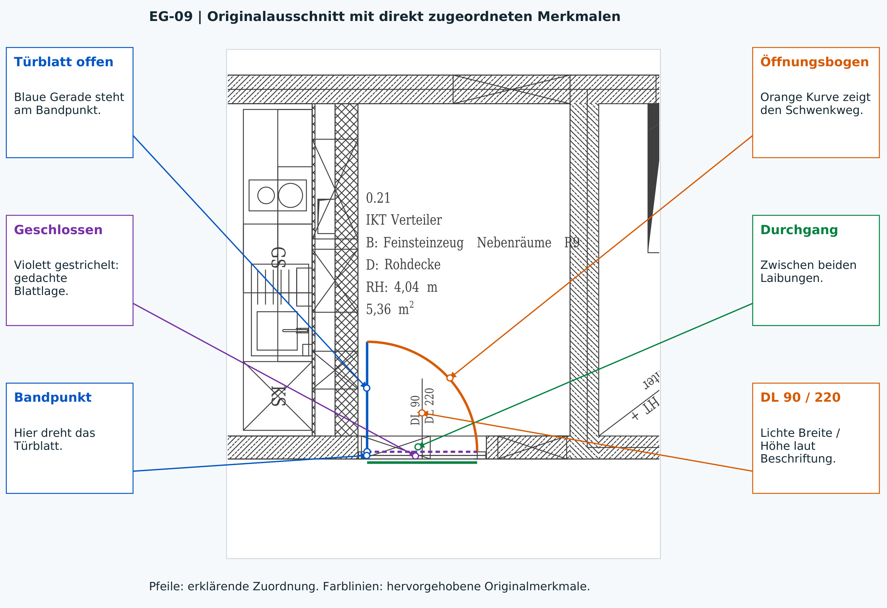

Original-PDF, Seite 1. Suchbereich in pt: [1350, 900, 1550, 1135]

### Beleg im EG

Raum 0.21, IKT Verteiler: Die untere Wand ist unterbrochen. Ein Türblatt, sein Drehpunkt und ein Viertelkreisbogen gehören zur Öffnung. Der Bogen zeigt den Schwenkbereich des gezeichneten Türblatts.

### Was kann man ablesen?

Die Beschriftung DL 90 / DL 220, die Anschlagseite und die dargestellte Öffnungsrichtung. Der Bogenradius beträgt in der DXF-Geometrie rund 900 mm und passt damit zur Breitenangabe 90 cm. Die lichte Höhe steht als Text im Plan; sie ist keine Messung aus der Draufsicht.

### Was folgt nicht daraus?

Der Bogen ist keine Mauer. Er beweist aber auch nicht, dass die Tür im Betrieb offen oder unversperrt ist. Den Durchgang als Türverbindung mit gesondertem Zustandsfeld führen.

### Direkt im Bild zugeordnete Merkmale

- Türblatt offen: Blaue Gerade steht am Bandpunkt. (Farbe: blue)
- Öffnungsbogen: Orange Kurve zeigt den Schwenkweg. (Farbe: orange)
- Geschlossen: Violett gestrichelt: gedachte Blattlage. (Farbe: purple)
- Durchgang: Zwischen beiden Laibungen. (Farbe: green)
- Bandpunkt: Hier dreht das Türblatt. (Farbe: blue)
- DL 90 / 220: Lichte Breite / Höhe laut Beschriftung. (Farbe: orange)

## EG-10 - Zweiflügelig: ein Portal, zwei Türflügel

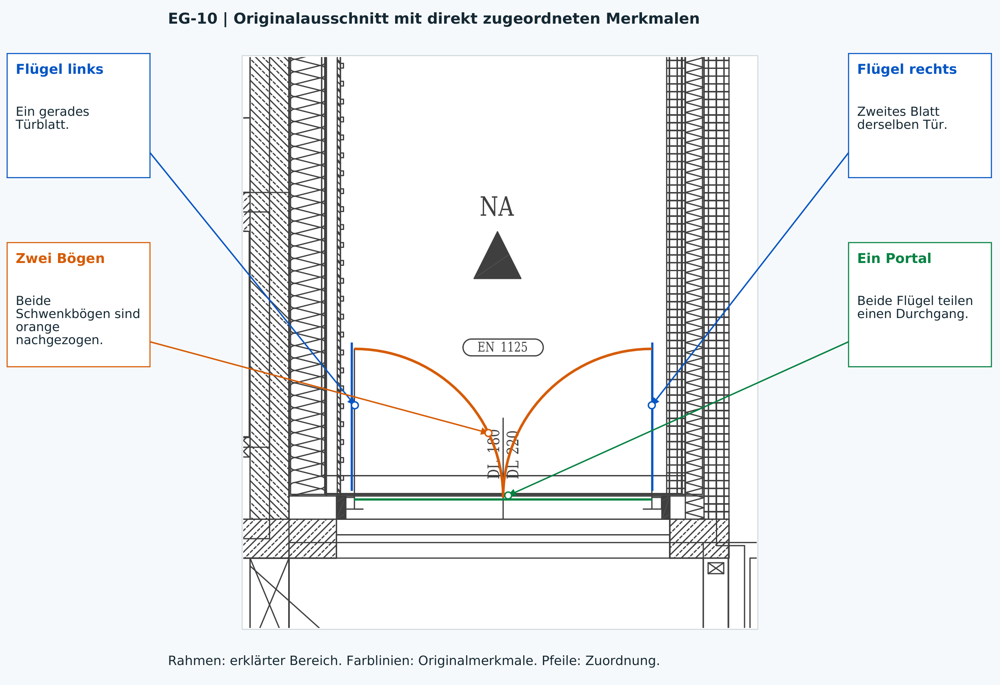

Original-PDF, Seite 1. Suchbereich in pt: [2410, 865, 2585, 1060]

### Was sieht man?

Links neben dem Windfang liegen zwei Türflügel in einer gemeinsamen Fassadenöffnung. Beide geraden Blätter sind blau markiert. Die zwei zugehörigen Öffnungsbögen sind jetzt über ihren gesamten Verlauf orange nachgezogen: ein Bogen je Flügel.

### So wird daraus eine Verbindung

Die zusammengehörenden Flügel zu einem Türportal bündeln und dessen beide Raum- beziehungsweise Außenseiten bestimmen. Zwei Bögen bedeuten hier nicht zwei voneinander unabhängige Durchgänge durch zwei Wände.

### NA ist ein Zusatzhinweis

Die NA-Kennzeichnung stützt die Lesart einer Ausgangsstelle. Sie allein beweist weder den weiteren Außenweg noch den aktuellen Türzustand. Der Weg endet in diesem Beispiel zunächst am außenliegenden Anschluss.

### Direkt im Bild zugeordnete Merkmale

- Flügel links: Ein gerades Türblatt. (Farbe: blue)
- Flügel rechts: Zweites Blatt derselben Tür. (Farbe: blue)
- Zwei Bögen: Beide Schwenkbögen sind orange nachgezogen. (Farbe: orange)
- Ein Portal: Beide Flügel teilen einen Durchgang. (Farbe: green)

## EG-11 - Schiebetüren funktionieren ohne Türbogen

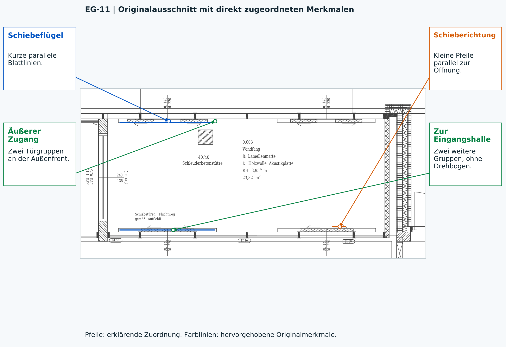

Original-PDF, Seite 1. Suchbereich in pt: [2970, 815, 3470, 1060]

### Eindeutige Merkmalskombination

Im Windfang 0.003 sieht man parallel zur Fassade bewegte Flügel und seitliche Pfeile. Zusätzlich steht im Plan ausdrücklich „Schiebetüren Fluchtweg gemäß AutSchR“. Ein Drehbogen fehlt hier aus gutem Grund.

### Was die Erkennung tun muss

Schiebetüren als eigenen Öffnungstyp berücksichtigen. Den beweglichen Flügel von festen Glasfeldern und den seitlichen Wandpfeilern trennen. Ein Verfahren, das nur Kreisbögen sucht, verliert diese Eingänge.

### Grenze der Aussage

Der Planhinweis wird als Beleg übernommen, nicht als von uns geprüfte technische Zulassung. Öffnungszustand und tatsächliche Nutzbarkeit bleiben eigene Angaben.

### Direkt im Bild zugeordnete Merkmale

- Schiebeflügel: Kurze parallele Blattlinien. (Farbe: blue)
- Schieberichtung: Kleine Pfeile parallel zur Öffnung. (Farbe: orange)
- Äußerer Zugang: Zwei Türgruppen an der Außenfront. (Farbe: green)
- Zur Eingangshalle: Zwei weitere Gruppen, ohne Drehbogen. (Farbe: green)

## EG-12 - Fenster: Öffnung im Baukörper, kein Fußweg

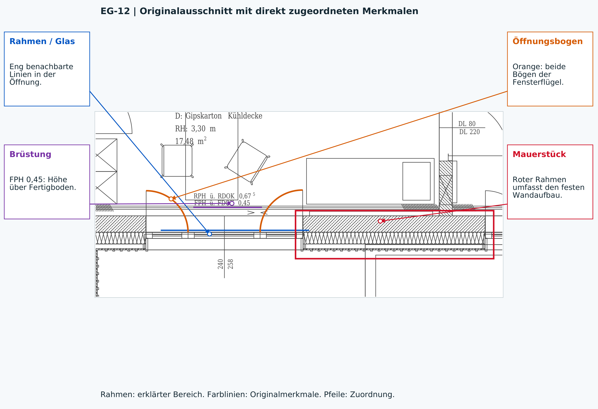

Original-PDF, Seite 1. Suchbereich in pt: [1400, 1510, 1730, 1660]

### Beleg am Verwaltungsflügel

An der unteren Fassade stehen Rahmenprofile, Glaslinien und Parapethöhen. Blau zeigt die Fensterlinien, Orange die Bögen der beiden Fensterflügel. Der geschlossene rote Rechteckrahmen umfasst den von dir bezeichneten festen Wandabschnitt rechts neben dem Fenster einschließlich seiner Schichten.

### Warum ist das kein Türportal?

Die Öffnung enthält einen Fensterabschluss; außerdem ist ein Parapethinweis vorhanden. Die Lücke in der Mauerschraffur reicht daher nicht als Nachweis einer begehbaren Verbindung.

### Für die Software

Fenster als eigene Objekte behalten und bei normalen Fußwegen sperren. Auch ein öffenbarer Flügel macht ein Fenster nicht automatisch zu einer Tür. Niedrige Brüstung oder Transparenz ändern diese Einordnung nicht.

### Direkt im Bild zugeordnete Merkmale

- Rahmen / Glas: Eng benachbarte Linien in der Öffnung. (Farbe: blue)
- Öffnungsbogen: Orange: beide Bögen der Fensterflügel. (Farbe: orange)
- Brüstung: FPH 0,45: Höhe über Fertigboden. (Farbe: purple)
- Mauerstück: Roter Rahmen umfasst den festen Wandaufbau. (Farbe: red)

## EG-13 - Ein Bogen kann auch zu einem Fenster gehören

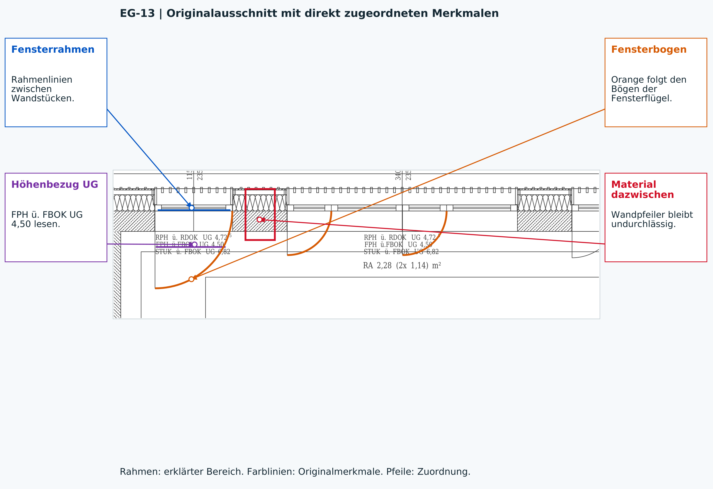

Original-PDF, Seite 1. Suchbereich in pt: [940, 35, 1320, 150]

### Das Gegenbeispiel im Original

Die obere Hallenfassade zeigt Öffnungsbögen. Daneben steht FPH ü. FBOK UG 4,50. Das Fenster liegt nach dieser Beschriftung 4,50 m über dem fertigen Fußboden des Untergeschosses.

### Der entscheidende Unterschied

Bogen plus Rahmen bedeutet noch nicht Tür. Hier widersprechen Höhe und Fensterbeschriftung einer gewöhnlichen bodengleichen Durchgangstür. Der Bezug „UG“ muss mitgelesen werden, obwohl das Planblatt Erdgeschoss heißt.

### Erwartetes Ergebnis

Keine Türverbindung vom Hallenbereich durch dieses Fenster erzeugen. Auch der dargestellte Sportboden wird dadurch nicht zum bestätigten EG-Fußboden. Höhe und Geschossbezug getrennt führen.

### Direkt im Bild zugeordnete Merkmale

- Fensterrahmen: Rahmenlinien zwischen Wandstücken. (Farbe: blue)
- Fensterbogen: Orange folgt den Bögen der Fensterflügel. (Farbe: orange)
- Höhenbezug UG: FPH ü. FBOK UG 4,50 lesen. (Farbe: purple)
- Material dazwischen: Wandpfeiler bleibt undurchlässig. (Farbe: red)

## EG-14 - Glas trennt Räume ebenfalls

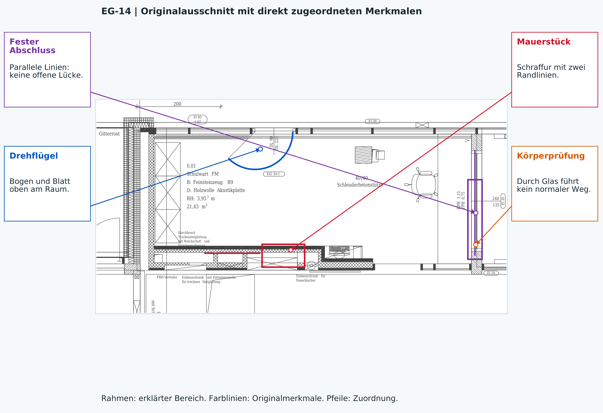

Original-PDF, Seite 1. Suchbereich in pt: [2520, 815, 3040, 1085]

### Beispiel Schulwart und Windfang

Zwischen Schulwartraum 0.01 und Windfang 0.003 ist ein schmaler Abschluss mit Rahmen und Höhenangaben dargestellt. Er darf nicht als freie Verbindung behandelt werden, nur weil die dicke Mauerschraffur fehlt.

### Objekte sauber unterscheiden

Massive Wand, festes Glasfeld, Fenster und beweglicher Türflügel erhalten verschiedene Klassen. Für die Wegprüfung kann dennoch jede dieser Klassen eine Sperre bilden.

### Weiße Stelle ist kein Beweis

Ein Durchgang wird erst aus einer bestätigten Öffnung mit passenden Flächen auf beiden Seiten. Die Erkennung darf nicht die gesamte Strecke zwischen zwei roten Wandpfeilern freigeben.

### Direkt im Bild zugeordnete Merkmale

- Fester Abschluss: Parallele Linien: keine offene Lücke. (Farbe: purple)
- Mauerstück: Schraffur mit zwei Randlinien. (Farbe: red)
- Drehflügel: Bogen und Blatt oben am Raum. (Farbe: blue)
- Körperprüfung: Durch Glas führt kein normaler Weg. (Farbe: orange)

## EG-15 - Einen freien Abschnitt positiv erkennen

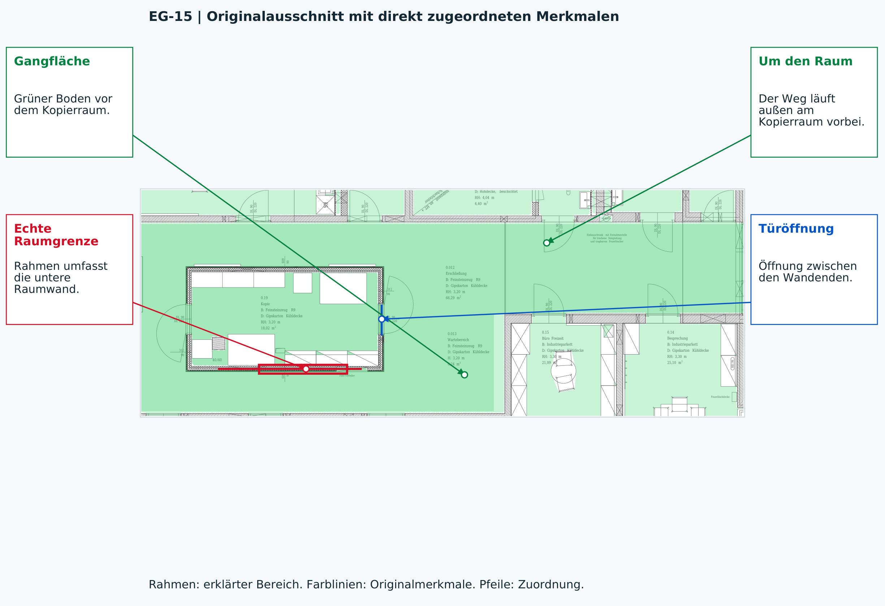

Original-PDF, Seite 1. Suchbereich in pt: [1060, 1035, 2085, 1420]

### Boden und Hindernisse unterscheiden

Grün zeigt den zusammenhängenden Boden vor und um den Kopierraum. Möbelgrundflächen, einschließlich der von dir markierten Sessel und Tischgruppe rechts, sind weiß ausgespart. Die schwarzen Konturen zeigen weiterhin ihre Form.

### Wo liegt die Raumgrenze?

Der rote Pfeil trifft jetzt die schraffierte untere Kopierraumwand. Das Möbel unmittelbar davor ist ein anderes Objekt. Die blaue Markierung liegt an der Türöffnung: Dort endet die Wand lokal und ein Zugang ist erkennbar.

### Was ein freier Weg zusätzlich braucht

Eine zusammenhängende grüne Fläche zeigt eine mögliche Verbindung. Für einen Körperweg müssen lichte Breite, Höhe, Hindernisabstand und Türzustand passen. Diese Prüfung erfolgt mit den Originalmaßen und einem festgelegten Nutzerprofil.

### Direkt im Bild zugeordnete Merkmale

- Gangfläche: Grüner Boden vor dem Kopierraum. (Farbe: green)
- Um den Raum: Der Weg läuft außen am Kopierraum vorbei. (Farbe: green)
- Echte Raumgrenze: Rahmen umfasst die untere Raumwand. (Farbe: red)
- Türöffnung: Öffnung zwischen den Wandenden. (Farbe: blue)

## EG-16 - Sackgasse heißt: begehbar, aber kein Durchweg

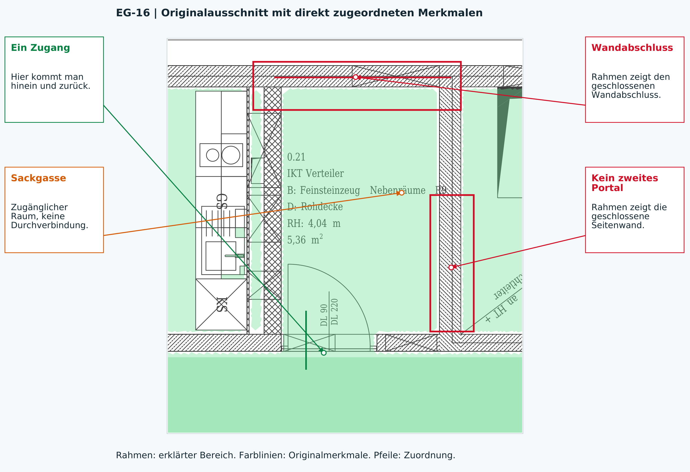

Original-PDF, Seite 1. Suchbereich in pt: [1340, 895, 1560, 1140]

### Beispiel IKT Verteiler 0.21

Im vollständigen sichtbaren Raumumriss ist ein normaler Zugang an der unteren Wand erkennbar. Ein zweiter Personendurchgang ist dort nicht belegt. Der Raum kann betreten werden, sofern die Tür nutzbar ist.

### Richtiges Wegmodell

Der Zugang führt hinein und wieder über dasselbe Portal zurück. Der Raum darf keine erfundene Abkürzung zu seinen Nachbarräumen erhalten. Eine Sackgasse ist deshalb nicht dasselbe wie eine gesperrte Fläche.

### Allgemeine Prüfung

Erst den vollständigen Verbindungsgraphen betrachten. Ein Ausschnitt ohne zweiten sichtbaren Ausgang allein beweist für beliebige andere Räume noch keine Sackgasse.

### Direkt im Bild zugeordnete Merkmale

- Ein Zugang: Hier kommt man hinein und zurück. (Farbe: green)
- Wandabschluss: Rahmen zeigt den geschlossenen Wandabschluss. (Farbe: red)
- Sackgasse: Zugänglicher Raum, keine Durchverbindung. (Farbe: orange)
- Kein zweites Portal: Rahmen zeigt die geschlossene Seitenwand. (Farbe: red)

## EG-17 - Eine Deckenlinie darf keinen Raum teilen

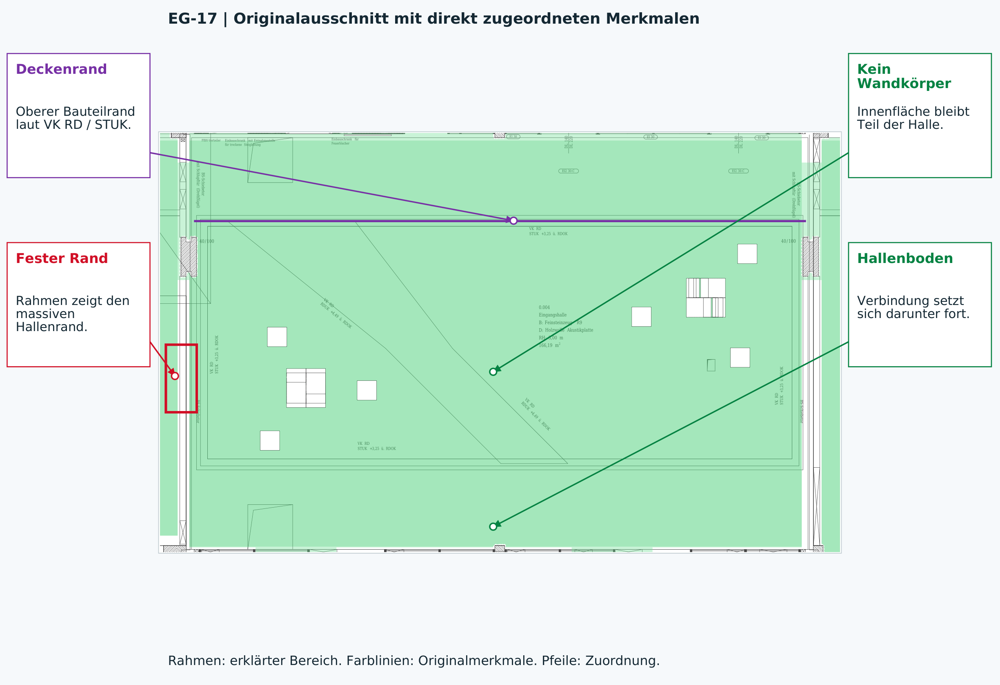

Original-PDF, Seite 1. Suchbereich in pt: [2540, 1030, 3465, 1600]

### Was ist im Halleninneren gezeichnet?

In der Eingangshalle 0.004 liegen ein großes Rechteck und diagonale Linien. Die Hinweise VK RD und STUK mit positiven Höhenangaben gehören zu Bauteilen oberhalb der betrachteten Bewegungsfläche.

### Warum keine Mauer?

Es fehlen die für eine Wand in der Gehzone passenden Wandseiten und Materialflächen. Die zugehörigen Höhenhinweise sprechen gegen eine raumteilende Wand auf Bodenhöhe.

### Prüffall für Claude Code

Diese Linien dürfen weder einen zusätzlichen Innenraum erzeugen noch den Gehbereich entlang des Rechtecks sperren. Höhenbezüge nicht mit einem pauschalen Linienfilter verlieren.

### Direkt im Bild zugeordnete Merkmale

- Deckenrand: Oberer Bauteilrand laut VK RD / STUK. (Farbe: purple)
- Kein Wandkörper: Innenfläche bleibt Teil der Halle. (Farbe: green)
- Fester Rand: Rahmen zeigt den massiven Hallenrand. (Farbe: red)
- Hallenboden: Verbindung setzt sich darunter fort. (Farbe: green)

## EG-18 - Technischer Durchbruch ist kein Durchgang

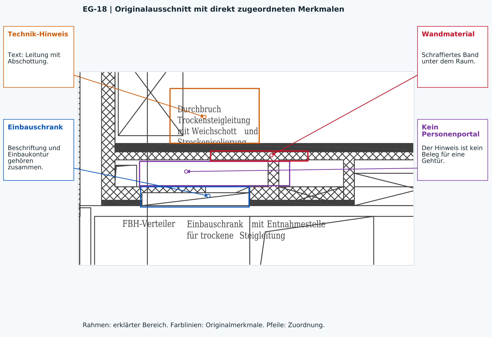

Original-PDF, Seite 1. Suchbereich in pt: [2575, 965, 2740, 1060]

### Den Text zuerst lesen

Der orange Rahmen zeigt den Hinweis auf einen „Durchbruch Trockensteigleitung“ mit Weichschott und Streckenisolierung. Diese Wörter beschreiben eine technische Leitungsführung. Der Pfeil bezeichnet den Textbeleg; er behauptet keine exakt vermessene Öffnungsgrenze.

### Wand und Einbau getrennt zeigen

Rot umrandet ein Stück des schraffierten Wandbandes. Blau bezeichnet den Einbau mit zugehörigem Schrankhinweis. Das große helle Feld innerhalb dieses Aufbaus ist deshalb nicht automatisch eine freie Türöffnung.

### Warum kein Fußgängerweg?

An der markierten Stelle ist keine Gehtür mit zugehörigem Personendurchgang belegt. Eine technische Durchführung kann klein, hochliegend oder abgeschottet sein. Ihre genaue Größe und Lage benötigen ein Detail; für die Raumerkennung entsteht hier keine Verbindungskante.

### Direkt im Bild zugeordnete Merkmale

- Technik-Hinweis: Text: Leitung mit Abschottung. (Farbe: orange)
- Wandmaterial: Schraffiertes Band unter dem Raum. (Farbe: red)
- Einbauschrank: Beschriftung und Einbaukontur gehören zusammen. (Farbe: blue)
- Kein Personenportal: Der Hinweis ist kein Beleg für eine Gehtür. (Farbe: purple)

## EG-19 - Lift, Treppe und Vorbereich getrennt lesen

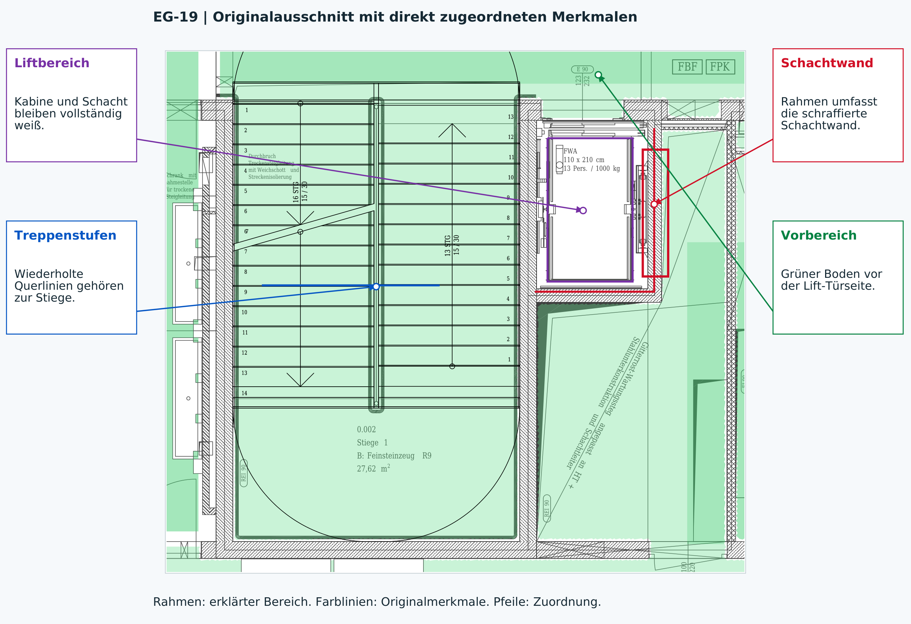

Original-PDF, Seite 1. Suchbereich in pt: [3540, 1620, 3995, 2030]

### Drei getrennte Bereiche

Die violette Kontur zeigt die Liftkabine. Die rote Kontur verfolgt Teile der Schachtwand. Links liegt die Treppe mit regelmäßig wiederholten Stufenkanten. Ein eigener grüner Vorbereich erschließt diese Bauteile.

### Weiß im Lift ist bewusst gewählt

Kabine und Schacht sind aus der allgemeinen Gehfläche ausgespart. Das bedeutet nicht, dass niemand eine Liftkabine betreten kann: Ihr Zugang und die Fahrt werden als eigene Verbindung behandelt. Zwischen Kabine und Schachtwand gibt es keinen umlaufenden Gang.

### Die nächste Seite zeigt den Lift im Detail

Dort werden Türseite, Kabinenumriss, Schachtwand und technische Zwischenräume einzeln farbig nachgezeichnet. So lässt sich der Aufzug erkennen, ohne seine Mechanik als Tür oder seine Zwischenräume als Wege fehlzulesen.

### Direkt im Bild zugeordnete Merkmale

- Liftbereich: Kabine und Schacht bleiben vollständig weiß. (Farbe: purple)
- Schachtwand: Rahmen umfasst die schraffierte Schachtwand. (Farbe: red)
- Treppenstufen: Wiederholte Querlinien gehören zur Stiege. (Farbe: blue)
- Vorbereich: Grüner Boden vor der Lift-Türseite. (Farbe: green)

## EG-29 - Lift im Detail: Kabine, Tür und Schacht

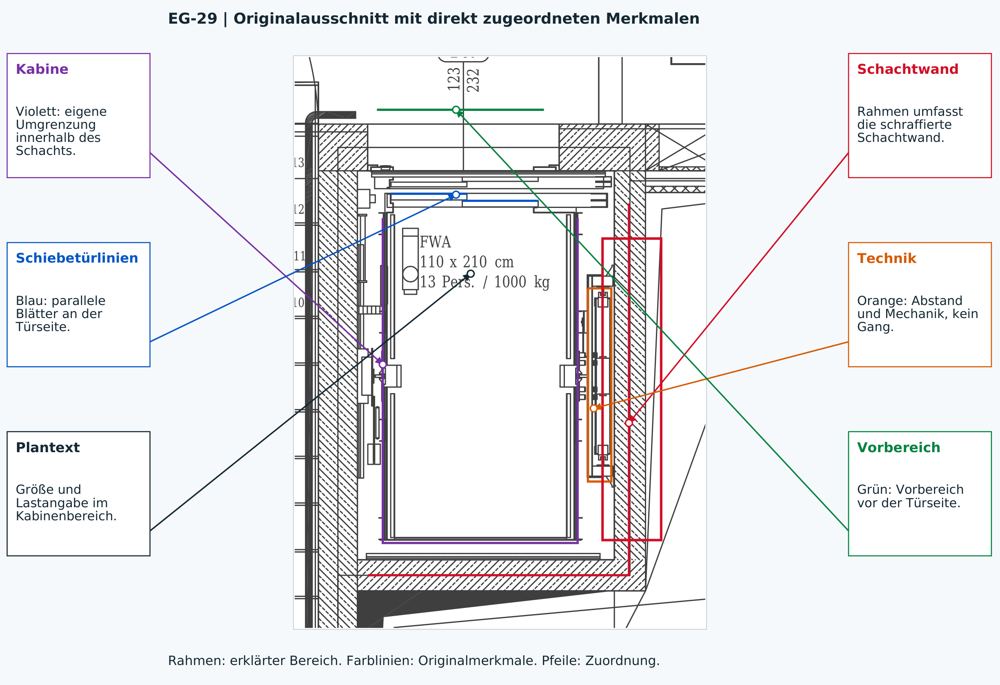

Original-PDF, Seite 1. Suchbereich in pt: [3810, 1635, 3950, 1830]

### Woran erkennt man den Lift?

Im schraffierten Schacht liegt ein eigener rechteckiger Kabinenumriss. Im Inneren stehen FWA, 110 × 210 cm und 13 Pers. / 1000 kg. Kabine, Türmechanik und der DXF-Layer „Neubau_430 Aufzug“ stützen die Zuordnung gemeinsam.

### Welche Linie zeigt welchen Teil?

Violett folgt dem Kabinenumriss. Rot liegt auf der massiven Schachteinfassung. Blau hebt die parallelen Schiebetürlinien an der oberen Kabinenseite hervor. Orange zeigt den technischen Zwischenraum seitlich der Kabine.

### Wie entsteht hier eine Verbindung?

Vom Vorbereich führt der Zugang an der Türseite in die Kabine, wenn diese auf dem Geschoss hält und die Türen geöffnet sind. Die Fahrt zum anderen Geschoss ist eine eigene Verbindung. Der technische Zwischenraum ist kein Fußweg; eine Zielhöhe ist hier nicht bestätigt.

### Direkt im Bild zugeordnete Merkmale

- Kabine: Violett: eigene Umgrenzung innerhalb des Schachts. (Farbe: purple)
- Schachtwand: Rahmen umfasst die schraffierte Schachtwand. (Farbe: red)
- Schiebetürlinien: Blau: parallele Blätter an der Türseite. (Farbe: blue)
- Technik: Orange: Abstand und Mechanik, kein Gang. (Farbe: orange)
- Plantext: Größe und Lastangabe im Kabinenbereich. (Farbe: ink)
- Vorbereich: Grün: Vorbereich vor der Türseite. (Farbe: green)

## EG-20 - Stiege 1: Woran erkennt man eine Treppe?

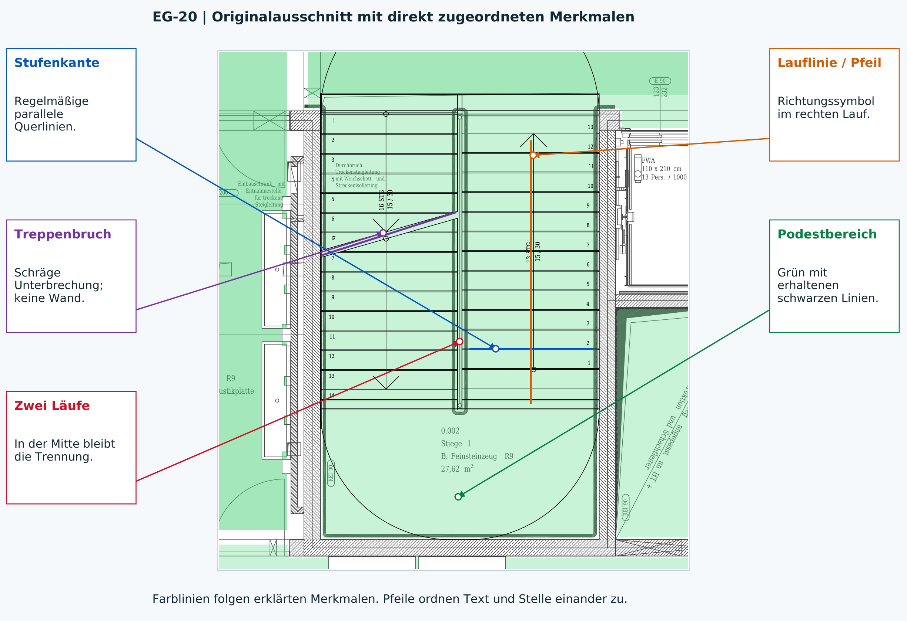

Original-PDF, Seite 1. Suchbereich in pt: [3510, 1610, 3890, 2030]

### Mehrere klare Merkmale

Im Raum 0.002 stehen wiederholte Stufenkanten, Laufpfeile, Stufennummern und der Name Stiege 1. Dazu kommen die Angaben 13 STG 15/30 und 16 STG 15/30 sowie ein Podest.

### Die Angabe lesen

STG bezeichnet Steigungen; 15/30 beschreibt hier die gezeichnete Steigungs-/Auftrittsangabe. Stufenkanten werden zu einem Treppenlauf zusammengefasst. Sie sind keine Reihe schmaler Einzelräume.

### Oben und unten

Die Laufpfeile zeigen auf dem Blatt in verschiedene Richtungen. Die höhere Ebene liegt nicht immer oben im Bild. Für die Geschossverknüpfung zusätzlich Start, Podest und Höhenanschluss im Nachbarplan bestätigen.

### Direkt im Bild zugeordnete Merkmale

- Stufenkante: Regelmäßige parallele Querlinien. (Farbe: blue)
- Lauflinie / Pfeil: Richtungssymbol im rechten Lauf. (Farbe: orange)
- Treppenbruch: Schräge Unterbrechung; keine Wand. (Farbe: purple)
- Podestbereich: Grün mit erhaltenen schwarzen Linien. (Farbe: green)
- Zwei Läufe: In der Mitte bleibt die Trennung. (Farbe: red)

## EG-21 - Stiege 2: Schnittlinie ist keine Mauer

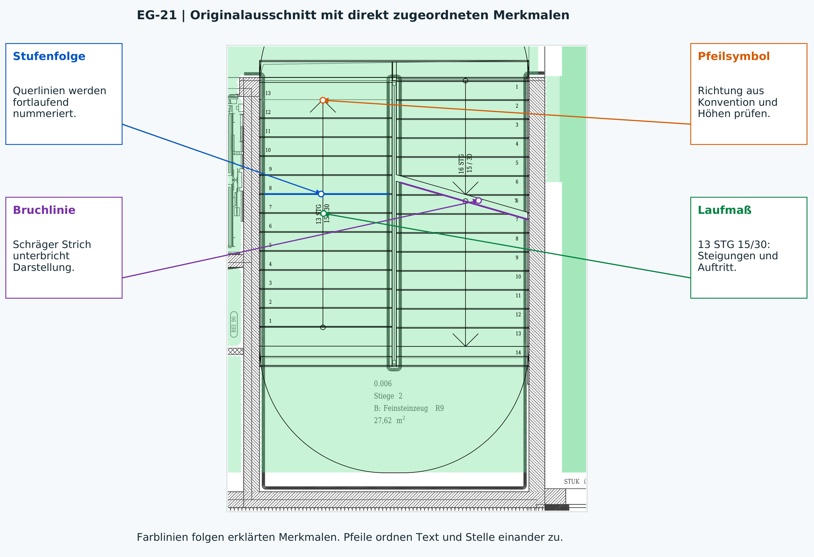

Original-PDF, Seite 1. Suchbereich in pt: [2160, 1220, 2460, 1610]

### Konkreter Befund

Stiege 2 trägt die Raumkennung 0.006. Wiederholte Stufen, Pfeile und Nummern bilden zwei zusammengehörige Laufbereiche. Die diagonale Unterbrechung gehört zur Darstellung des Treppenlaufs.

### Fehler vermeiden

Eine schräge Schnitt- oder Bruchlinie im Lauf ist keine quer eingebaute Wand. Ebenso ist die mittlere Geländerzone kein eigener begehbarer Raum. Beide gehören zur Treppendarstellung.

### Verbindung zur Erschließung

Die Erschließung 0.005 und der Treppenraum werden nur über die im Plan vorhandenen Öffnungen verbunden. Gleiche Lage untereinander in mehreren Geschossen reicht für einen bestätigten Laufanschluss nicht aus.

### Direkt im Bild zugeordnete Merkmale

- Stufenfolge: Querlinien werden fortlaufend nummeriert. (Farbe: blue)
- Pfeilsymbol: Richtung aus Konvention und Höhen prüfen. (Farbe: orange)
- Bruchlinie: Schräger Strich unterbricht Darstellung. (Farbe: purple)
- Laufmaß: 13 STG 15/30: Steigungen und Auftritt. (Farbe: green)

## EG-22 - Stiege 5: Pfeilrichtung und Ausgang trennen

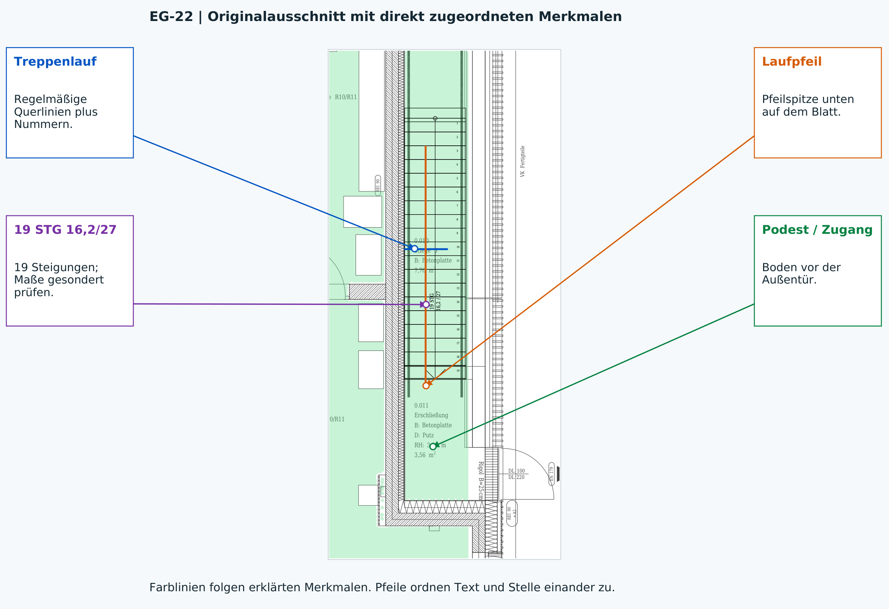

Original-PDF, Seite 1. Suchbereich in pt: [4910, 2020, 5150, 2550]

### Was der Plan zeigt

Stiege 5 heißt 0.010. Der Lauf enthält 19 nummerierte Steigungen und die Angabe 19 STG 16,2/27. Am unteren Blattrand schließt die Erschließung 0.011 mit einer nach außen gezeichneten Tür an.

### Was „rauf“ bedeutet

Entlang eines aufwärts bezeichneten Treppenlaufs gelangt man zur höheren Ebene; in Gegenrichtung zur niedrigeren. Die Blattorientierung ist dafür ohne Bedeutung. Startkreis, Pfeil, Nummerierung und Höhenbezug zusammen lesen.

### Was hier offen bleibt

Das genaue Zielgeschoss und die Höhen beider Endpunkte werden in diesem EG-Paket nicht endgültig festgelegt. Diese Angaben müssen mit dem UG-Arbeitsstrang und den passenden Nachbarplänen abgeglichen werden.

### Direkt im Bild zugeordnete Merkmale

- Treppenlauf: Regelmäßige Querlinien plus Nummern. (Farbe: blue)
- Laufpfeil: Pfeilspitze unten auf dem Blatt. (Farbe: orange)
- 19 STG 16,2/27: 19 Steigungen; Maße gesondert prüfen. (Farbe: purple)
- Podest / Zugang: Boden vor der Außentür. (Farbe: green)

## EG-23 - Stiege 6: spiegelähnlich, aber eigenes Objekt

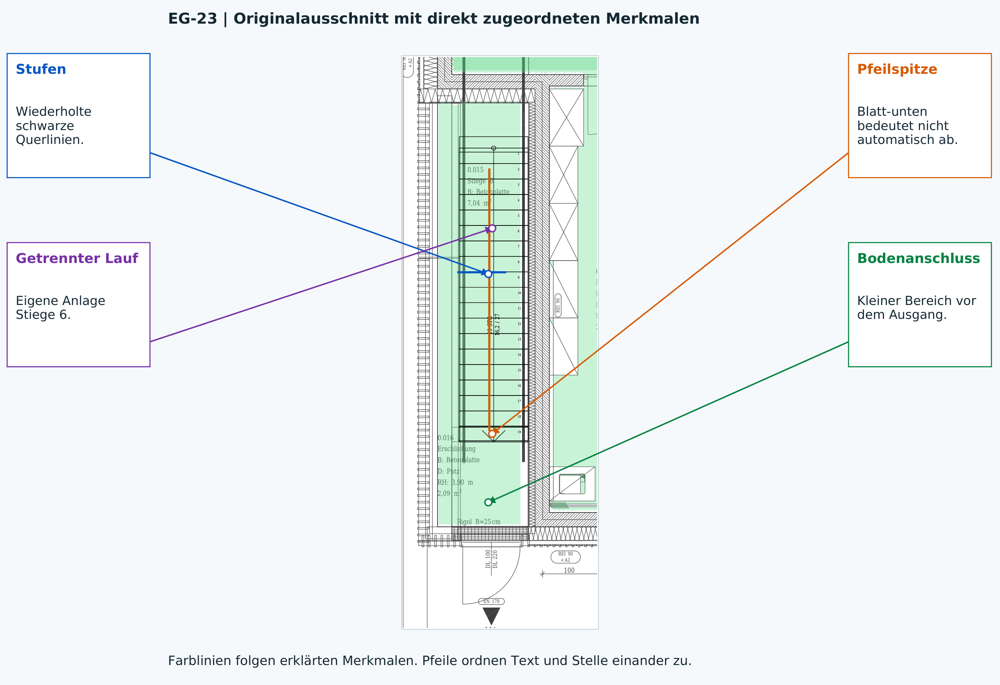

Original-PDF, Seite 1. Suchbereich in pt: [900, 1400, 1080, 1930]

### Eigene Kennung behalten

Die linke Randstiege trägt 0.015, der anschließende Bereich 0.016. Sichtbar sind 19 STG 16,2/27, die fortlaufenden Stufennummern, ein Laufpfeil und eine Tür am äußeren Anschluss.

### Nicht von Stiege 5 kopieren

Eine ähnliche Form ist ein guter Suchhinweis, aber kein Beleg für identische Anschlüsse. Stiege 6 erhält eine eigene ID, eigene Geometrie und eigene Quellenstellen.

### Höhenverbindung prüfen

Das Paket übergibt diesen Treppenanschluss als zu prüfende Verbindung. Eine feste Behauptung „führt von EG nach UG“ benötigt zusätzlich den belegten Anschluss am anderen Ende.

### Direkt im Bild zugeordnete Merkmale

- Stufen: Wiederholte schwarze Querlinien. (Farbe: blue)
- Pfeilspitze: Blatt-unten bedeutet nicht automatisch ab. (Farbe: orange)
- Getrennter Lauf: Eigene Anlage Stiege 6. (Farbe: purple)
- Bodenanschluss: Kleiner Bereich vor dem Ausgang. (Farbe: green)

## EG-24 - Außenstiege 4: Verlauf und Unterlaufschutz

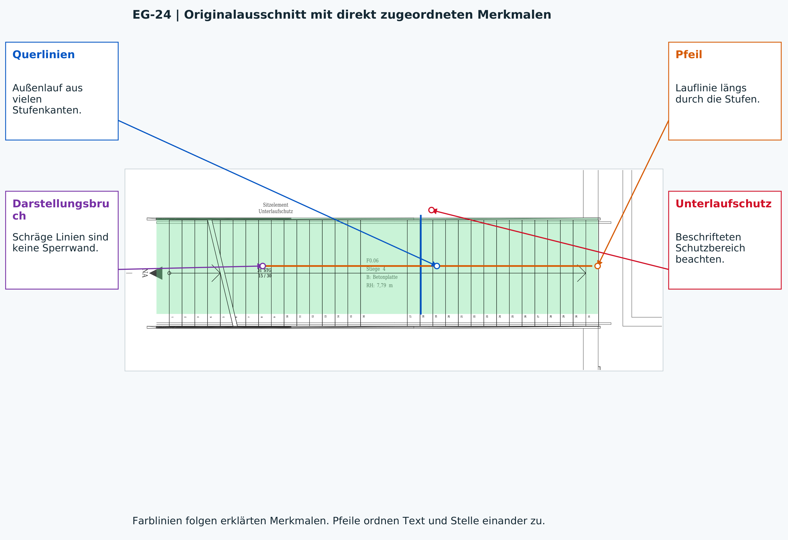

Original-PDF, Seite 1. Suchbereich in pt: [1780, 2000, 2450, 2250]

### Die Treppe ist seitlich gedreht

Stiege 4 trägt F0.06. Die Stufen laufen quer über das Blatt; der Plan nennt 31 STG 15/30. Die Merkmale einer Treppe bleiben erkennbar, auch wenn ihr Lauf horizontal im Bild erscheint.

### Unter der Treppe nicht raten

Die Beschriftung „Sitzelement Unterlaufschutz“ ist ein deutlicher Hinweis auf eine zusätzliche Begrenzung. Der Bereich unter einem Lauf darf ohne Höhen- und Hindernisprüfung nicht als freier Durchlauf angenommen werden.

### Richtung und Geschoss

Die Laufdarstellung hilft beim Erkennen der Bewegungsrichtung. Die tatsächlichen Höhen und Anschlüsse sind mit Nachbargrundriss oder Schnitt zu bestätigen. NA am Planrand ersetzt diesen Abgleich nicht.

### Direkt im Bild zugeordnete Merkmale

- Querlinien: Außenlauf aus vielen Stufenkanten. (Farbe: blue)
- Pfeil: Lauflinie längs durch die Stufen. (Farbe: orange)
- Darstellungsbruch: Schräge Linien sind keine Sperrwand. (Farbe: purple)
- Unterlaufschutz: Beschrifteten Schutzbereich beachten. (Farbe: red)

## EG-25 - Außenstiege 3: gleicher Typ, eigener Anschluss

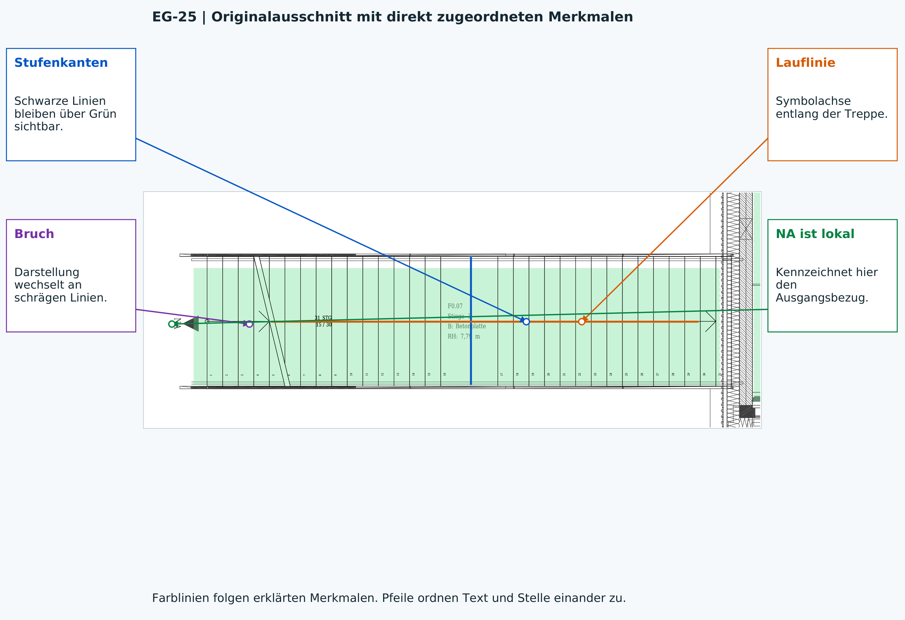

Original-PDF, Seite 1. Suchbereich in pt: [2820, 2500, 3450, 2740]

### Beleg im EG

Die zweite äußere Stiege heißt F0.07 beziehungsweise Stiege 3. Auch hier stehen 31 STG 15/30 und fortlaufende Stufennummern. Ihre Lage ist von Stiege 4 getrennt.

### Was die Software speichern soll

Eine eigene Treppenanlage mit Laufbereich, Endbereichen, Quellbelegen und noch offenen Höhenanschlüssen. Die Anlagen-ID bleibt geschossübergreifend gleich; die konkrete Geschossinstanz erhält eine eigene Kennung.

### Zusammenarbeit mit dem UG-Chat

Beide Arbeitsstränge vergleichen später Anlage, Lage, Orientierung und Höhen. Erst danach wird ein bestätigter Geschossübergang eingetragen. Die bloße Nummer 3 ist kein ausreichender Geometriebeleg.

### Direkt im Bild zugeordnete Merkmale

- Stufenkanten: Schwarze Linien bleiben über Grün sichtbar. (Farbe: blue)
- Lauflinie: Symbolachse entlang der Treppe. (Farbe: orange)
- Bruch: Darstellung wechselt an schrägen Linien. (Farbe: purple)
- NA ist lokal: Kennzeichnet hier den Ausgangsbezug. (Farbe: green)

## EG-26 - Ausgang erkannt: Außenweg noch nicht belegt

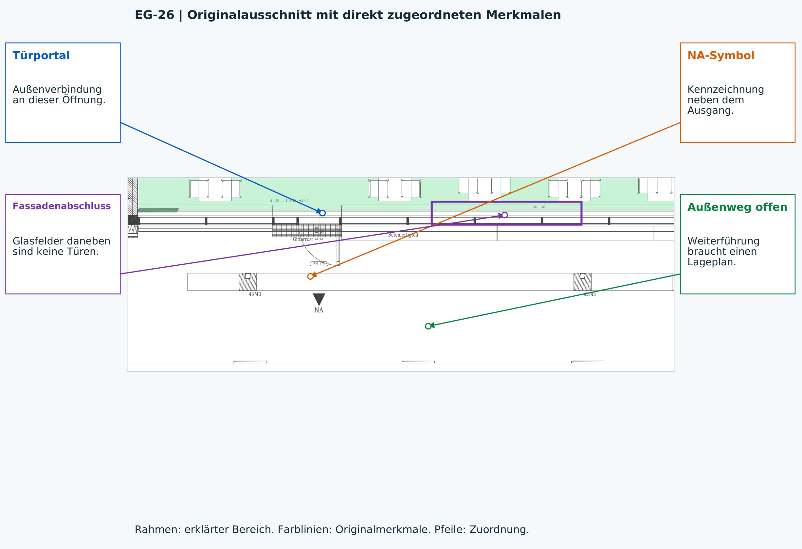

Original-PDF, Seite 1. Suchbereich in pt: [3430, 2670, 4140, 2920]

### Positiver Beleg

An der unteren Fassade des Speiseraums sind Türöffnungen und NA-Kennzeichnungen sichtbar. Daraus lässt sich ein Übergang zwischen Innenbereich und unmittelbar angrenzender Außenseite untersuchen.

### Die Wegkette hört nicht bei NA auf

Ein sicher erreichbarer Außenendpunkt benötigt den weiteren Verlauf mit Boden, Gelände, Einfriedung und möglichen Hindernissen. Diese Prüfung ist im vorliegenden EG-Grundriss nicht vollständig enthalten.

### Für die Ausgabe

Türportal erkannt und Außenanschluss vorhanden dürfen getrennte Ergebnisse sein. Einen unbestätigten weiteren Weg ausdrücklich offen lassen. Dieses Lernpaket enthält keine freigegebenen Fluchtwege.

### Direkt im Bild zugeordnete Merkmale

- Türportal: Außenverbindung an dieser Öffnung. (Farbe: blue)
- NA-Symbol: Kennzeichnung neben dem Ausgang. (Farbe: orange)
- Fassadenabschluss: Glasfelder daneben sind keine Türen. (Farbe: purple)
- Außenweg offen: Weiterführung braucht einen Lageplan. (Farbe: green)

## EG-27 - Mauer lesen: zwei Kanten und Material dazwischen

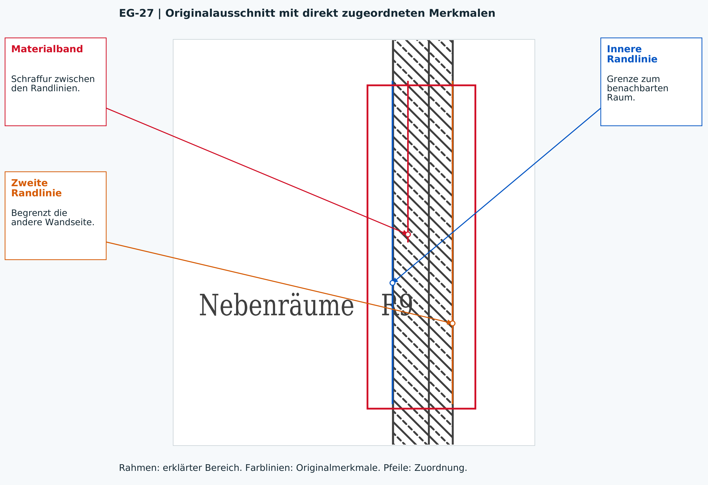

Original-PDF, Seite 1. Suchbereich in pt: [1460, 930, 1540, 1020]

### Was genau ist die Mauer?

Der geschlossene rote Rahmen umfasst das gesamte Wandstück. Im Rahmen begrenzen die blaue und orange Randlinie ein schraffiertes Band. Material zwischen zwei Kanten und die Fortsetzung nach oben und unten sind gemeinsam die Belege für einen Wandkörper.

### Warum kein Durchgang?

Zwischen den Kanten liegt Material. Der Körper kann diese Fläche nicht queren. Ein heller Zwischenraum in einer mehrschichtigen Darstellung ist ohne Öffnungsbeleg kein Gang.

### Welche Linie gehört nicht dazu?

Die Beschriftung im Raum und ihre Buchstaben bilden keine Geometriegrenze. Wanddicke nur am Original-DXF oder an einer belegten Maßangabe bestimmen.

### Direkt im Bild zugeordnete Merkmale

- Materialband: Schraffur zwischen den Randlinien. (Farbe: red)
- Innere Randlinie: Grenze zum benachbarten Raum. (Farbe: blue)
- Zweite Randlinie: Begrenzt die andere Wandseite. (Farbe: orange)

## EG-28 - Außenwand: Kern, Dämmung und Eckanschluss

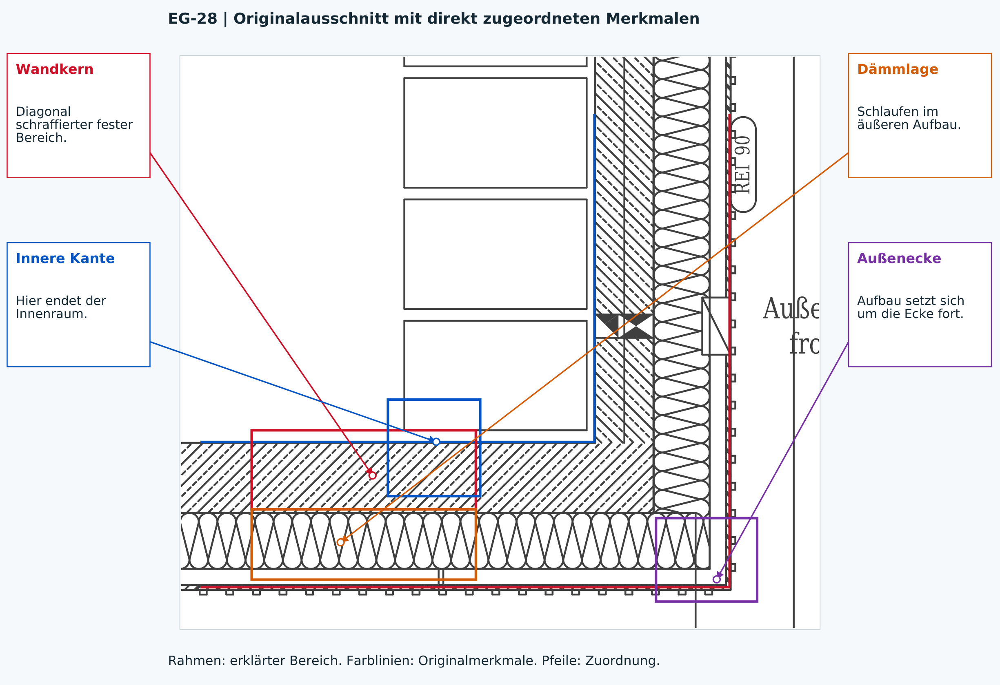

Original-PDF, Seite 1. Suchbereich in pt: [4965, 2710, 5110, 2840]

### Gesamten Aufbau erkennen

Der schraffierte Kern und die mit Schlaufen dargestellte Dämmlage gehören zum festen Außenabschluss. Die farbigen Konturen umfassen den gesamten sichtbaren Wandaufbau.

### Warum ist die Ecke wichtig?

Die Schichten setzen sich um die Ecke fort. Innenkante und Außenkante bilden zusammen eine geschlossene Begrenzung. Der Innenraum endet vor diesem Aufbau.

### Für die Raumerkennung

Die Außenseite des Kerns allein ist keine ausreichende Hindernisgrenze. Auch breite Dämm- und Bekleidungsschichten nicht als begehbaren Streifen ausgeben.

### Direkt im Bild zugeordnete Merkmale

- Wandkern: Diagonal schraffierter fester Bereich. (Farbe: red)
- Dämmlage: Schlaufen im äußeren Aufbau. (Farbe: orange)
- Innere Kante: Hier endet der Innenraum. (Farbe: blue)
- Außenecke: Aufbau setzt sich um die Ecke fort. (Farbe: purple)

## Grüne Flächen nach Nutzerkorrekturen

Die markierten Möbel, Sessel und Waschbecken sind weiß ausgespart. Die CAD-Aufbereitung berücksichtigt Kurven und ergänzte Möbelumrisse. Die grünen Flächen bleiben Lerninterpretationen; Körperbreite, lichte Höhe und Türzustand benötigen eigene Prüfungen.
