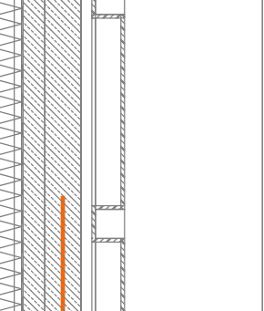
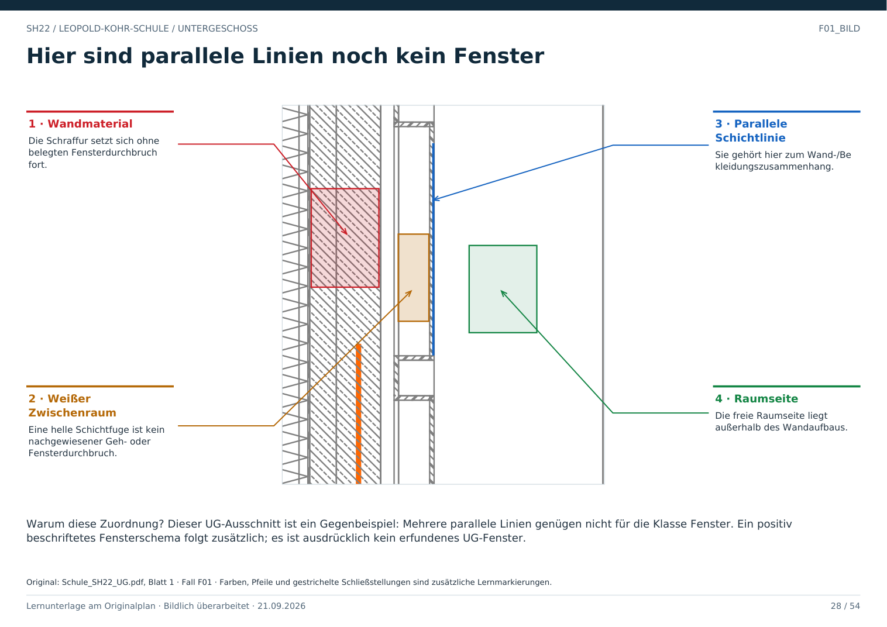

# F01 · Fenster erkennen – und falsche Fenster vermeiden

Geschoss: UG. PDF-Buch: Seite 27. Beschriftetes Detail: Seite 28.

## Was ein Fenster wäre

Eine Öffnung in einer Wand mit zugehörigen Rahmen- bzw. Glaslinien. Brüstungshöhe, Fensterkennzeichen und ein passender Schnitt oder eine Ansicht können die Zuordnung absichern.

## Was dieser UG-Ausschnitt zeigt

Hier laufen mehrere Schichten mit Materialmustern parallel. Es ist kein eindeutig belegter Fensterdurchbruch. Das Beispiel ist deshalb eine Gegenprobe, kein positives Fensterbeispiel.

## Warum parallel nicht genügt

Wandbekleidung, Vorsatzschale und Schichtgrenzen erzeugen ebenfalls parallele Linien. Eine Fensterzuordnung braucht zusätzlich die passende Öffnung und weitere Merkmale.

## Folge für einen Weg

Ein bestätigtes Fenster ist noch kein gewöhnliches Gehportal. Glas, Rahmen, Brüstung und Höhenlage können das Durchgehen verhindern. Eine Flurverbindung darf daraus nicht automatisch entstehen.

## Direkt beschriftetes Bild

Dieser UG-Ausschnitt ist ein Gegenbeispiel: Mehrere parallele Linien genügen nicht für die Klasse Fenster. Ein positiv beschriftetes Fensterschema folgt zusätzlich; es ist ausdrücklich kein erfundenes UG-Fenster.

## Prüffrage

Sind mehrere dünne parallele Linien ein sicherer Fensternachweis?

**Erwartete Antwort:** Nein. Dieser Ausschnitt zeigt, warum der Wandzusammenhang mitgeprüft werden muss.

## Nachweis

Originalquelle: `../quellen/Schule_SH22_UG.pdf`, Blatt 1. Ausschnitt in PDF-Punkten: `[31.53314208984375, 395.9178466796875, 127.89755249023438, 509.2877502441406]`. Original und Rotfassung liegen in `../bilder/`. Der Ausschnitt ist kein Raum- oder Objektpolygon.
