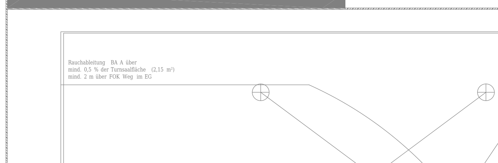
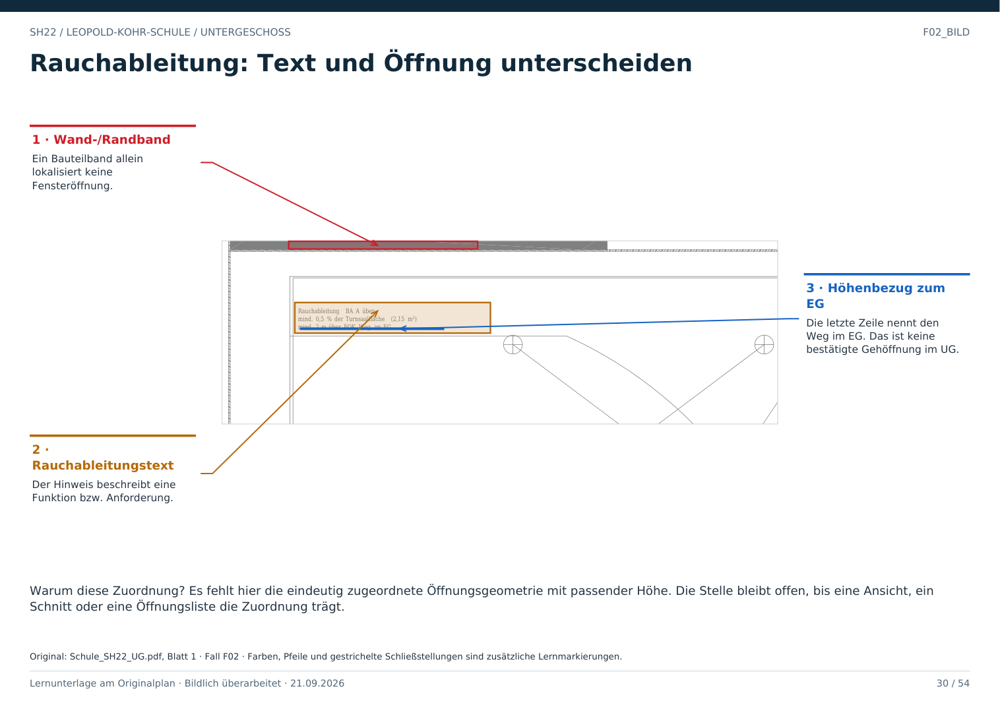

# F02 · Wo sind im UG Fenster sicher belegt?

Geschoss: UG. PDF-Buch: Seite 29. Beschriftetes Detail: Seite 30.

## Ergebnis dieses Pakets

Im geprüften UG-Blatt wurde kein Fenster eindeutig lokalisiert und als bestätigt annotiert. Das bedeutet nicht, dass das Gebäude keine Fenster hat.

## Der sichtbare Hinweis

Bei der Halle steht ein Hinweis zur Rauchableitung. Er nennt eine Höhenlage über FOK Weg im EG. Diese Textangabe allein lokalisiert kein gewöhnliches Fenster auf dem UG-Laufniveau.

## Was zur Klärung fehlt

Eine passende Ansicht, ein Schnitt, eine Öffnungskennzeichnung oder eine Fensterliste mit Bezug auf diese Stelle. Erst danach kann ein konkreter Fensterdatensatz bestätigt werden.

## Für Claude

Status „nicht eindeutig zugeordnet“ speichern. Weder eine fiktive Fensterposition noch eine Fensterzahl für das ganze Gebäude ableiten. Die Rohbeobachtung und die fehlende Bestätigung getrennt dokumentieren.

## Direkt beschriftetes Bild

Es fehlt hier die eindeutig zugeordnete Öffnungsgeometrie mit passender Höhe. Die Stelle bleibt offen, bis eine Ansicht, ein Schnitt oder eine Öffnungsliste die Zuordnung trägt.

## Prüffrage

Beweist der Rauchableitungstext eine begehbare Öffnung im UG?

**Erwartete Antwort:** Nein. Er liefert ohne lokale Zuordnung und Höhenabgleich keinen UG-Gehdurchgang.

## Nachweis

Originalquelle: `../quellen/Schule_SH22_UG.pdf`, Blatt 1. Ausschnitt in PDF-Punkten: `[70, 70, 540, 225]`. Original und Rotfassung liegen in `../bilder/`. Der Ausschnitt ist kein Raum- oder Objektpolygon.
