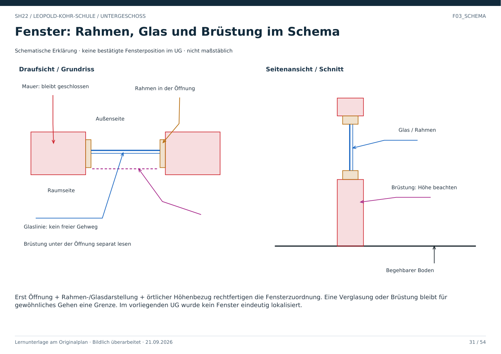

# F03_SCHEMA · Fenster in Draufsicht und Schnitt

Dies ist eine allgemeine schematische Erklärung, keine bestätigte Fensterposition im UG und keine maßstäbliche Projektzeichnung.

Rot zeigt die festen Mauerbereiche. Orange zeigt den Rahmen in der Öffnung. Blau zeigt die Verglasung. Violett weist auf die Brüstung unter der Öffnung hin. Der Schnitt macht sichtbar, warum eine Öffnung oberhalb einer Brüstung nicht automatisch einen Gehweg bildet.

Für die Fensterzuordnung im Projekt müssen Öffnungsgeometrie, Rahmen-/Glasdarstellung und örtlicher Höhenbezug zusammenpassen. F01 und F02 erklären, weshalb die vorliegenden UG-Stellen noch keine eindeutige positive Fensterzuordnung erlauben.

**Prüffrage:** Darf dieses Schema als zusätzliches Fenster im UG gespeichert werden?

**Antwort:** Nein. Es erklärt Begriffe und ist keine Quelle für eine neue Projektposition.
