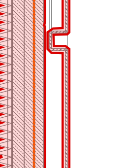
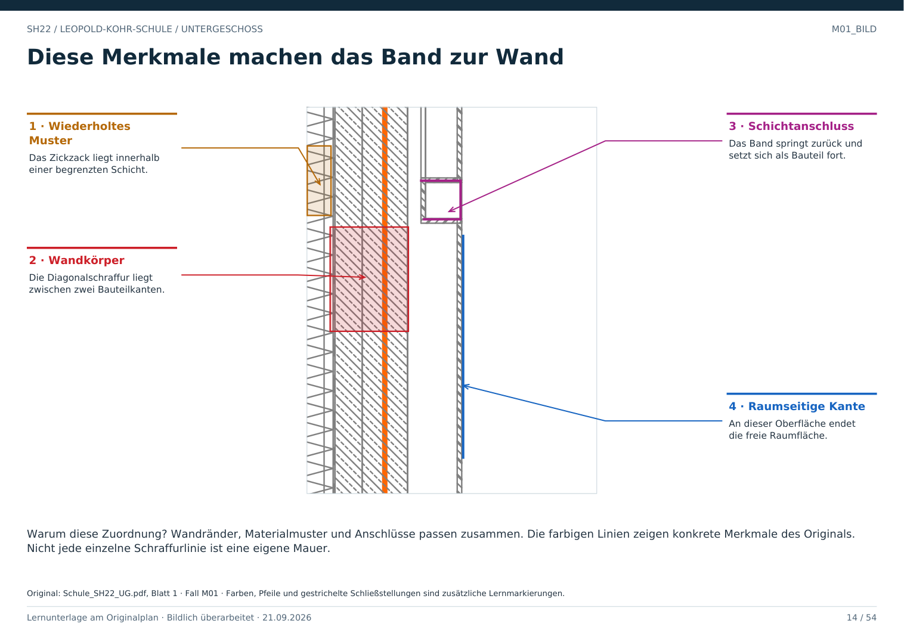

# M01 · Was ist eine Mauer?

Geschoss: UG. PDF-Buch: Seite 13. Beschriftetes Detail: Seite 14.

## Beobachtung

Das senkrechte Band besitzt mehrere klare Ränder. Dazwischen liegen Diagonalschraffur und ein wiederholtes Zickzackmuster. Rechts beginnt die freie Hallenseite.

## Begründung

Die Muster sind in begrenzten Schichten organisiert und setzen sich entlang der Wand fort. Im Gesamtplan schließen sie an andere Wandabschnitte an. Diese Kombination ist stärker als eine einzelne dicke Linie.

## Was man ablesen kann

Lage, Verlauf, Ecken, Schichtfolge und Anschlüsse sind sichtbar. Exakte Dicke braucht eine bestätigte Bemaßung oder kalibrierte Geometrie. Material und Tragwirkung nicht allein aus Grauton oder Muster ableiten.

## Folge für die Erkennung

Die komplette bauliche Dicke bildet eine Sperre auf dem relevanten Niveau. Die freie Raumfläche endet an der raumseitigen Oberfläche. Dünne Schichtzwischenräume sind keine begehbaren Räume.

## Direkt beschriftetes Bild

Wandränder, Materialmuster und Anschlüsse passen zusammen. Die farbigen Linien zeigen konkrete Merkmale des Originals. Nicht jede einzelne Schraffurlinie ist eine eigene Mauer.

## Prüffrage

Ist eine Schraffurlinie selbst die ganze Wand?

**Erwartete Antwort:** Nein. Wandränder, Schichten, Muster und Anschlüsse müssen zusammen gelesen werden.

## Nachweis

Originalquelle: `../quellen/Schule_SH22_UG.pdf`, Blatt 1. Ausschnitt in PDF-Punkten: `[31.53314208984375, 531.9617309570312, 116.56056213378906, 645.3316040039062]`. Original und Rotfassung liegen in `../bilder/`. Der Ausschnitt ist kein Raum- oder Objektpolygon.
