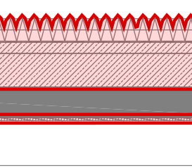
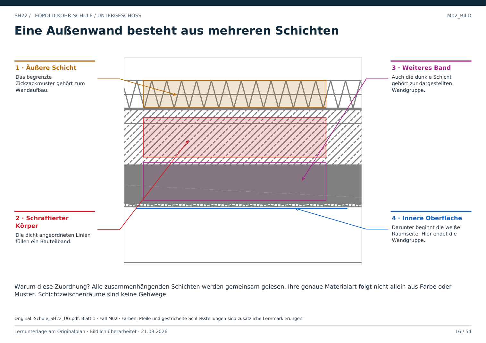

# M02 · Breite Außenmauer: alle Schichten gehören dazu

Geschoss: UG. PDF-Buch: Seite 15. Beschriftetes Detail: Seite 16.

## Beobachtung

Am oberen Hallenrand liegen mehrere horizontale Schichten. Die Quelle zeigt Zickzackmuster, Diagonalschraffur, dunkle Bänder und die anschließende weiße Raumseite.

## Warum vollständig markieren?

Ein Mensch kann nicht durch den Kern oder durch die Bekleidung gehen. Für die Raumhülle zählt deshalb die gesamte zusammenhängende Bauteilgruppe, einschließlich ihrer Außen- und Innenseite.

## Welche Linie zählt zum Raum?

Für die freie Bodenfläche wird die raumseitige Oberfläche verfolgt. Eine weiter außen liegende Schichtlinie würde Wandmaterial zur Raumfläche zählen.

## Grenze der Aussage

Schraffur und Quelllayer liefern Hinweise auf den Wandaufbau. Eine verbindliche Materialbezeichnung oder statische Einstufung verlangt weitere Planangaben.

## Direkt beschriftetes Bild

Alle zusammenhängenden Schichten werden gemeinsam gelesen. Ihre genaue Materialart folgt nicht allein aus Farbe oder Muster. Schichtzwischenräume sind keine Gehwege.

## Prüffrage

Sind vier parallele Schichten vier Räume?

**Erwartete Antwort:** Nein. Sie sind hier Teile eines gemeinsamen Wandaufbaus.

## Nachweis

Originalquelle: `../quellen/Schule_SH22_UG.pdf`, Blatt 1. Ausschnitt in PDF-Punkten: `[241.2674560546875, 21.797191619873047, 331.96337890625, 101.15612030029297]`. Original und Rotfassung liegen in `../bilder/`. Der Ausschnitt ist kein Raum- oder Objektpolygon.
