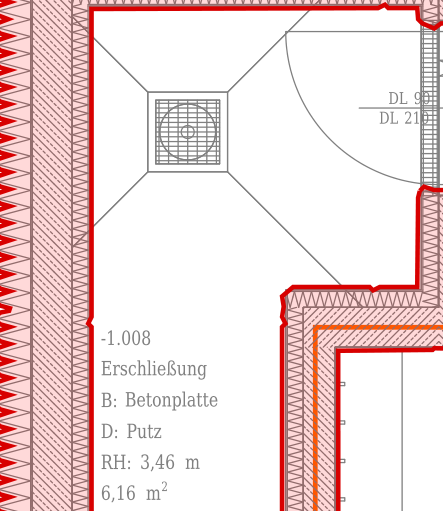
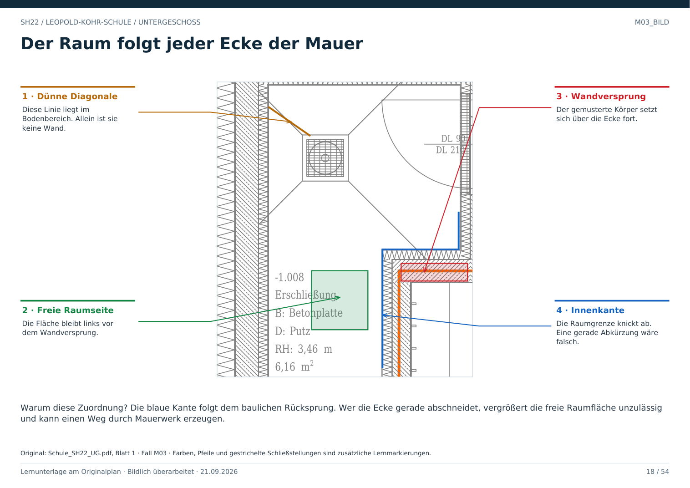

# M03 · Wandecken und Rücksprünge richtig verfolgen

Geschoss: UG. PDF-Buch: Seite 17. Beschriftetes Detail: Seite 18.

## Beobachtung

Die Erschließung -1.008 besitzt an der rechten Seite einen Rücksprung. Das gemusterte Wandband folgt der Ecke; die Fläche ist dadurch nicht einfach rechteckig.

## Warum das wichtig ist

Eine gerade Verbindung zwischen den äußersten Punkten würde eine Ecke des Wandkörpers abschneiden. Dadurch könnte eine berechnete Route durch Mauerwerk laufen.

## Vorgehen

An einer Innenkante beginnen, jeden Richtungswechsel nachvollziehen und bis zur nächsten Öffnung weitergehen. Nach der Öffnung am passenden Wandende fortsetzen.

## Für Claude

Eine Raumkontur darf zur Trennung an einem Türportal rechnerisch geschlossen werden. Diese virtuelle Trennlinie ist aber keine massive Wand und darf die Türverbindung nicht löschen.

## Direkt beschriftetes Bild

Die blaue Kante folgt dem baulichen Rücksprung. Wer die Ecke gerade abschneidet, vergrößert die freie Raumfläche unzulässig und kann einen Weg durch Mauerwerk erzeugen.

## Prüffrage

Darf man einen Rücksprung für eine einfachere Kontur weglassen?

**Erwartete Antwort:** Nein. Er verändert die freie Raumfläche und die mögliche Bewegung.

## Nachweis

Originalquelle: `../quellen/Schule_SH22_UG.pdf`, Blatt 1. Ausschnitt in PDF-Punkten: `[37.201637268066406, 1127.1536865234375, 184.58250427246094, 1297.20849609375]`. Original und Rotfassung liegen in `../bilder/`. Der Ausschnitt ist kein Raum- oder Objektpolygon.
