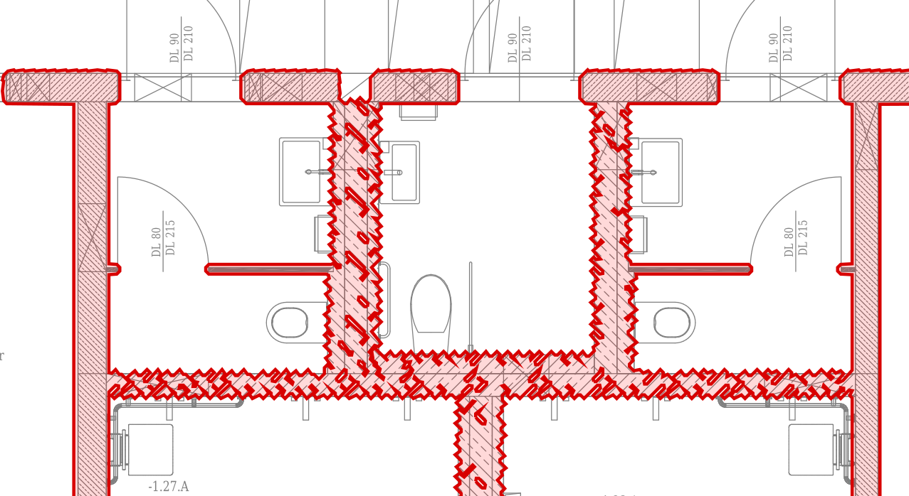
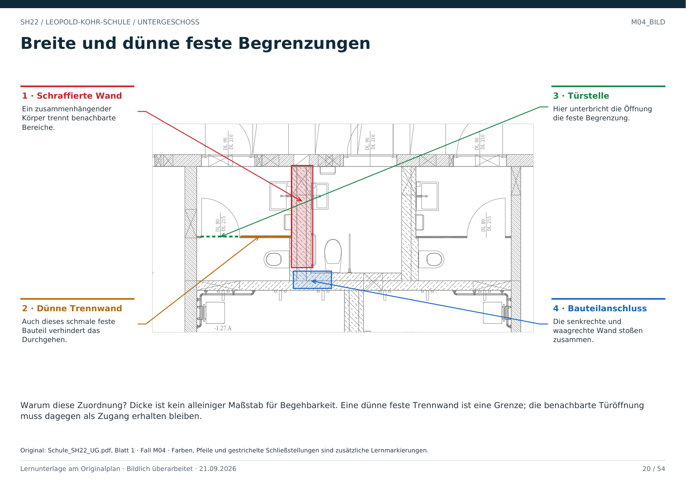

# M04 · Dünne feste Trennwände bleiben Begrenzungen

Geschoss: UG. PDF-Buch: Seite 19. Beschriftetes Detail: Seite 20.

## Beobachtung

Zwischen den kleinen Teilbereichen liegen schmale feste Bauteile. Einige enden an einer Türöffnung, andere schließen an die längere Trennwand an.

## Warum Wanddicke allein nicht genügt

Eine dünne feste Trennwand ist für das Durchgehen ebenso eine Grenze wie eine dicke Außenwand. Eine einzelne dünne Maß- oder Projektionslinie ist dagegen keine solche Grenze.

## Abgrenzung

Begrenzung, Materialdarstellung, Anschlüsse und vorhandene Öffnungen gemeinsam prüfen. Ein Objekt innerhalb eines Bereichs ersetzt nicht dessen Raumhülle.

## Für Claude

Hier werden nur feste Grenzen und Zugänge gelernt. Waschbecken, WC und Raumnutzung sind keine Klassifikationsziele dieses Lernpakets.

## Direkt beschriftetes Bild

Dicke ist kein alleiniger Maßstab für Begehbarkeit. Eine dünne feste Trennwand ist eine Grenze; die benachbarte Türöffnung muss dagegen als Zugang erhalten bleiben.

## Prüffrage

Darf eine dünne Trennwand als freie Fläche behandelt werden?

**Erwartete Antwort:** Nein, wenn die Quelle sie als feste bauliche Begrenzung zeigt.

## Nachweis

Originalquelle: `../quellen/Schule_SH22_UG.pdf`, Blatt 1. Ausschnitt in PDF-Punkten: `[263.9414367675781, 1195.1756591796875, 689.0785522460938, 1427.5838623046875]`. Original und Rotfassung liegen in `../bilder/`. Der Ausschnitt ist kein Raum- oder Objektpolygon.
