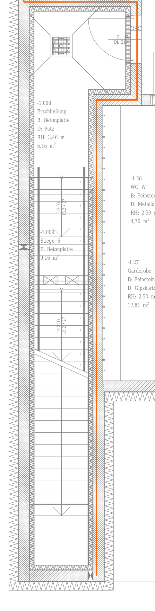
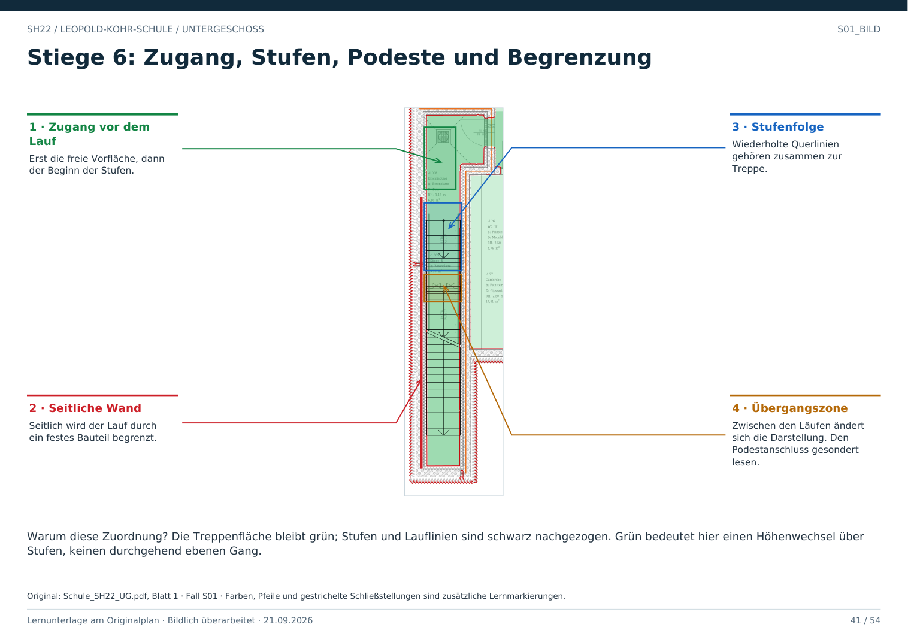

# S01 · Eine Treppe als Ganzes erkennen

Geschoss: UG. PDF-Buch: Seite 40. Beschriftetes Detail: Seite 41.

## Beobachtung

In dem schmalen langen Bereich liegen wiederholte Querlinien, Lauflinien, Pfeile, nummerierte Stufen und Podeste. Die Raumangabe benennt Stiege 6.

## Warum Treppe?

Die Kombination aus Stufenfolge, Richtungszeichen und Treppenbeschriftung passt zusammen. Weder die schmale Form noch eine einzelne Querlinie würde allein genügen.

## Was man ablesen kann

Lage und Verlauf der Läufe, Zwischenpodeste, Begrenzungen sowie örtliche Steigungsangaben. Ein Lauf und ein Podest erfüllen unterschiedliche Funktionen.

## Für Claude

Die Treppe als Verbindung mit Höhenwechsel erfassen. Nicht aus jeder Stufe einen Raum oder eine unpassierbare Querwand bilden. Ein Treppenauge ist dagegen keine begehbare Abkürzung.

## Direkt beschriftetes Bild

Die Treppenfläche bleibt grün; Stufen und Lauflinien sind schwarz nachgezogen. Grün bedeutet hier einen Höhenwechsel über Stufen, keinen durchgehend ebenen Gang.

## Prüffrage

Sind die vielen Querlinien viele Wände?

**Erwartete Antwort:** Nein. Zusammen mit den übrigen Zeichen zeigen sie hier eine Stufenfolge.

## Nachweis

Originalquelle: `../quellen/Schule_SH22_UG.pdf`, Blatt 1. Ausschnitt in PDF-Punkten: `[25.864646911621094, 1115.816650390625, 212.9249725341797, 1852.7210693359375]`. Original und Rotfassung liegen in `../bilder/`. Der Ausschnitt ist kein Raum- oder Objektpolygon.
