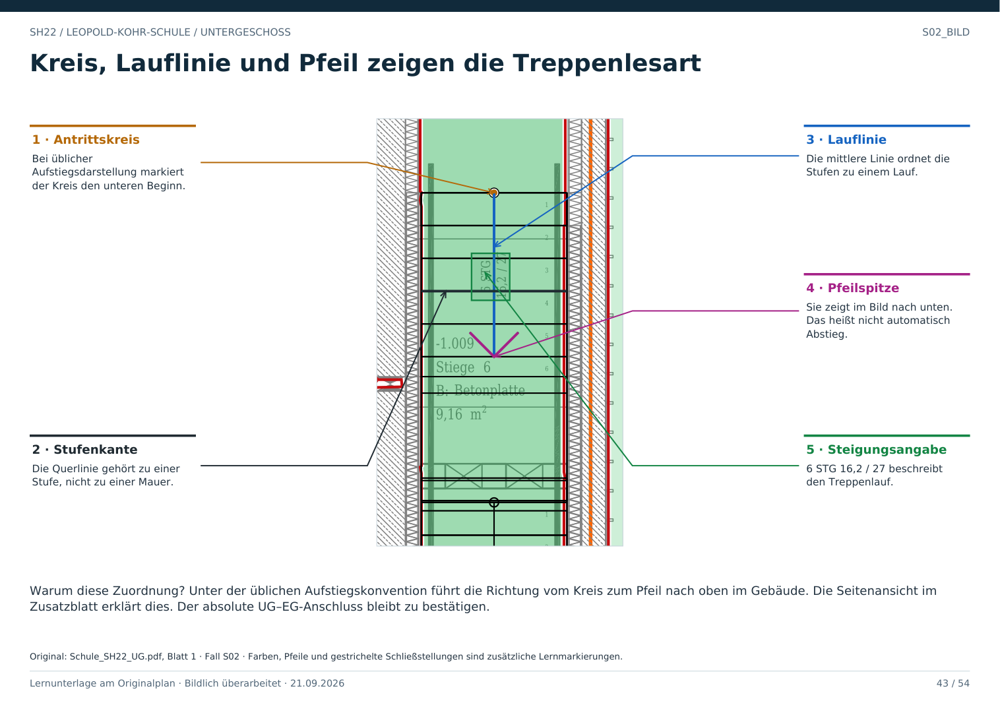

# S02 · Rauf oder runter: Bildrichtung ist keine Höhenrichtung

Geschoss: UG. PDF-Buch: Seite 42. Beschriftetes Detail: Seite 43.

## Direkt sichtbar

Die Lauflinie beginnt am Kreis, durchquert die nummerierten Stufen und endet in einer nach unten im Bild gerichteten Spitze. Daneben steht 6 STG 16,2 / 27.

## Übliche Lesart

Bei der üblichen Aufstiegsdarstellung kennzeichnet der Kreis den Antritt; die Pfeilrichtung führt zum höher gelegenen Austritt. Unter dieser Voraussetzung zeigt der Aufstieg hier nach unten auf dem Papier.

## So wird es bestätigt

Die Darstellungskonvention mit Legende und Schnitt abgleichen, Anfangs- und Endhöhe zuordnen und den Anschluss im Nachbargeschoss prüfen. Der Weg in Gegenrichtung wäre der Abstieg derselben Treppe.

## Status in diesem Paket

Stufenfolge und Bildrichtung sind belegt. Der absolute Höhen- und Geschossanschluss ist nicht abschließend bestätigt. Deshalb keine feste UG–EG-Verbindung aus dem Pfeil allein exportieren.

## Direkt beschriftetes Bild

Unter der üblichen Aufstiegskonvention führt die Richtung vom Kreis zum Pfeil nach oben im Gebäude. Die Seitenansicht im Zusatzblatt erklärt dies. Der absolute UG–EG-Anschluss bleibt zu bestätigen.

## Prüffrage

Bedeutet ein Pfeil nach unten im Bild automatisch Abstieg?

**Erwartete Antwort:** Nein. Unter der üblichen Aufstiegskonvention kann er gerade den Aufstieg zeigen. Höhenbezug und Projektkonvention bleiben zu bestätigen.

## Nachweis

Originalquelle: `../quellen/Schule_SH22_UG.pdf`, Blatt 1. Ausschnitt in PDF-Punkten: `[48.53862762451172, 1297.20849609375, 156.24002075195312, 1484.268798828125]`. Original und Rotfassung liegen in `../bilder/`. Der Ausschnitt ist kein Raum- oder Objektpolygon.
