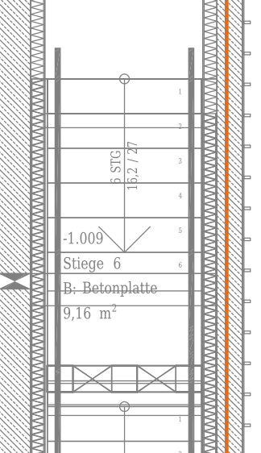
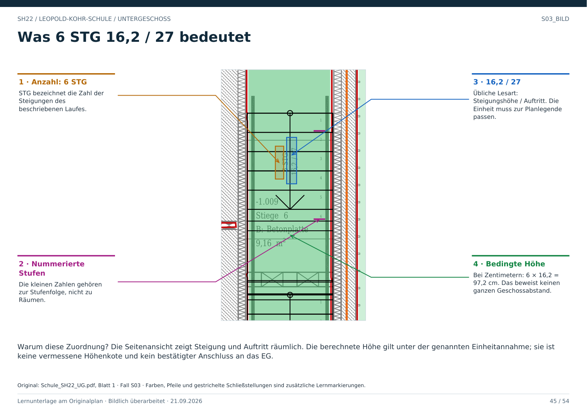

# S03 · Stufenangaben lesen und richtig zuordnen

Geschoss: UG. PDF-Buch: Seite 44. Beschriftetes Detail: Seite 45.

## Beschriftung im Original

6 STG 16,2 / 27 gehört zur gezeigten Stufenfolge. STG bezeichnet Steigungen. Die anschließenden Werte werden in der üblichen Schreibweise als Steigungshöhe und Auftritt gelesen.

## Bedingte Rechnung

Wenn die Werte in Zentimetern gelten, ergeben 6 × 16,2 cm einen Höhenunterschied von 97,2 cm. Das ist eine Rechnung aus der Beschriftung, kein gemessener Geschossabstand.

## Nicht verwechseln

Die sechs Steigungen bedeuten nicht zwingend sechs volle horizontale Auftritte innerhalb desselben Laufes. Podeste und die Darstellung des letzten Austritts müssen mitgelesen werden.

## Für Claude

Rohtext, interpretierte Anzahl, angenommene Einheit und bestätigte Höhen getrennt speichern. Aus der Steigungsangabe nicht automatisch auf das Erdgeschoss schließen.

## Direkt beschriftetes Bild

Die Seitenansicht zeigt Steigung und Auftritt räumlich. Die berechnete Höhe gilt unter der genannten Einheitannahme; sie ist keine vermessene Höhenkote und kein bestätigter Anschluss an das EG.

## Prüffrage

Beweist 6 STG, dass diese Teiltreppe ein ganzes Geschoss verbindet?

**Erwartete Antwort:** Nein. Sie kann nur einen Teil eines Höhenwechsels abbilden.

## Nachweis

Originalquelle: `../quellen/Schule_SH22_UG.pdf`, Blatt 1. Ausschnitt in PDF-Punkten: `[48.53862762451172, 1297.20849609375, 156.24002075195312, 1484.268798828125]`. Original und Rotfassung liegen in `../bilder/`. Der Ausschnitt ist kein Raum- oder Objektpolygon.
