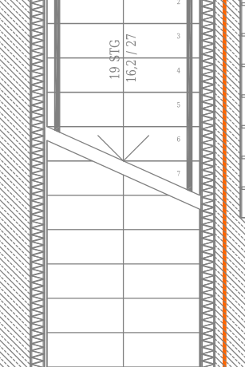
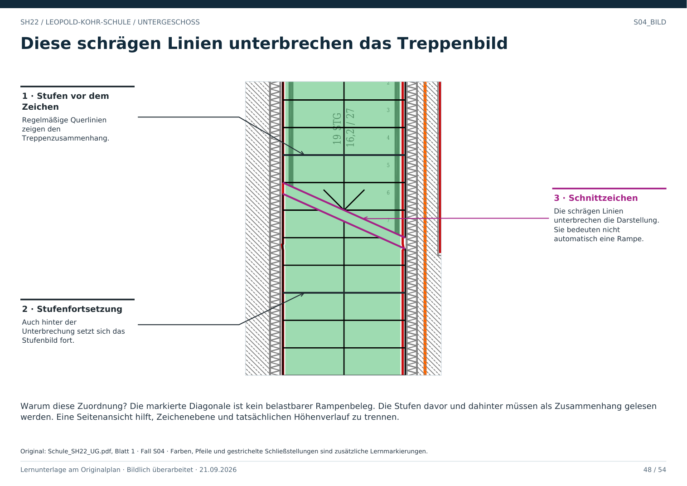

# S04 · Schräger Treppenschnitt ist keine Rampe

Geschoss: UG. PDF-Buch: Seite 47. Beschriftetes Detail: Seite 48.

## Beobachtung

Eine schräge Zeichenlinie unterbricht die regelmäßige Stufendarstellung. Auf beiden Seiten bleibt der Zusammenhang mit dem Treppenlauf erkennbar.

## Begründung

Eine solche Linie kann die zeichnerische Unterbrechung bzw. Schnittdarstellung eines weiterführenden Laufes markieren. Sie ist kein Beweis für einen schrägen ebenen Gehbelag.

## So unterscheiden

Für eine Rampe müssten Verlauf, Ränder und Neigungshinweise zusammenpassen. Hier sprechen die wiederholten Stufen und der umliegende Treppenkontext für eine Treppendarstellung.

## Für Claude

Die Unterbrechung nicht als massive Diagonalwand und nicht als zusätzlichen Raum behandeln. Die Fortsetzung nur anhand passender weiterer Darstellung anbinden.

## Direkt beschriftetes Bild

Die markierte Diagonale ist kein belastbarer Rampenbeleg. Die Stufen davor und dahinter müssen als Zusammenhang gelesen werden. Eine Seitenansicht hilft, Zeichenebene und tatsächlichen Höhenverlauf zu trennen.

## Prüffrage

Macht eine diagonale Linie zwischen Stufen daraus eine Rampe?

**Erwartete Antwort:** Nein. Der gesamte Darstellungskontext ist entscheidend.

## Nachweis

Originalquelle: `../quellen/Schule_SH22_UG.pdf`, Blatt 1. Ausschnitt in PDF-Punkten: `[48.53862762451172, 1484.268798828125, 150.571533203125, 1637.3182373046875]`. Original und Rotfassung liegen in `../bilder/`. Der Ausschnitt ist kein Raum- oder Objektpolygon.
