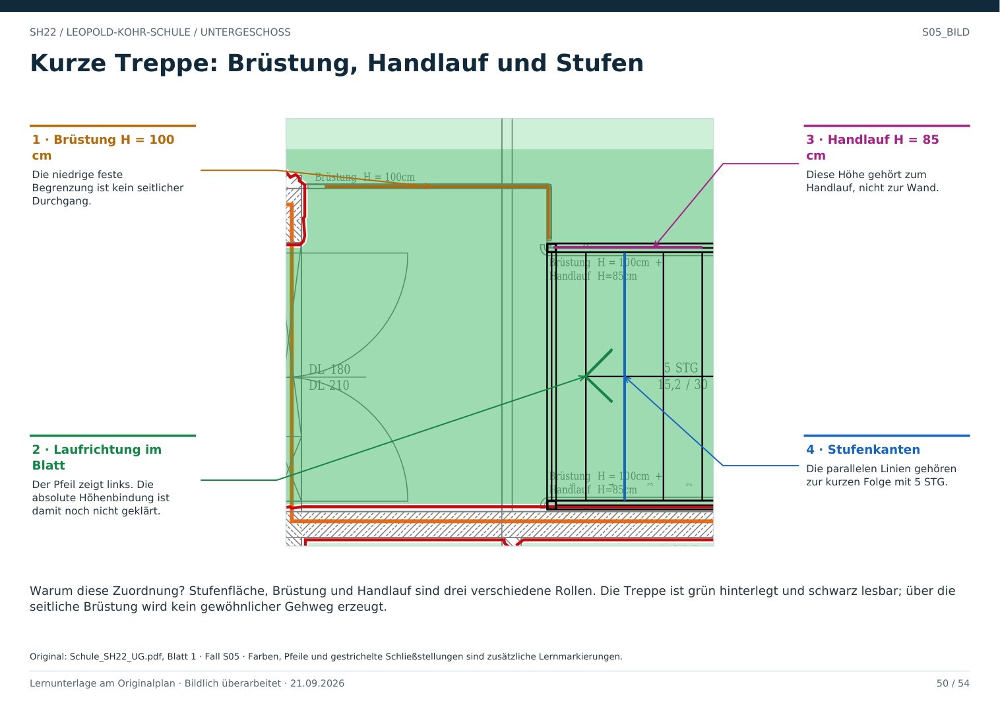

# S05 · Kurze Treppe, Brüstung und Handlauf trennen

Geschoss: UG. PDF-Buch: Seite 49. Beschriftetes Detail: Seite 50.

## Beobachtung

Rechts liegen 5 STG 15,2 / 30. Die seitlichen Begrenzungen tragen Brüstung H = 100 cm und Handlauf H = 85 cm.

## Drei verschiedene Objekte

Stufen tragen den Höhenwechsel. Die Brüstung bildet eine seitliche Begrenzung. Der Handlauf ist ein eigenes Bauteil. Seine Höhe darf nicht als Wandhöhe gespeichert werden.

## Begehbarkeit

Der Lauf wird längs über die Stufen benutzt. Die seitliche Brüstung ist kein freier Durchgang, obwohl sie nicht bis zur Decke reicht. Klettern wird nicht als gewöhnlicher Gehweg modelliert.

## Für Claude

Auch wenige Stufen bedeuten Niveauwechsel. Treppenrichtung und absolute Höhen werden separat bestätigt; das kurze Bauteil ist nicht automatisch eine Verbindung in ein anderes Geschoss.

## Direkt beschriftetes Bild

Stufenfläche, Brüstung und Handlauf sind drei verschiedene Rollen. Die Treppe ist grün hinterlegt und schwarz lesbar; über die seitliche Brüstung wird kein gewöhnlicher Gehweg erzeugt.

## Prüffrage

Ist jede nicht raumhohe Begrenzung frei durchgehbar?

**Erwartete Antwort:** Nein. Eine Brüstung kann den gewöhnlichen seitlichen Durchgang verhindern.

## Nachweis

Originalquelle: `../quellen/Schule_SH22_UG.pdf`, Blatt 1. Ausschnitt in PDF-Punkten: `[1635.7171630859375, 1070.46875, 1811.4405517578125, 1246.1920166015625]`. Original und Rotfassung liegen in `../bilder/`. Der Ausschnitt ist kein Raum- oder Objektpolygon.
