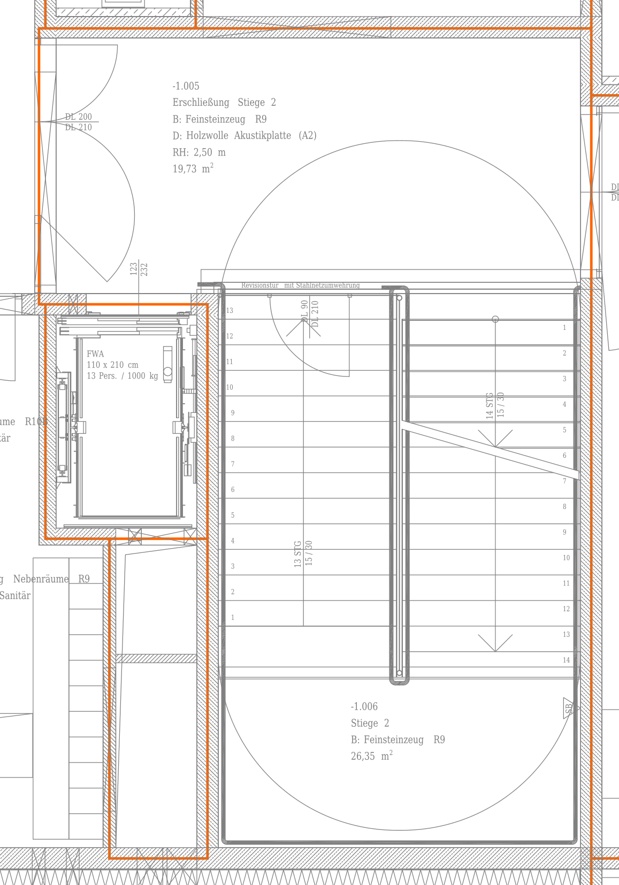
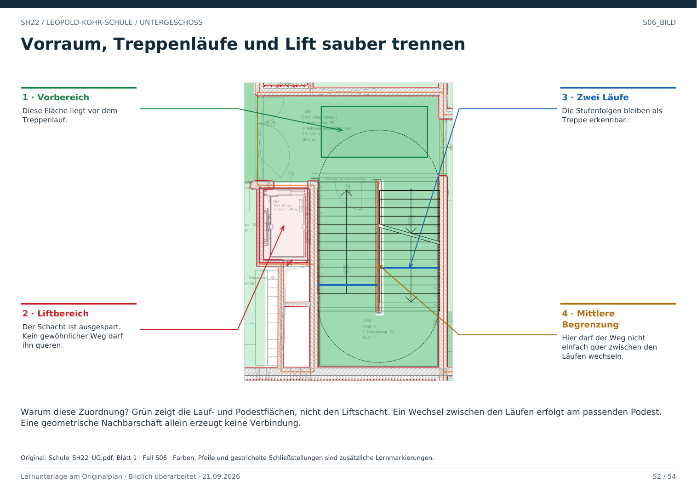

# S06 · Vorraum, Treppe und Lift getrennt erkennen

Geschoss: UG. PDF-Buch: Seite 51. Beschriftetes Detail: Seite 52.

## Beobachtung

Oben liegt ein Vorbereich, darunter Stiege 2 mit Läufen und Podest. Links neben dem Lauf ist ein eigener Liftbereich eingezeichnet. Ein großer Bogen reicht über den Treppenbereich.

## Bogen im Zusammenhang

Nicht jeder große Bogen ist ein Türschwenk. Hier müssen Lauflinien und Treppendarstellung von den wirklichen Türblättern an den Wandöffnungen unterschieden werden.

## Richtige Verbindungen

Der Vorbereich kann über einen belegten Zugang zur Treppe führen. Der Liftschacht ist keine freie Bodenfläche. Eine Liftverbindung setzt zusätzliche betriebliche und geschossbezogene Informationen voraus.

## Für Claude

Diese Objekte als getrennte Rollen speichern. Die geometrische Nachbarschaft allein verbindet weder die Geschosse noch den Vorraum mit dem Schacht.

## Direkt beschriftetes Bild

Grün zeigt die Lauf- und Podestflächen, nicht den Liftschacht. Ein Wechsel zwischen den Läufen erfolgt am passenden Podest. Eine geometrische Nachbarschaft allein erzeugt keine Verbindung.

## Prüffrage

Ist der Liftbereich ein kleiner frei durchgehbarer Raum?

**Erwartete Antwort:** Nein. Er darf nicht als gewöhnlicher Flurdurchgang verwendet werden.

## Nachweis

Originalquelle: `../quellen/Schule_SH22_UG.pdf`, Blatt 1. Ausschnitt in PDF-Punkten: `[1166.0721435546875, 1046.4749755859375, 1551.440673828125, 1597.95068359375]`. Original und Rotfassung liegen in `../bilder/`. Der Ausschnitt ist kein Raum- oder Objektpolygon.
