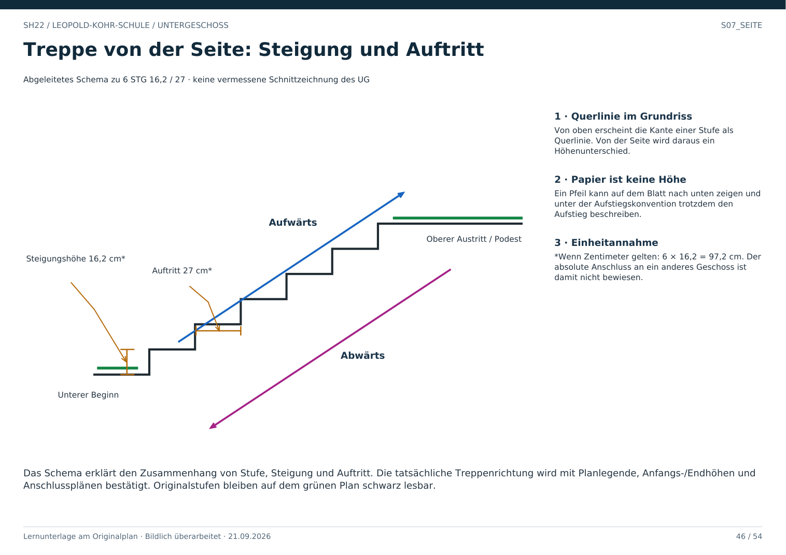

# S07_SEITE · Treppe von der Seite

Das Schema erklärt die Quelle „6 STG 16,2 / 27“. Es ist kein vermessener Schnitt der Stiege 6. Die Zeichnung zeigt sechs Steigungen, die horizontalen Auftritte sowie den oberen Austritt.

Von oben sieht man die Querlinie einer Stufenkante. Von der Seite erkennt man, dass diese Kante mit einer Höhenänderung verbunden ist. Der blaue Pfeil verläuft aufwärts, der violette in Gegenrichtung abwärts. Das ist ein räumlicher Zusammenhang; die Pfeilrichtung auf dem Grundrissblatt allein ist keine absolute Höhenangabe.

Bei angenommener Einheit Zentimeter ergeben sechs Steigungen zu 16,2 cm insgesamt 97,2 cm. Die Angabe 27 wird als Auftritt gelesen. Vor metrischer Anwendung müssen die Einheit und die Projektkonvention bestätigt werden. Die Zahl der Steigungen wird nicht mit der Zahl von Geschossen gleichgesetzt.

**Prüffrage:** Beweist diese Seitenansicht den Anschluss vom UG an das EG?

**Antwort:** Nein. Dafür fehlen hier bestätigte Anfangs-/Endhöhen und der Anschlussabgleich mit dem weiteren Plan.
