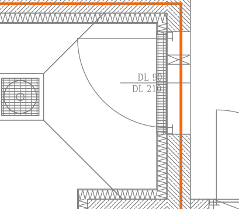
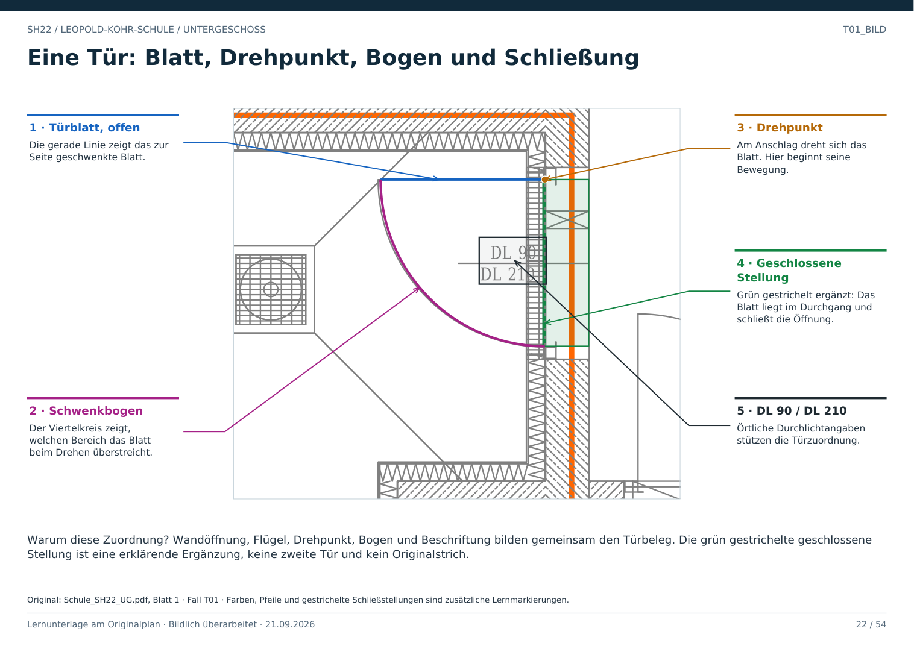

# T01 · Tür erkennen: Öffnung, Flügel und Bogen

Geschoss: UG. PDF-Buch: Seite 21. Beschriftetes Detail: Seite 22.

## Beobachtung

Rechts liegt eine Unterbrechung des gemusterten Wandbands. Ein gerades Blatt und ein Viertelkreisbogen gehören zu dieser Stelle. Die Beschriftung lautet DL 90 / DL 210.

## Warum eine Tür?

Wandenden, Öffnung, angeschlagener Flügel, Schwenkbogen und örtliche Maßangaben passen zueinander. Ein Bogen allein würde diese Aussage nicht tragen.

## Was ist ablesbar?

Lage, Anzahl der Flügel und die dargestellte Öffnungsseite. DL bezeichnet hier die Tür-Durchlichtangaben; 90 und 210 werden als Breite und Höhe gelesen. Einheiten und Detailbezug vor metrischer Verwendung im Projekt bestätigen.

## Was bleibt offen?

Der Grundriss zeigt die geplante Tür, nicht ob sie heute geöffnet, versperrt oder zugänglich ist. Die Verbindung deshalb als Türportal mit unbekanntem Betriebszustand speichern.

## Direkt beschriftetes Bild

Wandöffnung, Flügel, Drehpunkt, Bogen und Beschriftung bilden gemeinsam den Türbeleg. Die grün gestrichelte geschlossene Stellung ist eine erklärende Ergänzung, keine zweite Tür und kein Originalstrich.

## Prüffrage

Ist der Bogen eine gekrümmte Wand?

**Erwartete Antwort:** Nein. Er beschreibt hier den Schwenkbereich des Türblatts.

## Nachweis

Originalquelle: `../quellen/Schule_SH22_UG.pdf`, Blatt 1. Ausschnitt in PDF-Punkten: `[88.21809387207031, 1115.816650390625, 224.261962890625, 1234.8551025390625]`. Original und Rotfassung liegen in `../bilder/`. Der Ausschnitt ist kein Raum- oder Objektpolygon.
