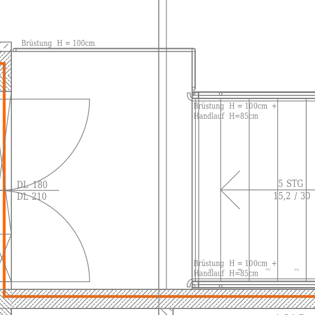
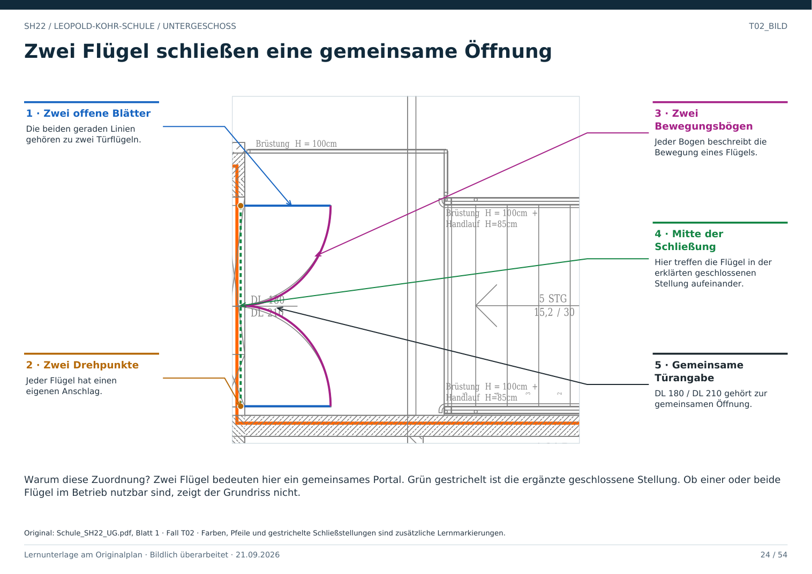

# T02 · Zwei Flügel, eine gemeinsame Öffnung

Geschoss: UG. PDF-Buch: Seite 23. Beschriftetes Detail: Seite 24.

## Beobachtung

Links liegen zwei Flügel mit zwei Bögen an einer gemeinsamen breiten Öffnung. Daneben steht DL 180 / DL 210. Rechts folgt eine kleine Treppe.

## Begründung

Beide Flügel schließen denselben Wanddurchbruch. Sie sind Teile einer zweiflügeligen Tür, nicht zwei voneinander unabhängige Raumverbindungen.

## Wie die Angaben helfen

Die gemeinsame Beschriftung beschreibt die Türstelle. Daraus nicht automatisch eine dauerhaft freie Breite von 180 ableiten: Die tatsächlich geöffneten Flügel und der Betrieb sind unbekannt.

## Übergang weiter prüfen

Hinter der Tür liegt nicht überall eine ebene Fläche. Der Zugang zur Treppe und die seitlichen Brüstungen gehören in ein eigenes Verbindungsmodell.

## Direkt beschriftetes Bild

Zwei Flügel bedeuten hier ein gemeinsames Portal. Grün gestrichelt ist die ergänzte geschlossene Stellung. Ob einer oder beide Flügel im Betrieb nutzbar sind, zeigt der Grundriss nicht.

## Prüffrage

Sind zwei Bögen immer zwei Türen?

**Erwartete Antwort:** Nein. Hier gehören zwei Flügel zu einer gemeinsamen Türöffnung.

## Nachweis

Originalquelle: `../quellen/Schule_SH22_UG.pdf`, Blatt 1. Ausschnitt in PDF-Punkten: `[1635.7171630859375, 1070.46875, 1811.4405517578125, 1246.1920166015625]`. Original und Rotfassung liegen in `../bilder/`. Der Ausschnitt ist kein Raum- oder Objektpolygon.
