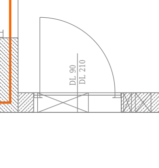
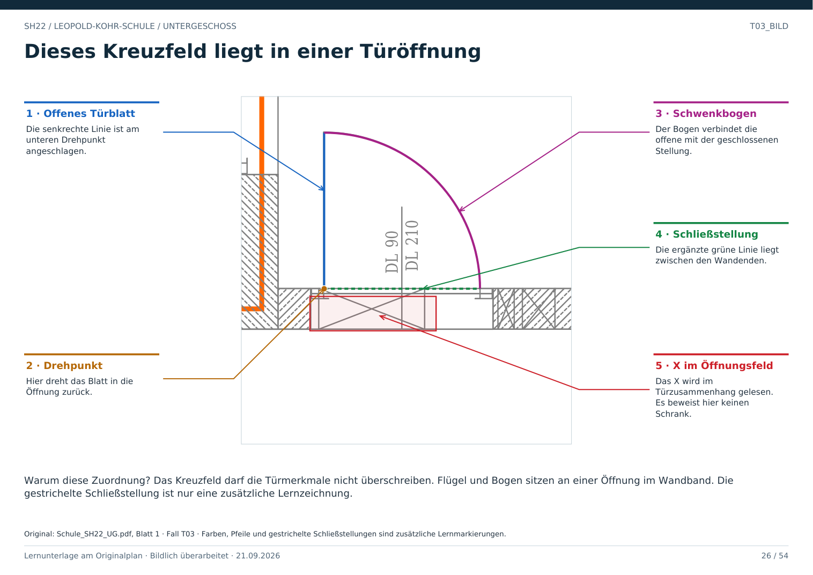

# T03 · Ein Kreuzfeld widerlegt eine Tür nicht

Geschoss: UG. PDF-Buch: Seite 25. Beschriftetes Detail: Seite 26.

## Beobachtung

In der Öffnung liegt zusätzlich ein X-Feld. Gleichzeitig sind Wandunterbrechung, Flügel, Viertelkreisbogen und DL 90 / DL 210 vorhanden.

## Begründung

Die zusammenpassenden Türmerkmale bestimmen den Zusammenhang. Die isolierte Regel „X bedeutet Schrank“ wäre hier falsch.

## Öffnung und Raumtrennung

Der Flur und der angrenzende Raum bleiben getrennte Flächen. Die Tür bildet die Verbindung zwischen ihnen. Die virtuelle Raumtrennung ist kein festes Hindernis.

## Für Claude

Jede Klassifikation muss lokale und benachbarte Zeichen berücksichtigen. Das X-Feld nicht als massiven Verschluss der gesamten Öffnung übernehmen.

## Direkt beschriftetes Bild

Das Kreuzfeld darf die Türmerkmale nicht überschreiben. Flügel und Bogen sitzen an einer Öffnung im Wandband. Die gestrichelte Schließstellung ist nur eine zusätzliche Lernzeichnung.

## Prüffrage

Darf jedes X als nicht begehbarer Kasten klassifiziert werden?

**Erwartete Antwort:** Nein. Seine Bedeutung hängt von den übrigen Zeichen an derselben Stelle ab.

## Nachweis

Originalquelle: `../quellen/Schule_SH22_UG.pdf`, Blatt 1. Ausschnitt in PDF-Punkten: `[184.58250427246094, 1166.8331298828125, 292.2839050292969, 1280.2030029296875]`. Original und Rotfassung liegen in `../bilder/`. Der Ausschnitt ist kein Raum- oder Objektpolygon.
