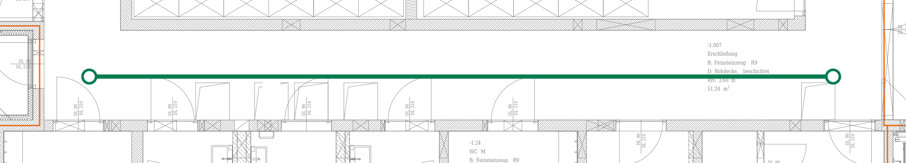
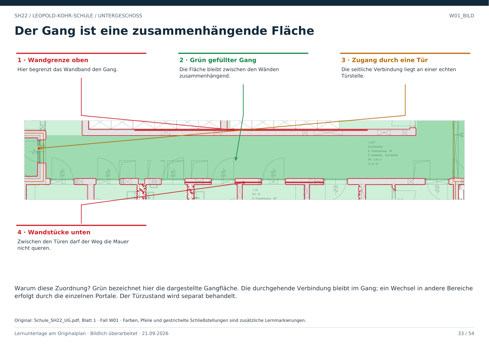

# W01 · Freier Weg: Fläche und Verbindung unterscheiden

Geschoss: UG. PDF-Buch: Seite 32. Beschriftetes Detail: Seite 33.

## Beobachtung

Die Erschließung -1.007 bildet einen langen Streifen zwischen begrenzenden Bauteilen. Entlang der unteren Seite liegen einzelne Türstellen zu angrenzenden Bereichen.

## Warum ein Wegkandidat?

Der freie Streifen setzt sich seitlich fort und ist nicht in regelmäßige Stufen zerlegt. Keine massive Querwand schließt den hier grün markierten Beispielabschnitt.

## Grün richtig lesen

Die grüne Linie zeigt nur eine lokale Verbindung im Flur. Sie ist keine optimierte Route und kein Nachweis einer vorgeschriebenen oder körperbezogen ausreichenden Durchgangsbreite.

## Für eine Person prüfen

Freie Breite, Hindernisse, Türzustände und Bodenhöhe separat ermitteln. Ein mathematischer Punkt passt durch kleinere Spalten als ein Mensch; eine bloße Mittellinie genügt nicht.

## Direkt beschriftetes Bild

Grün bezeichnet hier die dargestellte Gangfläche. Die durchgehende Verbindung bleibt im Gang; ein Wechsel in andere Bereiche erfolgt durch die einzelnen Portale. Der Türzustand wird separat behandelt.

## Prüffrage

Macht eine weiße Bildstelle allein einen freien Weg?

**Erwartete Antwort:** Nein. Es braucht zusammenhängenden Boden, ausreichend Platz und nachgewiesene Übergänge.

## Nachweis

Originalquelle: `../quellen/Schule_SH22_UG.pdf`, Blatt 1. Ausschnitt in PDF-Punkten: `[144.90304565429688, 1087.4742431640625, 1216.24853515625, 1280.2030029296875]`. Original und Rotfassung liegen in `../bilder/`. Der Ausschnitt ist kein Raum- oder Objektpolygon.
