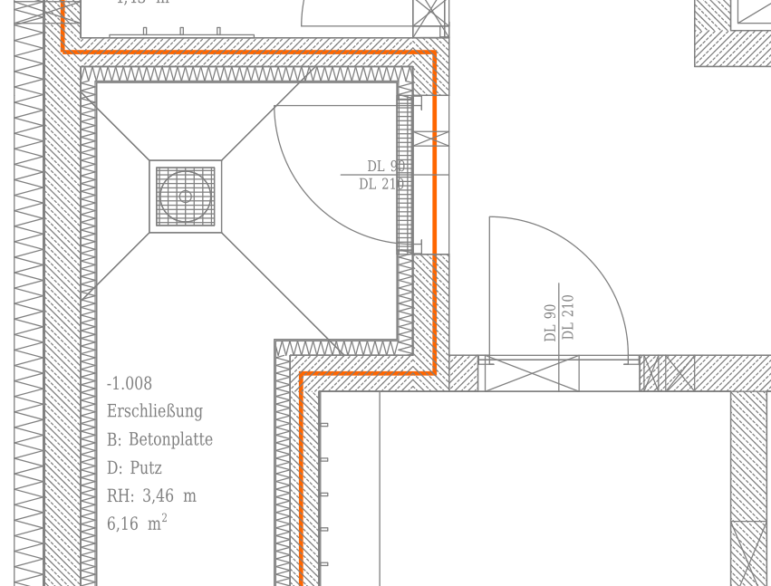
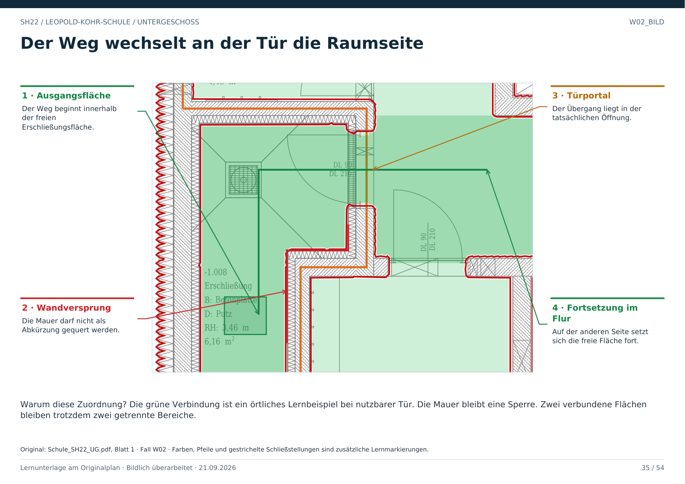

# W02 · Durch eine Tür zu einem anderen Bereich

Geschoss: UG. PDF-Buch: Seite 34. Beschriftetes Detail: Seite 35.

## Beobachtung

Die Erschließung -1.008 liegt links. An ihrer rechten oberen Seite befindet sich die Tür zum anschließenden Flur -1.007, der im größeren Ausschnitt erkennbar ist.

## Wie die Verbindung entsteht

Der Weg bleibt erst in der freien Fläche, erreicht die Öffnung zwischen den Wandenden und setzt sich auf der anderen Seite fort. Die Wand daneben wird nicht gequert.

## Zwei getrennte Aussagen

Die Verbindung ist geometrisch als Türstelle erkennbar. Ob sie aktuell nutzbar ist, bleibt offen. Im Modell lautet die Kante deshalb „Tür, Zustand unbekannt“.

## Raumgrenze trotzdem erhalten

Eine Türöffnung darf benachbarte Bereiche nicht zu einem einzigen ungeteilten Raum machen. Flächenzugehörigkeit und Verbindbarkeit sind unterschiedliche Informationen.

## Direkt beschriftetes Bild

Die grüne Verbindung ist ein örtliches Lernbeispiel bei nutzbarer Tür. Die Mauer bleibt eine Sperre. Zwei verbundene Flächen bleiben trotzdem zwei getrennte Bereiche.

## Prüffrage

Müssen zwei durch eine Tür verbundene Bereiche ein einziger Raum sein?

**Erwartete Antwort:** Nein. Sie bleiben getrennte Flächen mit einer gemeinsamen Türverbindung.

## Nachweis

Originalquelle: `../quellen/Schule_SH22_UG.pdf`, Blatt 1. Ausschnitt in PDF-Punkten: `[31.53314208984375, 1098.8111572265625, 314.9578857421875, 1314.2139892578125]`. Original und Rotfassung liegen in `../bilder/`. Der Ausschnitt ist kein Raum- oder Objektpolygon.
