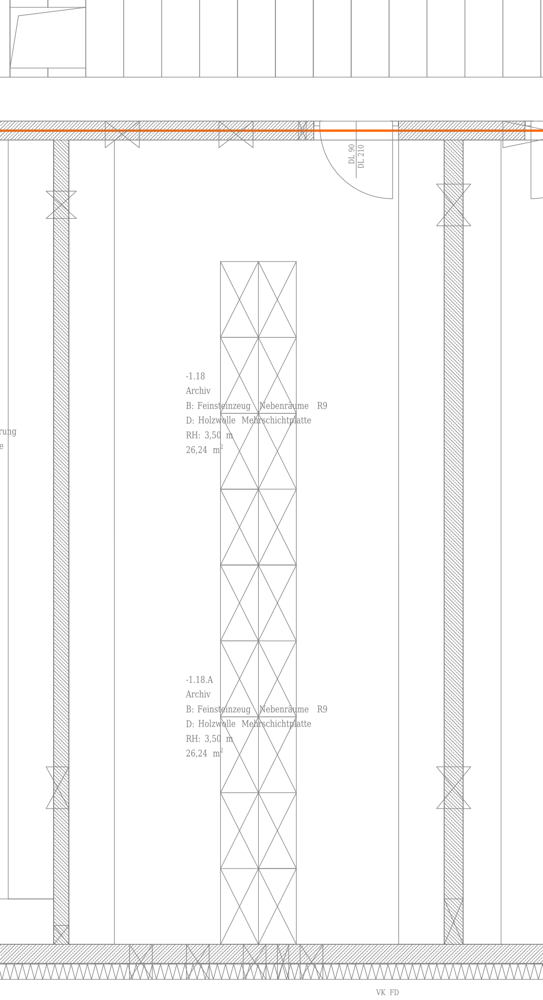
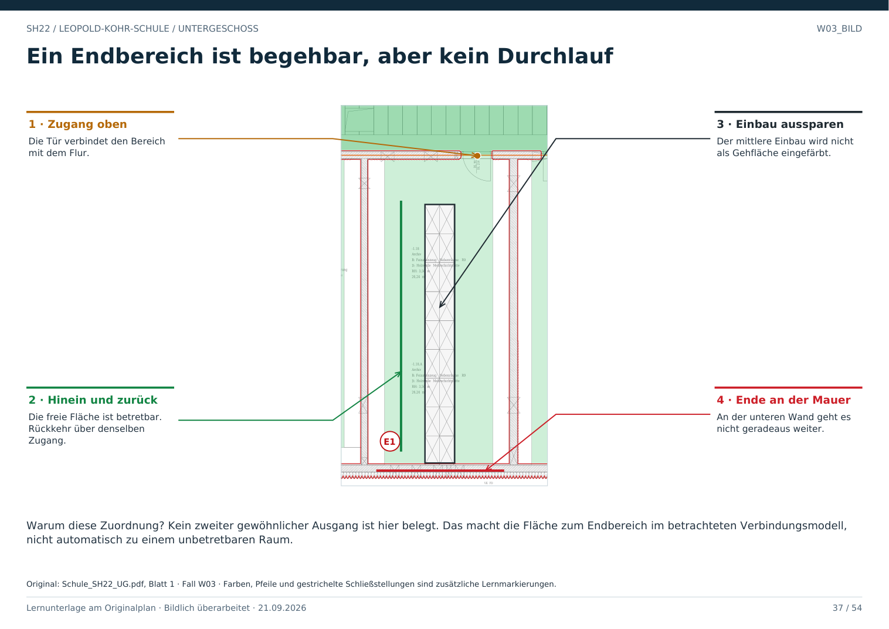

# W03 · Begehbar kann trotzdem eine Sackgasse sein

Geschoss: UG. PDF-Buch: Seite 36. Beschriftetes Detail: Seite 37.

## Beobachtung

Die große mittlere Fläche besitzt oben eine Tür zum Flur. Die seitlichen und unteren Begrenzungen sind im betrachteten Ausschnitt durchgehend als Wände dargestellt.

## Sackgasse richtig verstehen

Eine Sackgasse ist nicht automatisch unbetretbar. Man kann hineingehen und auf demselben Zugang zurückkehren. Es fehlt eine belegte Weiterverbindung zu einem anderen Ausgang.

## Ausschnittgrenze beachten

Hier ist kein zweiter gewöhnlicher Ausgang belegt. Für eine endgültige Aussage müssen die vollständige Raumhülle und gegebenenfalls weitere Pläne geprüft werden.

## Für Claude

Nicht allein die Anzahl benachbarter Räume zählen. Unterschiedliche bestätigte Portale und deren Ziele prüfen. Ein Möbelrechteck in der Mitte wird dabei nicht zu einem zweiten Weg.

## Direkt beschriftetes Bild

Kein zweiter gewöhnlicher Ausgang ist hier belegt. Das macht die Fläche zum Endbereich im betrachteten Verbindungsmodell, nicht automatisch zu einem unbetretbaren Raum.

## Prüffrage

Ist eine Fläche mit einem einzigen Zugang verboten oder unbetretbar?

**Erwartete Antwort:** Das folgt daraus nicht. Sie ist im Verbindungsmodell ein Endbereich, sofern kein weiterer Zugang nachgewiesen wird.

## Nachweis

Originalquelle: `../quellen/Schule_SH22_UG.pdf`, Blatt 1. Ausschnitt in PDF-Punkten: `[1800, 1490, 2180, 2190]`. Original und Rotfassung liegen in `../bilder/`. Der Ausschnitt ist kein Raum- oder Objektpolygon.
