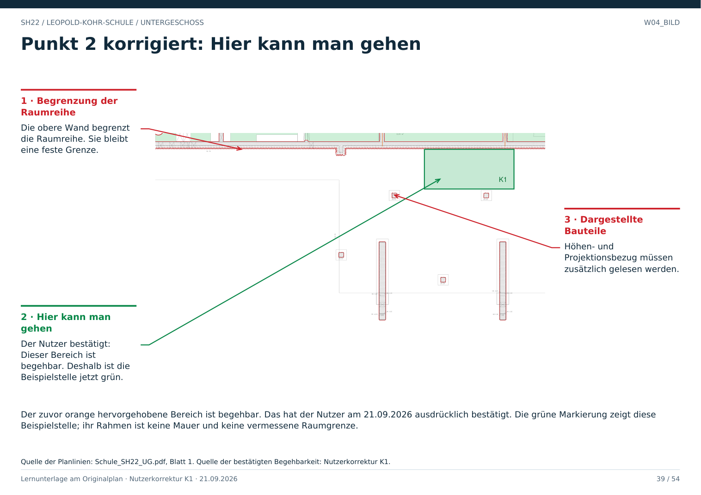

# W04 · Der gezeigte Bereich ist begehbar

Geschoss: UG. PDF-Buch: Seite 38. Beschriftetes Detail: Seite 39.

## Korrektur zu Punkt 2

Der zuvor orange hervorgehobene Bereich ist begehbar. Das hat der Nutzer am 21.09.2026 ausdrücklich bestätigt. Die grüne Markierung zeigt diese Beispielstelle; ihr Rahmen ist keine Mauer und keine vermessene Raumgrenze.

Die Begehbarkeit stammt aus der ausdrücklichen Bestätigung des Nutzers. Sie wird als Projektinformation K1 übernommen. Die frühere Einstufung dieses Bereichs als ungeklärt ist überholt.

## Für Claude

Die Fläche als begehbar übernehmen und K1 als Quelle speichern. Wände und reale Hindernisse bleiben bei der Wegführung zu berücksichtigen. Ein konkreter Zugang durch die obere Wand wird durch diese Korrektur nicht neu eingezeichnet.

Eine weiße Darstellung ist kein Beleg gegen Begehbarkeit. Ein bestätigter begehbarer Bereich darf nicht allein wegen seiner weißen Darstellung ausgeschlossen werden. Wände und tatsächliche Hindernisse sind weiterhin zu berücksichtigen.

## Prüffrage

Ist der in W04 hervorgehobene Bereich begehbar?

**Erwartete Antwort:** Ja. Der Nutzer hat seine Begehbarkeit bestätigt. Die frühere Einordnung als ungeklärt ist für diesen Bereich korrigiert.

## Quellen

- Originalzeichnung: `../quellen/Schule_SH22_UG.pdf`, Blatt 1.
- Ausschnitt in PDF-Punkten: `[1880.0, 2120.0, 3290.0, 2840.0]`.
- Bestätigung und Umfang: [Nutzerkorrektur K1](../daten/nutzerkorrekturen.json).
- Die hervorgehobene Beispielstelle ist keine vollständige vermessene Boden- oder Raumgrenze.
