# Pruefung ZERFALL / SCHLITZ am Plan — jede Restflaeche einzeln

Stand `3d91a2c` (Branch `selman/extents-ausreisser`) · Owner-Rolle Selman (raumerkennung) · geschrieben fuer **Enis zum Nachpruefen**.

Auftrag (woertlich): „Die 5,72 m2 ZERFALL/SCHLITZ am Plan pruefen. Jede Restflaeche einzeln, keine Summe: Lage, Flaeche, Umriss, groesste Breite und Laenge, Schlankheit, vorheriger Raum, entfernende Regel. Klassifizieren: (a) Wandschlitz, nie Nutzflaeche, entfaellt zulaessig; (b) Dopplung, war schon in einem anderen Raum, entfaellt zulaessig; (c) echte Nutzflaeche, darf nicht entfallen, muss zugeschlagen werden. Je Flaeche ein Planausschnitt-Bild (300 mm Umfeld, Wandkoerper, Nachbarraeume) als Beleg. Wo nicht eindeutig belegbar: offenlassen, nicht als zulaessig deklarieren.“ Dazu, aus demselben Auftrag: „rechnerisch dokumentiert heisst nicht am Plan zulaessig“.

**Zwei Befunde vorweg, weil sie die Form des Auftrags aendern:**

1. Die Zahl **5,72 m2** ist als ZERFALL-/SCHLITZ-Groesse im Repo **nicht reproduzierbar** (§ 1). Geprueft wurde deshalb die vollstaendige Menge ZERFALL + SCHLITZ + ENTFALL-Restkoerper: **16,550292 m2**.
2. Eine **Buchung** ist nicht eine **Restflaeche**. Die 22 Buchungen zerfallen geometrisch in **212 Einzelkoerper** — die sind hier einzeln aufgefuehrt (§ 4/§ 5), nicht die Buchungen.

| Klasse | Stuecke | Flaeche m2 | Anteil |
|---|--:|--:|--:|
| (a) Wandschlitz — entfaellt zulaessig | 97 | 0,162431 | 1,0 % |
| (b) Dopplung — entfaellt zulaessig | 0 gegen `polygon_mm` · **3 gegen `polygon_roh`** | 0,000000 · **0,001751** | 0,0 % · **0,01 %** |
| (c) echte Nutzflaeche — darf NICHT entfallen, muss zugeschlagen werden | 5 | 9,471117 | 57,2 % |
| OFFEN — nicht als zulaessig deklarierbar | 110 | 6,916744 | 41,8 % |
| **Summe** | **212** | **16,550292** | 100,0 % |

> **NACHTRAG 2026-09-13 — drei Korrekturen an diesem Dokument, aus der gegnerischen Gegenpruefung.**
> Wer daraus zitiert, muss diese drei kennen:
> 1. **Die Aussage „(b) 0 Stueck, strukturell nicht belegbar“ war zu stark.** Sie gilt nur gegen
>    `polygon_mm`. Gegen `polygon_roh` — und der Auftragswortlaut „war schon in einem anderen Raum“
>    trifft `polygon_roh` direkter — liegen **3 Stuecke zu 100,0 % in `raum_92`** (§ 8.4).
>    Zusammen 0,001751 m2, also 0,01 % der Menge; die Richtung des Befunds aendert sich, die Bilanz nicht.
> 2. **Bei Mollgasse ist „Wandanteil 0,0 %“ keine Sachaussage, sondern eine Referenzluecke** (§ 3.2).
>    Betroffen sind 2 der 5 (c)-Flaechen mit 3,073029 m2. Sie bleiben (c), aber nicht wegen des
>    Wandkriteriums — das ist dort blind.
> 3. **Die (c)-Menge haengt nachweislich NICHT an der Wand-Schranke** (§ 3.3): von 2 % bis 50 %
>    bleiben es dieselben 5 Stuecke / 9,471117 m2. Die offene Frage aus § 8.6 ist damit fuer (c) erledigt.

Bilder: `docs/bilder/zerfall_schlitz/` (62 PNG). Wegwerf-Messskripte liegen im Scratchpad (`C:/Users/selma/AppData/Local/Temp/claude/D--KI-Projekt/15c400f4-f6ff-4226-8584-4bd9ac336bc7/scratchpad`), nicht im Repo.

---

## 1. Woher kommen die 5,72 m2? — nicht reproduzierbar

Gesucht mit vier voneinander unabhaengigen Zugriffen, alle in dieser Phase gefahren:

1. **Literal im Repo** (`grep -rn "5,72\|5\.72" docs Projekte/_ergebnis`): kein Treffer mit Bezug zur Bereinigung. Die Treffer sind (i) `docs/STEMPEL_REPORT.md` — dort ist die Spalte „m2 Polygon“ fuer **alle** 38 Barawitzka-Stempel konstant 5.72, weil dieser Report (2026-09-05, `scripts/stempel_report.py`) im Eingangsplan nur „2 Raum-Polygone“ fand; das ist ein Stempel-gegen-Polygon-Vergleich, keine Restflaeche — und (ii) Koordinatenzahlen in `docs/architektur.svg`.
2. **`Barawitzka_EG/raum_1`** traegt 5,72 m2 — aber roh **und** bereinigt, mit **0 Bereinigungsbuchungen**: die Bereinigung hat diesen Raum nie angefasst (`Projekte/_ergebnis/Barawitzka_EG/bericht.md`, Zentrum (10,67 / −8,10) m).
3. **Commit-Historie** (`git log --all --format="%h|%s|%b" | grep -c "5,72\|5.72"`): **0** Treffer.
4. **Benannte Aggregate**: 36 Aggregate aus den Buchungen gebildet (je Plan je Regel, je Regel gesamt, Plansummen, Plan-Kombinationen). Die drei naechsten an 5,72:

| Aggregat | m2 | Abstand zu 5,72 |
|---|--:|--:|
| Mollgasse_EG / STEMPEL_NAEHE | 6,299236 | 0,579 |
| alle Plaene / STEMPEL_NAEHE | 6,313534 | 0,594 |
| ZERFALL Barawitzka+Mollgasse | 6,584843 | 0,865 |

Kein benanntes Aggregat trifft 5,72. Umgekehrt treffen **willkuerliche Teilmengen** der Buchungen die Zahl beliebig oft (Suchlauf `_inventar.py`: Abbruch bei 41 Treffern in ±0,005 m2, z. B. Barawitzka `raum_43` ZERFALL + Mollgasse `raum_18` ZERFALL + Muthgasse `raum_86` ZERFALL + `raum_92` ZERFALL = 5,721 m2). Genau das zeigt: 5,72 ist kombinatorisches Rauschen, keine benennbare Menge.

**Konsequenz:** eine Summe, die niemand reproduzieren kann, ist nicht Grundlage dieser Pruefung geworden. Wenn die 5,72 m2 aus einer Quelle ausserhalb des Repos stammen (Notiz, Chat, fremder Lauf), bitte nachreichen — im Repo sind sie in keiner Form vorhanden. Bis dahin gilt die vollstaendige Menge unten.

## 2. Die gepruefte Menge und ihr Nachweis

### 2.1 Buchungen je Plan (neu gerechnet aus `raeume.json`)

| Plan | Geschoss | ENTFALL | ENTHALTENSEIN | LIFT_SCHACHT | QUELLE_RANG | SCHLITZ | SCHWERPUNKT | STEMPEL_NAEHE | ZERFALL |
|---|---|--:|--:|--:|--:|--:|--:|--:|--:|
| `Barawitzka_EG` | EG | 1 / 0,224190 m2 | 2 / 26,874396 m2 | — | 7 / 15,378368 m2 | — | — | — | 2 / 3,511814 m2 |
| `Mollgasse_EG` | EG | — | 2 / 18,667707 m2 | — | 10 / 20,864903 m2 | 1 / 0,002115 m2 | 4 / 0,013073 m2 | 26 / 6,299236 m2 | 5 / 3,073029 m2 |
| `Muthgasse_E2` | E2 | 4 / 1,525206 m2 | 2 / 21,592429 m2 | 1 / 3,944377 m2 | 36 / 146,141284 m2 | — | — | 3 / 0,014298 m2 | 9 / 8,213938 m2 |
| `Rennweg_EG` | EG | — | — | — | — | — | 1 / 0,000020 m2 | — | — |
| `Rennweg_OG3` | OG3 | — | — | — | — | — | — | — | — |

Die beiden Rennweg-Plaene tragen **keine** ZERFALL-, SCHLITZ- oder ENTFALL-Buchung — sie sind mitgemessen und liefern nichts.

- **ZERFALL**: 16 Buchungen / 14,798781 m2 → **206 Restflaechen** (14,798781 m2)
- **SCHLITZ**: 1 Buchungen / 0,002115 m2 → **1 Restflaechen** (0,002115 m2)
- **ENTFALL**: 5 Buchungen / 1,749396 m2 → **5 Restflaechen** (1,749396 m2)
- **Summe: 16,550292 m2 in 212 Restflaechen**

### 2.2 Groessenverteilung der 212 Restflaechen

| Schwelle | Stuecke | Flaeche m2 | Anteil der Menge |
|---|--:|--:|--:|
| alle | 212 | 16,550292 | 100,0 % |
| ≥ 1 mm2 (`RAUSCH_MM2`) | 154 | 16,550290 | 100,0 % |
| ≥ 100 mm2 | 122 | 16,549036 | 100,0 % |
| ≥ 0,01 m2 (Einzelbild) | 45 | 16,411994 | 99,2 % |
| ≥ 0,1 m2 | 22 | 15,193298 | 91,8 % |
| ≥ 1 m2 (`ENTFALL_MM2`) | 5 | 9,471117 | 57,2 % |

**58 Stuecke liegen unter der Rauschschwelle des Moduls selbst** (`RAUSCH_MM2` = 1 mm2), zusammen 0,0000027 m2 — Rechenrauschen der Rasterpolygone (400–738 Punkte je Ring), nicht Planbereiche.

### 2.3 Warum die Einzelkoerper belastbar sind (Rekonstruktionsnachweis)

Die Restflaechen stehen nicht in `raeume.json` — dort steht je Raum nur die Buchungssumme. Rekonstruiert wurde die Buchungskette je Raum auf `polygon_roh`, mit den **Produktionsfunktionen selbst** (`_startpolygon`, `_groesste`, `_schlitz`, `ENTFALL_MM2` aus `src/notbeleuchtung/raumerkennung/bereinigung.py`). Kontrollen:

- **61 Gegenspieler-Buchungen** nachgefahren, groesstes Delta gebucht ↔ gemessen **0,000 mm2**.
- **ZERFALL/SCHLITZ/ENTFALL je Raum**: 23 Vergleiche gebucht ↔ gemessen, groesste Abweichung **0,0 mm2**.
- **Ueberlebender Rest == `flaeche_berechnet`** aus `raeume.json`: 12 Vergleiche, groesste Abweichung **0,0 mm2**.
- **Flaechenbilanz** roh − bereinigt == Σ Buchungen: **0** Abweichungen > 1e−6 m2 ueber alle fuenf Plaene.
- **Gueltigkeit**: 0 von 212 Restflaechen ungueltig, 0 von 248 Raumpolygonen ungueltig (`shapely.is_valid`); `buffer(0)`-Reparatur aendert keine Dopplungsmessung (0 Stuecke geaendert).
- **Eine Ausnahme, nicht geglaettet**: `STEMPEL_NAEHE(raum_86)` 12000,0 mm2, `STEMPEL_NAEHE(raum_93)` 1751,5 mm2, `STEMPEL_NAEHE(raum_90)` 546,3 mm2 — reproduzierbar nur gegen das `polygon_roh` des Gegenspielers (Delta 0,000 mm2). Erklaerbar, weil `raum_86` selbst entfallen ist und kein `polygon_mm` mehr traegt.

### 2.4 Was „Schwerpunkt“ hier heisst

Der Schwerpunkt ist der Flaechenschwerpunkt (`centroid`). Bei **23 der 212 Stuecke** liegt er wegen der konkaven Form **nicht im Stueck** — dort steht im Block zusaetzlich ein Punkt, der garantiert im Stueck liegt (`representative_point`). Das ist auch die Aufloesung einer Scheinbeobachtung: beim Stueck `Muthgasse_E2__raum_86__ENTFALL__01` liegt der Schwerpunkt in `raum_24` „Loggia“, die Flaeche selbst ueberschneidet `raum_24` aber zu **0,000 mm2** (Abstand 0,0 mm, Kontaktlaenge 6 211 mm) — sie liegt auf der Naht zwischen `raum_24` und `raum_26`. Beruehrung ist keine Dopplung.

### 2.5 Eingabedateien mit Hash — damit jede Zahl und jedes Bild bindbar ist

Nachgetragen 2026-09-13: ohne Hash sind die 97 (a)-Klassifikationen und die 62 Bilder an keinen
Stand gebunden. Commit dieser Pruefung: **`3d91a2ceebb5e1a034feb4fa4faf5b7a3edf81b4`**.

| Plan | in der Menge | Bytes | SHA-256 der DXF |
|---|---|--:|---|
| `Barawitzka_EG` | ja | 12 900 878 | `76ed8b4552c6654543fd9a9b0b4de3d5d85e7bc37a0209bec1dcf6d491446d43` |
| `Mollgasse_EG` | ja | 10 282 242 | `4a0b66084d258a183dbbb81c2703820b00c9b18cf0a5a2b2b345fb999800f527` |
| `Muthgasse_E2` | ja | 23 248 762 | `d840674bb5a57865f71fac54341b6a30ece35b0f0d1d13e69cd4db5933d88089` |
| `Rennweg_EG` | nein — 0 Buchungen | 4 015 763 | `7044ff3bed0a7d80b77eab79fcc6140f40679eadd7e6f0ab873ec3070663bc8f` |
| `Rennweg_OG3` | nein — 0 Buchungen | 3 842 240 | `ef8cd3cc5691ee29b5343d695b6ca4a797a32edff2a95b050e450fc7b7eebf5d` |

Die beiden Rennweg-Plaene sind mitgelistet, weil die Pruefung sie durchsucht hat: sie tragen keine
ZERFALL-, SCHLITZ- oder ENTFALL-Buchung. Alle Restflaechen kommen aus den ersten drei.

## 3. Wie klassifiziert wurde — und was daran meine Setzung ist

### 3.1 Wand-Referenz

Wandkoerper **nicht** aus der Liste `wandkoerper` in `raeume.json` (das ist der Material-Scan aus `scripts/plan_pruefen.py` und traegt keine Geometrie), sondern aus der DXF: `lade_dxf` → `finde_wandkoerper` → `wand_union` (Puffer 25 mm, Default) auf `Projekte/_eingang/<Plan>.dxf`.

| Plan | Faktor | Wandkoerper | Union-Teile | Flaeche Union m2 |
|---|--:|--:|--:|--:|
| `Barawitzka_EG` | 1000 | 1243 | 10 | 75,72 |
| `Mollgasse_EG` | 1000 | 171 | 43 | 129,11 |
| `Muthgasse_E2` | 10 | 737 | 224 | 4686,87 |

Lauf `_wandkoerper_cache2.py` (25,4 s) reproduziert den Cache der Messphase **bitgleich** (md5 identisch je Plan).

### 3.2 Kalibrierung: ist die Wand-Referenz ueberhaupt trennscharf?

Gegenprobe an **bekannten** Nutzraeumen (gestempelt, Flag `ok`): wie viel von so einem Raum liegt in der Wand-Union?

| Plan | n Raeume | Median | p90 | Maximum | ueber 50 % |
|---|--:|--:|--:|--:|--:|
| `Barawitzka_EG` | 35 | 0,0 % | 6,6 % | 20,3 % | 0 |
| `Mollgasse_EG` | 46 | 0,0 % | 0,1 % | 1,7 % | 0 |
| `Muthgasse_E2` | 74 | 0,0 % | 4,0 % | 9,2 % | 0 |

**Kein** bekannter Nutzraum liegt ueber 50 % in der Wand-Union. Damit ist „≥ 90 % in der Wand-Union“ ein belastbarer Beleg fuer (a) und kein Zufallstreffer.

**Nachtrag 2026-09-13 — diese Kalibrierung reicht nicht, und bei Mollgasse kippt sie.** Die Tabelle
oben zeigt nur, dass ein Nutzraum nicht IN der Wand liegt. Das ist trivial: ein Raum liegt immer
NEBEN der Wand. Sie kann deshalb nicht unterscheiden, ob „Wandanteil 0,0 %“ heisst *hier ist keine
Wand* oder *hier kennt die Referenz keine Wand*. Die Gegenprobe, die das kann, misst den **Rand**:
wie viel vom Umriss eines bekannten Nutzraums liegt innerhalb 50 mm an der Wand-Union?

| Plan | n Raeume | Rand an Wand, Median | p10 | Minimum | Wand-Union / Raum-Huelle |
|---|--:|--:|--:|--:|--:|
| `Barawitzka_EG` | 35 | 83,7 % | 50,7 % | 10,3 % | 75,72 / 583,90 m2 = 13,0 % |
| `Mollgasse_EG` | 46 | 76,7 % | **0,0 %** | **0,0 %** | 129,11 / 1926,58 m2 = **6,7 %** |
| `Muthgasse_E2` | 74 | 70,5 % | 22,7 % | 14,4 % | 4686,87 / 20027,61 m2 = 23,4 % |

Bei Barawitzka und Muthgasse hat **jeder** bekannte Nutzraum Wandkontakt (Minimum 10,3 % bzw.
14,4 % seines Umrisses) — dort traegt ein gemessener Wandanteil von 0,0 % die Aussage *keine Wand*.
Bei Mollgasse liegen mindestens 10 % der bekannten Nutzraeume mit **0,0 % ihres Umrisses** an einer
Wand: fuer die ist die Wand-Referenz schlicht blind. Die Ursache ist im Plan sichtbar — Mollgasse
hat 797 Wand-Entities, aus denen nur 171 Wandkoerper werden, und die staerksten Layer
(`02-FIL-G00-LEG-GK` 57, `02-FIL-G00-LEG-ORANGE` 52, `02-FIL-G00-Leg-STB` 52) zaehlen gar nicht als
Wand-Layer; erkannt sind nur `02-TWA/WDA/ZWA-G00-LEG-M0`.

**Folge fuer dieses Dokument:** bei den beiden Mollgasse-Flaechen der Klasse (c)
(`raum_25` 1,938377 m2 und `raum_18` 1,134652 m2, zusammen 3,073029 m2 = 32,4 % der (c)-Menge) ist
„Wandanteil 0,0 %“ **kein Beleg**. Sie bleiben (c), aber nur getragen von Flaeche und freier Breite
— nicht vom Wandkriterium. Fuer (a) ist die Luecke harmlos: sie kann nur Stuecke uebersehen, nie
falsch als Wandschlitz ausweisen.

### 3.3 Die Schranken — offen gelegt

| Klasse | Schranke | Herkunft der Schranke |
|---|---|---|
| (a) | ≥ 90 % der Stueckflaeche in der Wand-Union | meine Setzung, durch § 3.2 kalibriert (bekannte Nutzraeume max. 20,3 %) |
| (b) | ≥ 90 % der Stueckflaeche im `polygon_mm` eines ANDEREN Raums | meine Setzung, dieselbe Schranke wie (a). **Nachtrag: gegen `polygon_mm` gemessen ist das die falsche Bezugsgroesse — siehe § 8.4** |
| (c) | ≥ 1,00 m2 **und** Inkreis ≥ 500 mm **und** Wand < 10 % **und** Dopplung < 10 % | 1,00 m2 = `ENTFALL_MM2` des Moduls selbst; **die 500 mm sind MEINE Setzung**. Zur Wand-Schranke siehe Sensitivitaet unten |

**Sensitivitaet der Wand-Schranke, nachgetragen 2026-09-13.** Die Schranke „Wand < 10 %“ war nicht
kalibriert — die Gegenpruefung hat das zu Recht bemaengelt. Gemessen ueber alle 212 Stuecke, Rest
der Regel unveraendert:

| Wand-Schranke | (c)-Stuecke | (c)-Flaeche m2 |
|---|--:|--:|
| < 2 % | 5 | 9,471117 |
| < 5 % | 5 | 9,471117 |
| < 10 % (Dokument) | 5 | 9,471117 |
| < 20 % | 5 | 9,471117 |
| < 30 % | 5 | 9,471117 |
| < 50 % | 5 | 9,471117 |

**Die (c)-Menge haengt nicht an dieser Schranke.** Kein Stueck liegt in ihrer Naehe: die fuenf
(c)-Flaechen haben 0,0 · 0,0 · 0,0 · 0,1 · 0,3 % Wandanteil gegen die **ungepufferte** Wand. Erst
bei kuenstlich aufgeblasener Wand wandern sie hoch:

| Stueck | Wand roh | Puffer 25 mm (Dokument) | 50 mm | 100 mm | 200 mm |
|---|--:|--:|--:|--:|--:|
| `Barawitzka_EG__raum_43__ZERFALL__01` | 0,0 % | 4,8 % | 9,4 % | 18,0 % | 33,6 % |
| `Mollgasse_EG__raum_18__ZERFALL__01` | 0,0 % | 0,0 % | 0,0 % | 0,0 % | 0,0 % |
| `Mollgasse_EG__raum_25__ZERFALL__01` | 0,0 % | 0,0 % | 0,0 % | 0,0 % | 0,0 % |
| `Muthgasse_E2__raum_88__ZERFALL__01` | 0,1 % | 6,3 % | 14,7 % | 31,7 % | 61,7 % |
| `Muthgasse_E2__raum_90__ZERFALL__01` | 0,3 % | 7,3 % | 20,5 % | 46,4 % | 75,1 % |

Die Mollgasse-Nullen ueber alle Pufferstufen sind genau die Referenzluecke aus § 3.2, nicht ein
besonders wandfernes Stueck. Auch wenn die Dopplung gegen `polygon_roh` statt `polygon_mm` gerechnet
wird, bleiben es dieselben 5 Stuecke / 9,471117 m2.
| OFFEN | alles dazwischen | — |

Ausdruecklich: das Repo definiert **keine** Begehbarkeits-Mindestbreite (gegrept nach `MIN_BREITE`, `min_breite`, `begehbar`, `MIN_WIDTH` in `src/` — nur Prosa-Kommentare, keine Konstante). Die 500 mm sind deshalb nicht belegt, sondern gesetzt; sie sind der Grund, warum viele Stuecke OFFEN bleiben statt (c) zu werden. Eine andere Owner-Schranke verschiebt die Bilanz — siehe § 6.2.

### 3.4 Messdefinitionen (damit jede Zahl nachrechenbar ist)

- **groesste Breite / Laenge**: kuerzeste/laengste Seite des kleinsten umschliessenden Rechtecks (`minimum_rotated_rectangle`).
- **Schlankheitsgrad**: Laenge / Breite dieses Rechtecks.
- **freie Breite (Inkreis)**: Durchmesser des groessten einbeschriebenen Kreises (`shapely.maximum_inscribed_circle`) — das ist die Zahl, die sagt, ob man auf der Flaeche stehen kann; die bbox-Breite kann das nicht.
- **im Wandkoerper**: Schnittflaeche mit der Wand-Union / Stueckflaeche.
- **in einem anderem Raum**: groesste Schnittflaeche mit dem `polygon_mm` eines anderen Raums (aus `raeume` **und** `entfallen`) / Stueckflaeche.
- **Nachbarn**: Raeume mit Abstand ≤ 10 mm; Kontaktlaenge = Laenge des Stueck-Randes innerhalb 10 mm um das Nachbarpolygon. Gemessen fuer die Stuecke ≥ 0,01 m2.

## 4. Einzelaufstellung der Restflaechen ≥ 0,01 m2 (45 Stueck, 16,411994 m2 = 99,2 % der Menge)

Je Stueck ein Block mit allen Pflichtfeldern und dem Planausschnitt (300 mm Umfeld, Wandkoerper grau, Nachbarraeume blau, Herkunftsraum gruen, `polygon_roh` gruen gestrichelt, Restflaeche rot). Die 167 Stuecke unter 0,01 m2 stehen vollstaendig in § 5.

### 4.1 Klasse (c) — echte Nutzflaeche, darf NICHT entfallen (5 Stueck, 9,471117 m2)

> **Einschraenkung, nachgetragen 2026-09-13.** Bei `Mollgasse_EG__raum_25__ZERFALL__01` und
> `Mollgasse_EG__raum_18__ZERFALL__01` steht unten „Wandanteil 0,0 %“. Diese Zahl ist auf diesem
> Plan **kein Beleg**, sondern eine Referenzluecke (§ 3.2): mindestens 10 % der bekannten
> Nutzraeume von Mollgasse haben dort ueberhaupt keinen erkannten Wandkontakt. Beide Flaechen
> bleiben (c), getragen von Flaeche (1,938377 / 1,134652 m2) und freier Breite (1 286 / 926 mm
> Inkreis) — nicht vom Wandkriterium. Bei den drei anderen (c)-Flaechen traegt es
> (Barawitzka und Muthgasse haben bei JEDEM bekannten Nutzraum Wandkontakt).

#### Barawitzka_EG__raum_43__ZERFALL__01 · ZERFALL 01 — Klasse (c)

| Pflichtfeld | Messwert |
|---|---|
| Plan · Geschoss | `Barawitzka_EG` · EG (`Projekte/_eingang/Barawitzka_EG.dxf`) |
| Raum-ID vorher | `raum_43` „Terrasse“ · Typ TERRASSE · Quelle F · Flag flutung_unsicher · roh 56,643 m2 → bereinigt 15,533 m2 · Liste `raeume` |
| entfernende Regel | `ZERFALL` (Buchung Nr. 1 dieses Raums in `raum.bereinigung[]`) |
| Flaeche | **2,995052 m2** (2995052,0 mm2) |
| Schwerpunkt (Plan-mm) | (8870,6 / -24775,0) |
| Umriss | 187 Punkte, 0 Loecher |
| groesste Breite / Laenge | 1 925 mm / 2 264 mm (kleinstes umschliessendes Rechteck) |
| Schlankheitsgrad | 1,18 (Laenge/Breite) |
| freie Breite (Inkreis) | 1 635 mm |
| im Wandkoerper | 0,0 % (78,0 mm2 von 2995052,0 mm2) |
| in einem anderen Raum (`polygon_mm`) | 0,0 % — kein anderer Raum getroffen |
| Nachbarn (Abstand ≤ 10 mm) | `raum_37` „Treppenhaus 2“ STIEGENHAUS, Kontakt 3 159 mm, Abstand 0,0 mm |
| **Klasse** | **(c) echte Nutzflaeche — darf NICHT entfallen, muss zugeschlagen werden** |
| Begruendung | 2,995052 m2, freie Breite (Inkreis) 1 635 mm, Wandanteil 0,0 %, Dopplung 0,0 % — weder (a) noch (b), und die Geometrie ist mit 1 925 mm kleinster und 2 264 mm groesster Ausdehnung begehbar. |
| Bild | `bilder/zerfall_schlitz/Barawitzka_EG__raum_43__ZERFALL__01.png` — Fenster 2 864 × 2 864 mm (300 mm Umfeld), Massstab 3,44 mm/px, Stueckbreite 559 px |

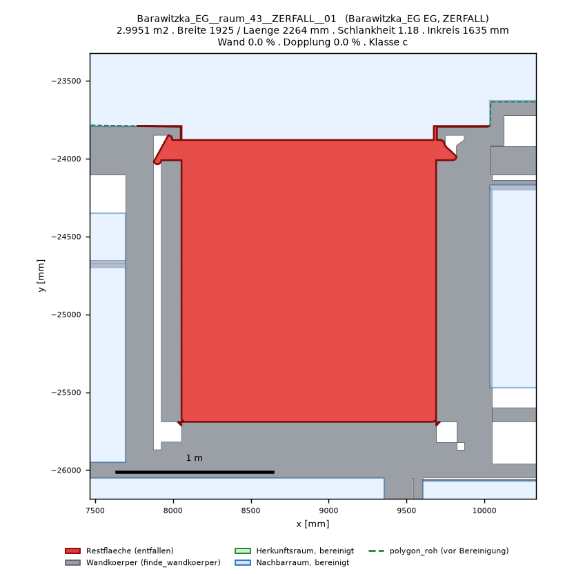

#### Mollgasse_EG__raum_25__ZERFALL__01 · ZERFALL 01 — Klasse (c)

| Pflichtfeld | Messwert |
|---|---|
| Plan · Geschoss | `Mollgasse_EG` · EG (`Projekte/_eingang/Mollgasse_EG.dxf`) |
| Raum-ID vorher | `raum_25` „ZIMMER“ · Typ ZIMMER · Quelle F · Flag flutung_unsicher · roh 21,488 m2 → bereinigt 15,043 m2 · Liste `raeume` |
| entfernende Regel | `ZERFALL` (Buchung Nr. 1 dieses Raums in `raum.bereinigung[]`) |
| Flaeche | **1,938377 m2** (1938377,3 mm2) |
| Schwerpunkt (Plan-mm) | (2676937,7 / 1551283,6) |
| Umriss | 20 Punkte, 0 Loecher |
| groesste Breite / Laenge | 1 474 mm / 1 747 mm (kleinstes umschliessendes Rechteck) |
| Schlankheitsgrad | 1,19 (Laenge/Breite) |
| freie Breite (Inkreis) | 1 286 mm |
| im Wandkoerper | 0,0 % (0,0 mm2 von 1938377,3 mm2) |
| in einem anderen Raum (`polygon_mm`) | 0,0 % — kein anderer Raum getroffen |
| Nachbarn (Abstand ≤ 10 mm) | `raum_9` „VORPLATZ“, Kontakt 1 711 mm, Abstand 0,0 mm |
| **Klasse** | **(c) echte Nutzflaeche — darf NICHT entfallen, muss zugeschlagen werden** |
| Begruendung | 1,938377 m2, freie Breite (Inkreis) 1 286 mm, Wandanteil 0,0 %, Dopplung 0,0 % — weder (a) noch (b), und die Geometrie ist mit 1 474 mm kleinster und 1 747 mm groesster Ausdehnung begehbar. |
| Bild | `bilder/zerfall_schlitz/Mollgasse_EG__raum_25__ZERFALL__01.png` — Fenster 2 347 × 2 347 mm (300 mm Umfeld), Massstab 2,82 mm/px, Stueckbreite 522 px |

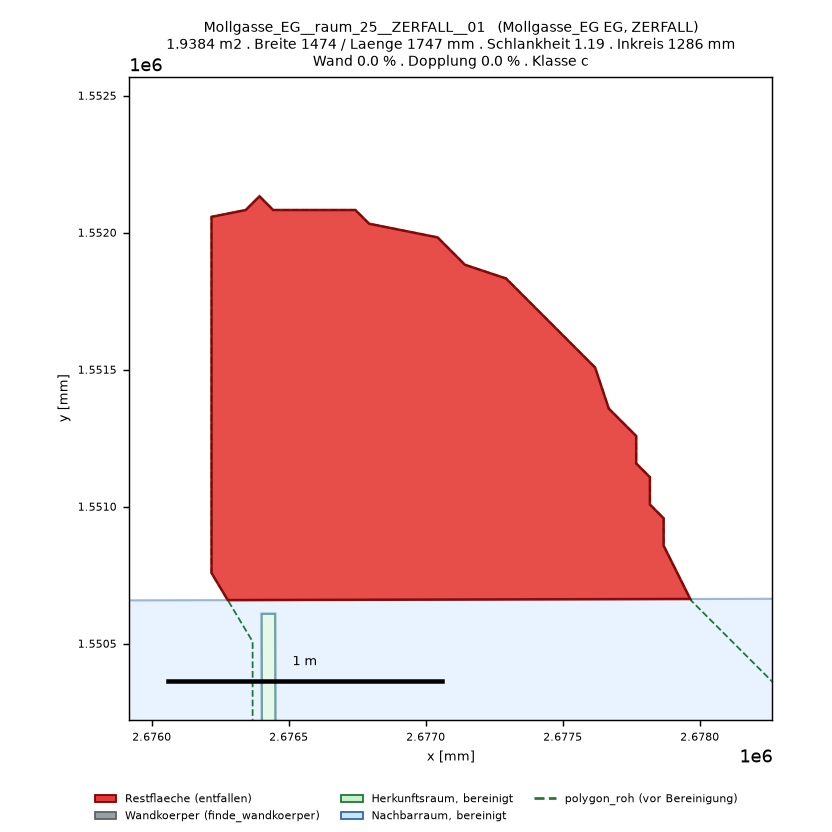

#### Muthgasse_E2__raum_88__ZERFALL__01 · ZERFALL 01 — Klasse (c)

| Pflichtfeld | Messwert |
|---|---|
| Plan · Geschoss | `Muthgasse_E2` · E2 (`Projekte/_eingang/Muthgasse_E2.dxf`) |
| Raum-ID vorher | `raum_88` „STGH“ · Typ STIEGENHAUS · Quelle F · Flag flutung_unsicher · roh 20,675 m2 → bereinigt 3,820 m2 · Liste `raeume` |
| entfernende Regel | `ZERFALL` (Buchung Nr. 1 dieses Raums in `raum.bereinigung[]`) |
| Flaeche | **1,895620 m2** (1895619,6 mm2) |
| Schwerpunkt (Plan-mm) | (332460,8 / 98603,2) |
| Umriss | 181 Punkte, 0 Loecher |
| groesste Breite / Laenge | 1 902 mm / 3 743 mm (kleinstes umschliessendes Rechteck) |
| Schlankheitsgrad | 1,97 (Laenge/Breite) |
| freie Breite (Inkreis) | 672 mm |
| im Wandkoerper | 0,1 % (1467,2 mm2 von 1895619,6 mm2) |
| in einem anderen Raum (`polygon_mm`) | 0,0 % (groesster Treffer `raum_68`) |
| Nachbarn (Abstand ≤ 10 mm) | `raum_67` „Schl.“, Kontakt 3 686 mm, Abstand 0,0 mm · `raum_68` „Gang“ GANG, Kontakt 1 722 mm, Abstand 0,0 mm |
| **Klasse** | **(c) echte Nutzflaeche — darf NICHT entfallen, muss zugeschlagen werden** |
| Begruendung | 1,895620 m2, freie Breite (Inkreis) 672 mm, Wandanteil 0,1 %, Dopplung 0,0 % — weder (a) noch (b), und die Geometrie ist mit 1 902 mm kleinster und 3 743 mm groesster Ausdehnung begehbar. |
| Bild | `bilder/zerfall_schlitz/Muthgasse_E2__raum_88__ZERFALL__01.png` — Fenster 4 223 × 4 223 mm (300 mm Umfeld), Massstab 5,08 mm/px, Stueckbreite 375 px |

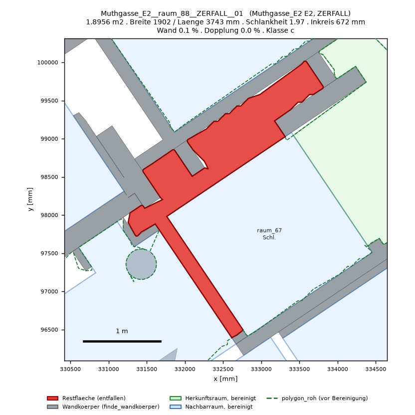

#### Muthgasse_E2__raum_90__ZERFALL__01 · ZERFALL 01 — Klasse (c)

| Pflichtfeld | Messwert |
|---|---|
| Plan · Geschoss | `Muthgasse_E2` · E2 (`Projekte/_eingang/Muthgasse_E2.dxf`) |
| Raum-ID vorher | `raum_90` „Zimmer“ · Typ ZIMMER · Quelle F · Flag flutung_unsicher · roh 18,952 m2 → bereinigt 3,990 m2 · Liste `raeume` |
| entfernende Regel | `ZERFALL` (Buchung Nr. 1 dieses Raums in `raum.bereinigung[]`) |
| Flaeche | **1,507416 m2** (1507416,4 mm2) |
| Schwerpunkt (Plan-mm) | (350590,8 / 124593,6) — liegt bei dieser konkaven Form NICHT im Stueck; Punkt IM Stueck: (350932,6 / 124725,4) |
| Umriss | 169 Punkte, 0 Loecher |
| groesste Breite / Laenge | 1 726 mm / 4 619 mm (kleinstes umschliessendes Rechteck) |
| Schlankheitsgrad | 2,68 (Laenge/Breite) |
| freie Breite (Inkreis) | 615 mm |
| im Wandkoerper | 0,3 % (4768,6 mm2 von 1507416,4 mm2) |
| in einem anderen Raum (`polygon_mm`) | 0,0 % — kein anderer Raum getroffen |
| Nachbarn (Abstand ≤ 10 mm) | `raum_54` „Vorraum“ VORRAUM, Kontakt 3 587 mm, Abstand 0,0 mm |
| **Klasse** | **(c) echte Nutzflaeche — darf NICHT entfallen, muss zugeschlagen werden** |
| Begruendung | 1,507416 m2, freie Breite (Inkreis) 615 mm, Wandanteil 0,3 %, Dopplung 0,0 % — weder (a) noch (b), und die Geometrie ist mit 1 726 mm kleinster und 4 619 mm groesster Ausdehnung begehbar. |
| Bild | `bilder/zerfall_schlitz/Muthgasse_E2__raum_90__ZERFALL__01.png` — Fenster 4 986 × 4 986 mm (300 mm Umfeld), Massstab 5,99 mm/px, Stueckbreite 288 px |

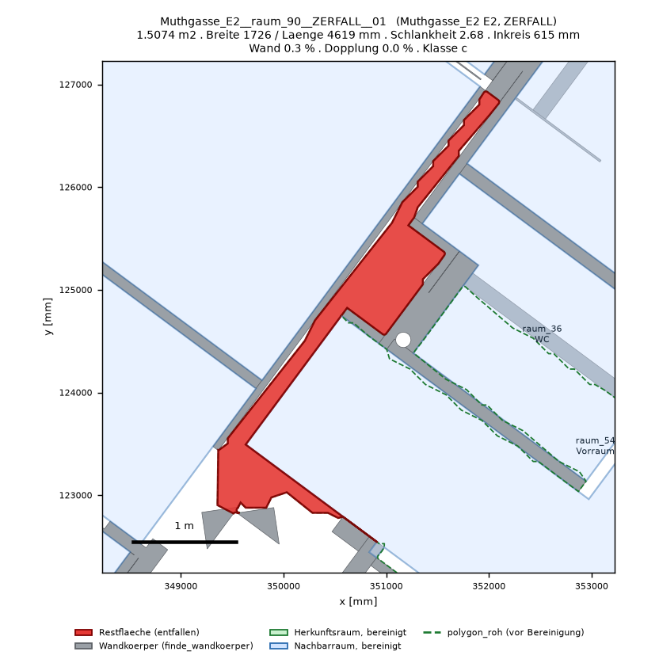

#### Mollgasse_EG__raum_18__ZERFALL__01 · ZERFALL 01 — Klasse (c)

| Pflichtfeld | Messwert |
|---|---|
| Plan · Geschoss | `Mollgasse_EG` · EG (`Projekte/_eingang/Mollgasse_EG.dxf`) |
| Raum-ID vorher | `raum_18` „ZIMMER“ · Typ ZIMMER · Quelle F · Flag flutung_unsicher · roh 17,273 m2 → bereinigt 14,134 m2 · Liste `raeume` |
| entfernende Regel | `ZERFALL` (Buchung Nr. 1 dieses Raums in `raum.bereinigung[]`) |
| Flaeche | **1,134652 m2** (1134651,6 mm2) |
| Schwerpunkt (Plan-mm) | (2668141,6 / 1551167,3) |
| Umriss | 17 Punkte, 0 Loecher |
| groesste Breite / Laenge | 1 360 mm / 1 461 mm (kleinstes umschliessendes Rechteck) |
| Schlankheitsgrad | 1,07 (Laenge/Breite) |
| freie Breite (Inkreis) | 926 mm |
| im Wandkoerper | 0,0 % (0,0 mm2 von 1134651,6 mm2) |
| in einem anderen Raum (`polygon_mm`) | 0,0 % — kein anderer Raum getroffen |
| Nachbarn (Abstand ≤ 10 mm) | `raum_9` „VORPLATZ“, Kontakt 1 449 mm, Abstand 0,0 mm · `raum_56` „GEHWEG“, Kontakt 1 333 mm, Abstand 0,0 mm |
| **Klasse** | **(c) echte Nutzflaeche — darf NICHT entfallen, muss zugeschlagen werden** |
| Begruendung | 1,134652 m2, freie Breite (Inkreis) 926 mm, Wandanteil 0,0 %, Dopplung 0,0 % — weder (a) noch (b), und die Geometrie ist mit 1 360 mm kleinster und 1 461 mm groesster Ausdehnung begehbar. |
| Bild | `bilder/zerfall_schlitz/Mollgasse_EG__raum_18__ZERFALL__01.png` — Fenster 2 024 × 2 024 mm (300 mm Umfeld), Massstab 2,43 mm/px, Stueckbreite 559 px |

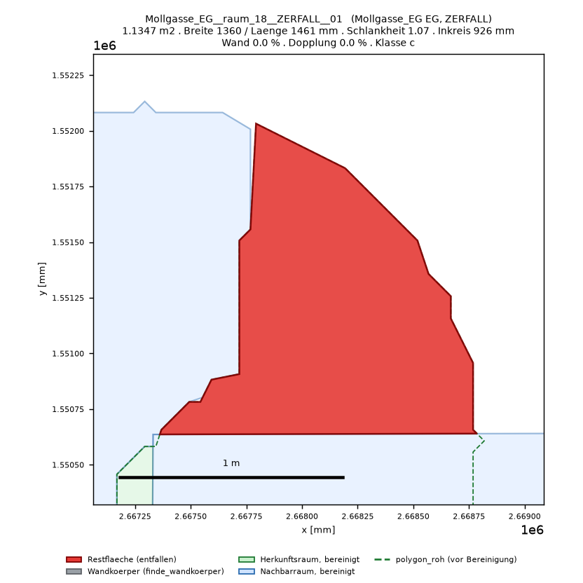

### 4.2 Klasse (a) — Wandschlitz, entfaellt zulaessig, Stuecke ≥ 0,01 m2 (3 von 97)

Die restlichen 94 (a)-Stuecke sind kleiner als 0,01 m2 und stehen in § 5.

#### Muthgasse_E2__raum_86__ZERFALL__06 · ZERFALL 06 — Klasse (a)

| Pflichtfeld | Messwert |
|---|---|
| Plan · Geschoss | `Muthgasse_E2` · E2 (`Projekte/_eingang/Muthgasse_E2.dxf`) |
| Raum-ID vorher | `raum_86` „Wohnküche“ · Typ KÜCHE · Quelle F · Flag entfallen · roh 43,659 m2 → bereinigt 0,000 m2 · Liste `entfallen` |
| entfernende Regel | `ZERFALL` (Buchung Nr. 6 dieses Raums in `raum.bereinigung[]`) |
| Flaeche | **0,045960 m2** (45960,4 mm2) |
| Schwerpunkt (Plan-mm) | (335401,2 / 94920,7) |
| Umriss | 12 Punkte, 0 Loecher |
| groesste Breite / Laenge | 41 mm / 1 996 mm (kleinstes umschliessendes Rechteck) |
| Schlankheitsgrad | 48,66 (Laenge/Breite) |
| freie Breite (Inkreis) | 39 mm |
| im Wandkoerper | 100,0 % (45960,4 mm2 von 45960,4 mm2) |
| in einem anderen Raum (`polygon_mm`) | 0,0 % (groesster Treffer `raum_20`) |
| Nachbarn (Abstand ≤ 10 mm) | `raum_20` „Bad“ BAD, Kontakt 2 023 mm, Abstand 0,0 mm |
| **Klasse** | **(a) Wandschlitz — entfaellt zulaessig** |
| Begruendung | 100,0 % der Flaeche liegen in der Wand-Union (`finde_wandkoerper` + `wand_union`, Puffer 25 mm) — Schranke (a) ist 90 %. Freie Breite 39 mm, Schlankheit 48,7: als Nutzflaeche geometrisch ausgeschlossen. |
| Bild | `bilder/zerfall_schlitz/Muthgasse_E2__raum_86__ZERFALL__06.png` — Fenster 2 237 × 2 237 mm (300 mm Umfeld), Massstab 2,69 mm/px, Stueckbreite 15 px |

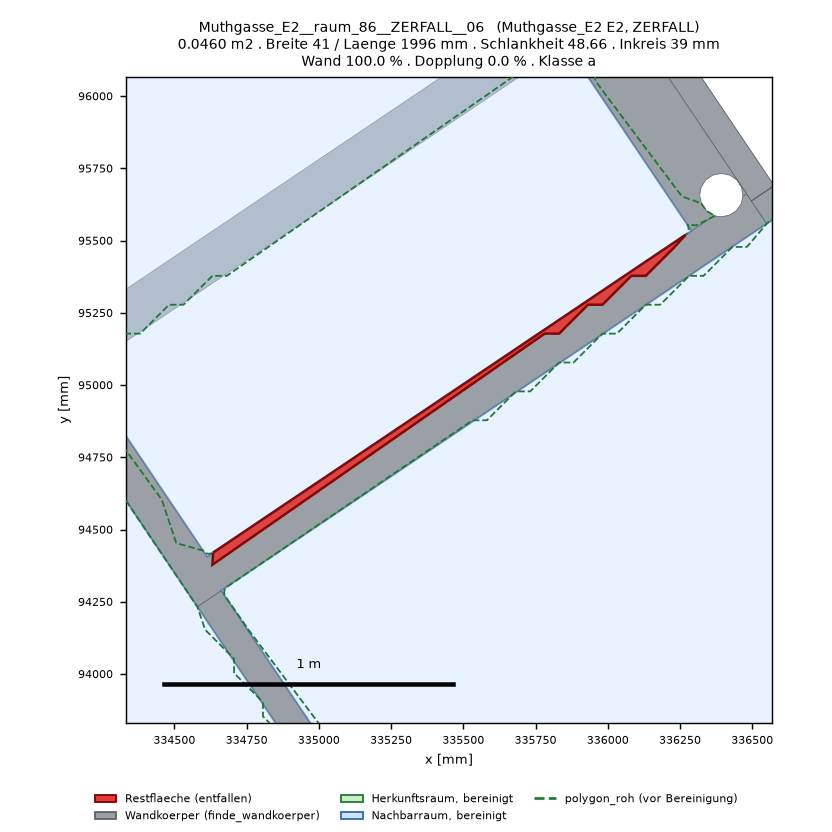

#### Muthgasse_E2__raum_86__ZERFALL__07 · ZERFALL 07 — Klasse (a)

| Pflichtfeld | Messwert |
|---|---|
| Plan · Geschoss | `Muthgasse_E2` · E2 (`Projekte/_eingang/Muthgasse_E2.dxf`) |
| Raum-ID vorher | `raum_86` „Wohnküche“ · Typ KÜCHE · Quelle F · Flag entfallen · roh 43,659 m2 → bereinigt 0,000 m2 · Liste `entfallen` |
| entfernende Regel | `ZERFALL` (Buchung Nr. 7 dieses Raums in `raum.bereinigung[]`) |
| Flaeche | **0,024233 m2** (24233,2 mm2) |
| Schwerpunkt (Plan-mm) | (336152,2 / 95778,5) |
| Umriss | 21 Punkte, 0 Loecher |
| groesste Breite / Laenge | 95 mm / 758 mm (kleinstes umschliessendes Rechteck) |
| Schlankheitsgrad | 8,00 (Laenge/Breite) |
| freie Breite (Inkreis) | 81 mm |
| im Wandkoerper | 100,0 % (24233,2 mm2 von 24233,2 mm2) |
| in einem anderen Raum (`polygon_mm`) | 0,0 % — kein anderer Raum getroffen |
| Nachbarn (Abstand ≤ 10 mm) | `raum_20` „Bad“ BAD, Kontakt 761 mm, Abstand 0,0 mm |
| **Klasse** | **(a) Wandschlitz — entfaellt zulaessig** |
| Begruendung | 100,0 % der Flaeche liegen in der Wand-Union (`finde_wandkoerper` + `wand_union`, Puffer 25 mm) — Schranke (a) ist 90 %. Freie Breite 81 mm, Schlankheit 8,0: als Nutzflaeche geometrisch ausgeschlossen. |
| Bild | `bilder/zerfall_schlitz/Muthgasse_E2__raum_86__ZERFALL__07.png` — Fenster 1 203 × 1 203 mm (300 mm Umfeld), Massstab 1,45 mm/px, Stueckbreite 66 px |

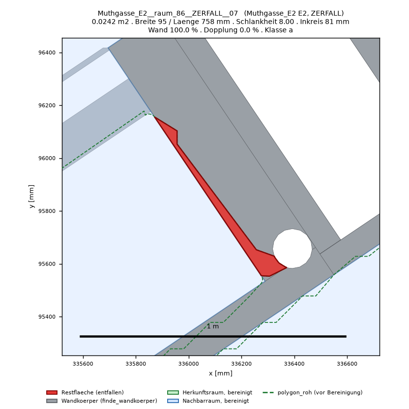

#### Muthgasse_E2__raum_92__ZERFALL__03 · ZERFALL 03 — Klasse (a)

| Pflichtfeld | Messwert |
|---|---|
| Plan · Geschoss | `Muthgasse_E2` · E2 (`Projekte/_eingang/Muthgasse_E2.dxf`) |
| Raum-ID vorher | `raum_92` „Wohnküche“ · Typ KÜCHE · Quelle F · Flag entfallen · roh 20,726 m2 → bereinigt 0,000 m2 · Liste `entfallen` |
| entfernende Regel | `ZERFALL` (Buchung Nr. 3 dieses Raums in `raum.bereinigung[]`) |
| Flaeche | **0,023283 m2** (23282,9 mm2) |
| Schwerpunkt (Plan-mm) | (352654,5 / 127418,6) — liegt bei dieser konkaven Form NICHT im Stueck; Punkt IM Stueck: (352665,8 / 127428,0) |
| Umriss | 8 Punkte, 0 Loecher |
| groesste Breite / Laenge | 32 mm / 1 278 mm (kleinstes umschliessendes Rechteck) |
| Schlankheitsgrad | 39,42 (Laenge/Breite) |
| freie Breite (Inkreis) | 32 mm |
| im Wandkoerper | 100,0 % (23282,9 mm2 von 23282,9 mm2) |
| in einem anderen Raum (`polygon_mm`) | 0,0 % (groesster Treffer `raum_37`) |
| Nachbarn (Abstand ≤ 10 mm) | `raum_37` „Bad“ BAD, Kontakt 1 491 mm, Abstand 0,0 mm |
| **Klasse** | **(a) Wandschlitz — entfaellt zulaessig** |
| Begruendung | 100,0 % der Flaeche liegen in der Wand-Union (`finde_wandkoerper` + `wand_union`, Puffer 25 mm) — Schranke (a) ist 90 %. Freie Breite 32 mm, Schlankheit 39,4: als Nutzflaeche geometrisch ausgeschlossen. |
| Bild | `bilder/zerfall_schlitz/Muthgasse_E2__raum_92__ZERFALL__03.png` — Fenster 1 633 × 1 633 mm (300 mm Umfeld), Massstab 1,96 mm/px, Stueckbreite 17 px |

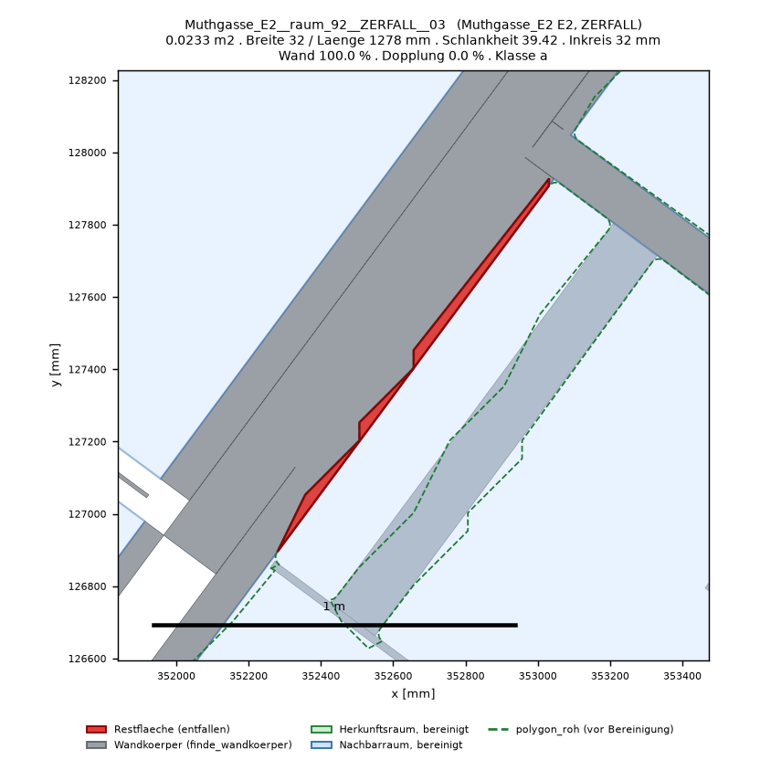

### 4.3 OFFEN — Stuecke ≥ 0,01 m2 (37 von 110), 6,847401 m2

Diese Stuecke sind **nicht** als zulaessig entfallen deklariert. In jedem Block steht unter „Begruendung“, **welche Messung oder Entscheidung fehlt**, um die Klasse zu schliessen.

#### Muthgasse_E2__raum_86__ENTFALL__01 · ENTFALL 01 — Klasse OFFEN

| Pflichtfeld | Messwert |
|---|---|
| Plan · Geschoss | `Muthgasse_E2` · E2 (`Projekte/_eingang/Muthgasse_E2.dxf`) |
| Raum-ID vorher | `raum_86` „Wohnküche“ · Typ KÜCHE · Quelle F · Flag entfallen · roh 43,659 m2 → bereinigt 0,000 m2 · Liste `entfallen` |
| entfernende Regel | `ENTFALL` (Buchung Nr. 1 dieses Raums in `raum.bereinigung[]`) |
| Flaeche | **0,938508 m2** (938507,5 mm2) |
| Schwerpunkt (Plan-mm) | (336526,4 / 89685,0) — liegt bei dieser konkaven Form NICHT im Stueck; Punkt IM Stueck: (337355,5 / 89687,5) |
| Umriss | 119 Punkte, 0 Loecher |
| groesste Breite / Laenge | 1 818 mm / 4 112 mm (kleinstes umschliessendes Rechteck) |
| Schlankheitsgrad | 2,26 (Laenge/Breite) |
| freie Breite (Inkreis) | 559 mm |
| im Wandkoerper | 2,1 % (20027,4 mm2 von 938507,5 mm2) |
| in einem anderen Raum (`polygon_mm`) | 0,0 % (groesster Treffer `raum_26`) |
| Nachbarn (Abstand ≤ 10 mm) | `raum_24` „Loggia“ BALKON, Kontakt 6 211 mm, Abstand 0,0 mm · `raum_26` „Wohnküche“ KÜCHE, Kontakt 3 186 mm, Abstand 0,0 mm |
| **Klasse** | **OFFEN — nicht als zulaessig deklarierbar** |
| Begruendung | Flaeche 0,938508 m2 unter der (c)-Schranke 1,00 m2 (= `ENTFALL_MM2` des Moduls), freie Breite mit 559 mm aber ausreichend. Zu schliessen mit einer Owner-Entscheidung: ab welcher Flaeche ist ein Restkoerper Nutzflaeche? |
| Bild | `bilder/zerfall_schlitz/Muthgasse_E2__raum_86__ENTFALL__01.png` — Fenster 4 688 × 4 688 mm (300 mm Umfeld), Massstab 5,64 mm/px, Stueckbreite 323 px |

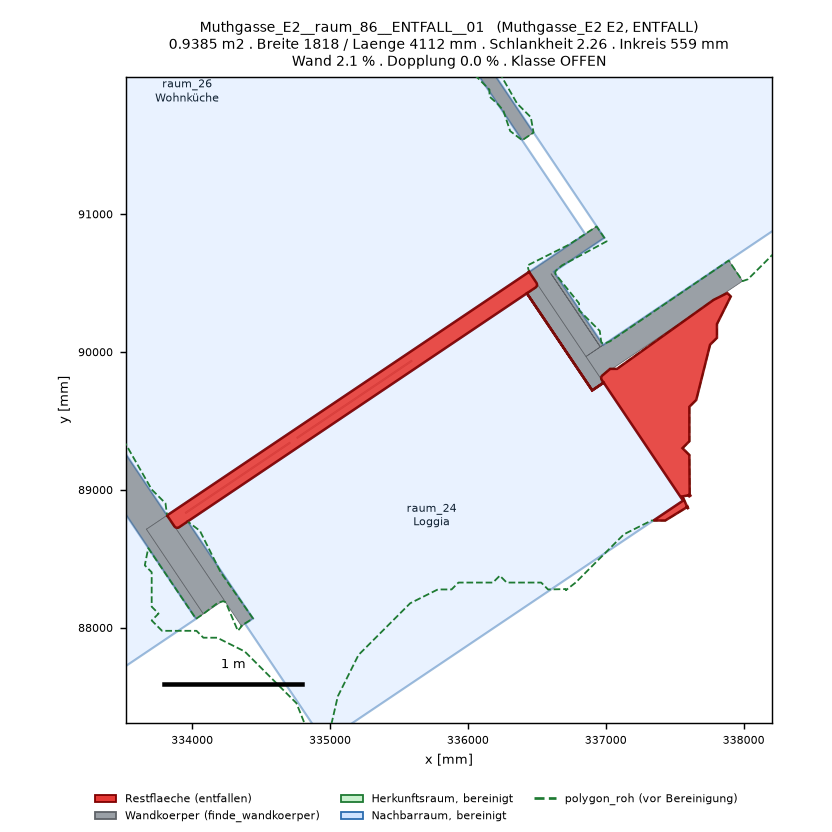

#### Muthgasse_E2__raum_88__ZERFALL__02 · ZERFALL 02 — Klasse OFFEN

| Pflichtfeld | Messwert |
|---|---|
| Plan · Geschoss | `Muthgasse_E2` · E2 (`Projekte/_eingang/Muthgasse_E2.dxf`) |
| Raum-ID vorher | `raum_88` „STGH“ · Typ STIEGENHAUS · Quelle F · Flag flutung_unsicher · roh 20,675 m2 → bereinigt 3,820 m2 · Liste `raeume` |
| entfernende Regel | `ZERFALL` (Buchung Nr. 2 dieses Raums in `raum.bereinigung[]`) |
| Flaeche | **0,762984 m2** (762984,2 mm2) |
| Schwerpunkt (Plan-mm) | (329767,2 / 96755,9) — liegt bei dieser konkaven Form NICHT im Stueck; Punkt IM Stueck: (329950,9 / 96759,7) |
| Umriss | 136 Punkte, 0 Loecher |
| groesste Breite / Laenge | 400 mm / 2 225 mm (kleinstes umschliessendes Rechteck) |
| Schlankheitsgrad | 5,56 (Laenge/Breite) |
| freie Breite (Inkreis) | 391 mm |
| im Wandkoerper | 0,1 % (865,9 mm2 von 762984,2 mm2) |
| in einem anderen Raum (`polygon_mm`) | 0,0 % (groesster Treffer `raum_68`) |
| Nachbarn (Abstand ≤ 10 mm) | `raum_68` „Gang“ GANG, Kontakt 3 069 mm, Abstand 0,0 mm |
| **Klasse** | **OFFEN — nicht als zulaessig deklarierbar** |
| Begruendung | freie Breite (Inkreis) 391 mm unter meiner (c)-Schranke 500 mm. Diese 500 mm sind MEINE Setzung — das Repo definiert keine Begehbarkeitsbreite (gegrept, § 3.3). Zu schliessen mit einer Owner-Entscheidung zur Mindestbreite. |
| Bild | `bilder/zerfall_schlitz/Muthgasse_E2__raum_88__ZERFALL__02.png` — Fenster 2 660 × 2 660 mm (300 mm Umfeld), Massstab 3,20 mm/px, Stueckbreite 125 px |

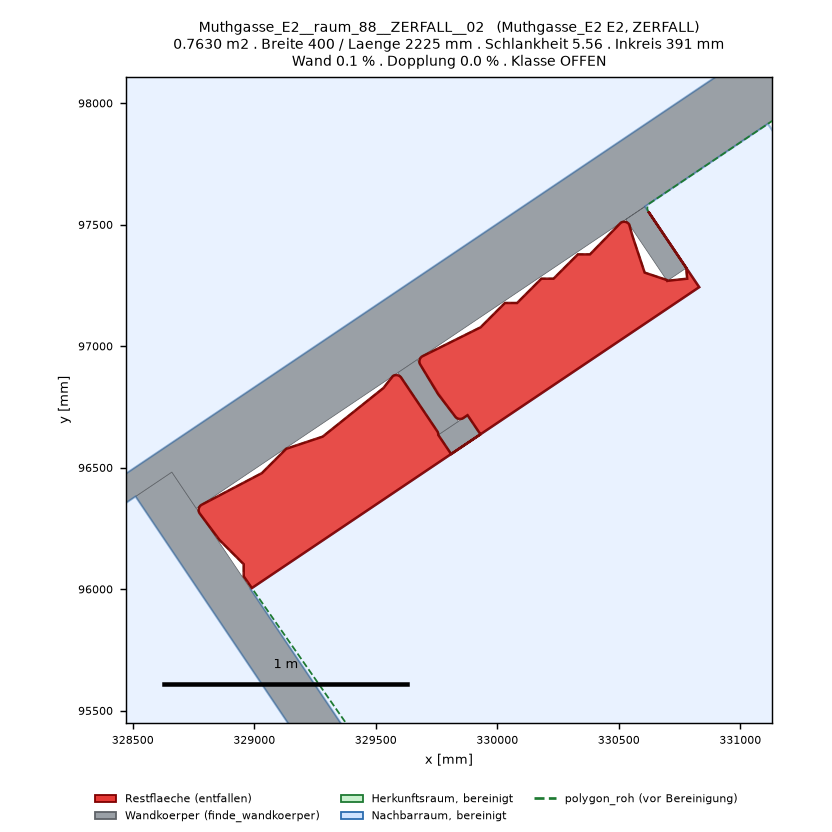

#### Muthgasse_E2__raum_87__ZERFALL__01 · ZERFALL 01 — Klasse OFFEN

| Pflichtfeld | Messwert |
|---|---|
| Plan · Geschoss | `Muthgasse_E2` · E2 (`Projekte/_eingang/Muthgasse_E2.dxf`) |
| Raum-ID vorher | `raum_87` „Wohnküche“ · Typ KÜCHE · Quelle F · Flag flutung_unsicher · roh 39,545 m2 → bereinigt 24,616 m2 · Liste `raeume` |
| entfernende Regel | `ZERFALL` (Buchung Nr. 1 dieses Raums in `raum.bereinigung[]`) |
| Flaeche | **0,437742 m2** (437741,5 mm2) |
| Schwerpunkt (Plan-mm) | (349452,0 / 109774,3) |
| Umriss | 64 Punkte, 0 Loecher |
| groesste Breite / Laenge | 799 mm / 1 139 mm (kleinstes umschliessendes Rechteck) |
| Schlankheitsgrad | 1,42 (Laenge/Breite) |
| freie Breite (Inkreis) | 575 mm |
| im Wandkoerper | 0,0 % (22,4 mm2 von 437741,5 mm2) |
| in einem anderen Raum (`polygon_mm`) | 0,0 % (groesster Treffer `raum_31`) |
| Nachbarn (Abstand ≤ 10 mm) | `raum_31` „Loggia“ BALKON, Kontakt 1 435 mm, Abstand 0,0 mm |
| **Klasse** | **OFFEN — nicht als zulaessig deklarierbar** |
| Begruendung | Flaeche 0,437742 m2 unter der (c)-Schranke 1,00 m2 (= `ENTFALL_MM2` des Moduls), freie Breite mit 575 mm aber ausreichend. Zu schliessen mit einer Owner-Entscheidung: ab welcher Flaeche ist ein Restkoerper Nutzflaeche? |
| Bild | `bilder/zerfall_schlitz/Muthgasse_E2__raum_87__ZERFALL__01.png` — Fenster 1 637 × 1 637 mm (300 mm Umfeld), Massstab 1,97 mm/px, Stueckbreite 406 px |

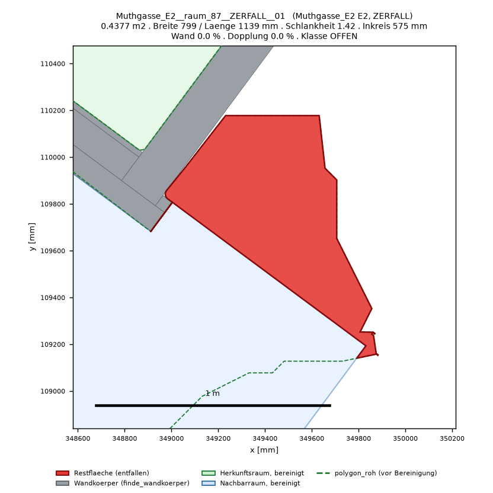

#### Muthgasse_E2__raum_86__ZERFALL__01 · ZERFALL 01 — Klasse OFFEN

| Pflichtfeld | Messwert |
|---|---|
| Plan · Geschoss | `Muthgasse_E2` · E2 (`Projekte/_eingang/Muthgasse_E2.dxf`) |
| Raum-ID vorher | `raum_86` „Wohnküche“ · Typ KÜCHE · Quelle F · Flag entfallen · roh 43,659 m2 → bereinigt 0,000 m2 · Liste `entfallen` |
| entfernende Regel | `ZERFALL` (Buchung Nr. 1 dieses Raums in `raum.bereinigung[]`) |
| Flaeche | **0,409664 m2** (409664,4 mm2) |
| Schwerpunkt (Plan-mm) | (338854,9 / 91193,8) |
| Umriss | 45 Punkte, 0 Loecher |
| groesste Breite / Laenge | 333 mm / 3 241 mm (kleinstes umschliessendes Rechteck) |
| Schlankheitsgrad | 9,72 (Laenge/Breite) |
| freie Breite (Inkreis) | 275 mm |
| im Wandkoerper | 2,3 % (9339,5 mm2 von 409664,4 mm2) |
| in einem anderen Raum (`polygon_mm`) | 0,0 % (groesster Treffer `raum_25`) |
| Nachbarn (Abstand ≤ 10 mm) | `raum_25` „Zimmer“ ZIMMER, Kontakt 4 332 mm, Abstand 0,0 mm |
| **Klasse** | **OFFEN — nicht als zulaessig deklarierbar** |
| Begruendung | freie Breite (Inkreis) 275 mm unter meiner (c)-Schranke 500 mm. Diese 500 mm sind MEINE Setzung — das Repo definiert keine Begehbarkeitsbreite (gegrept, § 3.3). Zu schliessen mit einer Owner-Entscheidung zur Mindestbreite. |
| Bild | `bilder/zerfall_schlitz/Muthgasse_E2__raum_86__ZERFALL__01.png` — Fenster 3 380 × 3 380 mm (300 mm Umfeld), Massstab 4,06 mm/px, Stueckbreite 82 px |

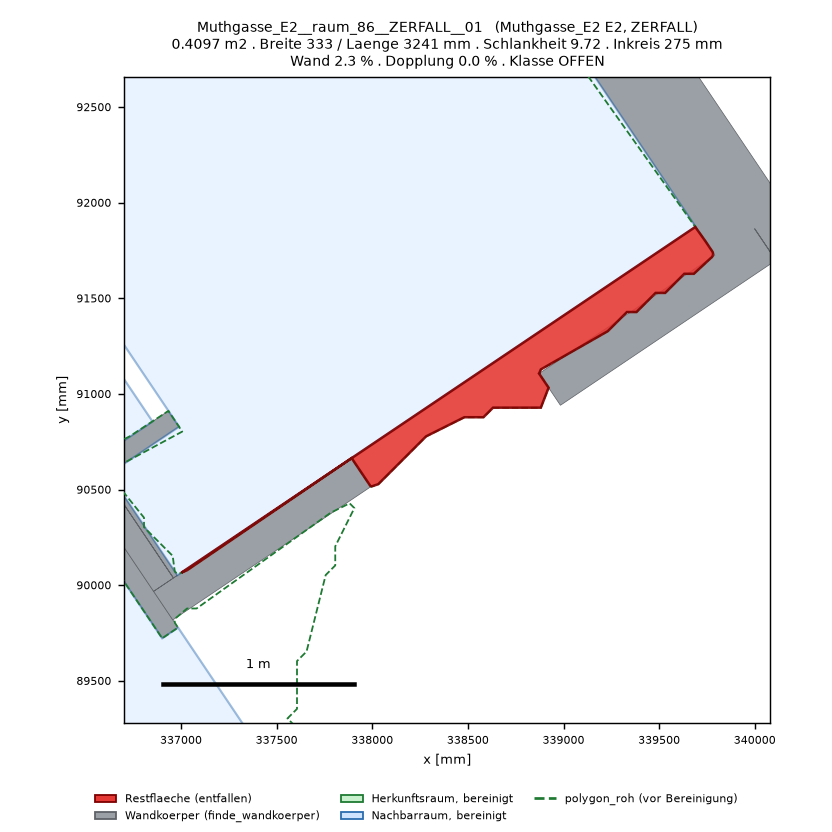

#### Muthgasse_E2__raum_85__ZERFALL__01 · ZERFALL 01 — Klasse OFFEN

| Pflichtfeld | Messwert |
|---|---|
| Plan · Geschoss | `Muthgasse_E2` · E2 (`Projekte/_eingang/Muthgasse_E2.dxf`) |
| Raum-ID vorher | `raum_85` „Wohnküche“ · Typ KÜCHE · Quelle F · Flag ok · roh 33,464 m2 → bereinigt 1,061 m2 · Liste `raeume` |
| entfernende Regel | `ZERFALL` (Buchung Nr. 1 dieses Raums in `raum.bereinigung[]`) |
| Flaeche | **0,379588 m2** (379587,9 mm2) |
| Schwerpunkt (Plan-mm) | (331880,4 / 85829,3) |
| Umriss | 17 Punkte, 0 Loecher |
| groesste Breite / Laenge | 717 mm / 1 552 mm (kleinstes umschliessendes Rechteck) |
| Schlankheitsgrad | 2,16 (Laenge/Breite) |
| freie Breite (Inkreis) | 451 mm |
| im Wandkoerper | 1,4 % (5375,2 mm2 von 379587,9 mm2) |
| in einem anderen Raum (`polygon_mm`) | 0,0 % — kein anderer Raum getroffen |
| Nachbarn (Abstand ≤ 10 mm) | `raum_23` „Loggia“ BALKON, Kontakt 1 196 mm, Abstand 0,0 mm |
| **Klasse** | **OFFEN — nicht als zulaessig deklarierbar** |
| Begruendung | freie Breite (Inkreis) 451 mm unter meiner (c)-Schranke 500 mm. Diese 500 mm sind MEINE Setzung — das Repo definiert keine Begehbarkeitsbreite (gegrept, § 3.3). Zu schliessen mit einer Owner-Entscheidung zur Mindestbreite. |
| Bild | `bilder/zerfall_schlitz/Muthgasse_E2__raum_85__ZERFALL__01.png` — Fenster 2 050 × 2 050 mm (300 mm Umfeld), Massstab 2,46 mm/px, Stueckbreite 291 px |

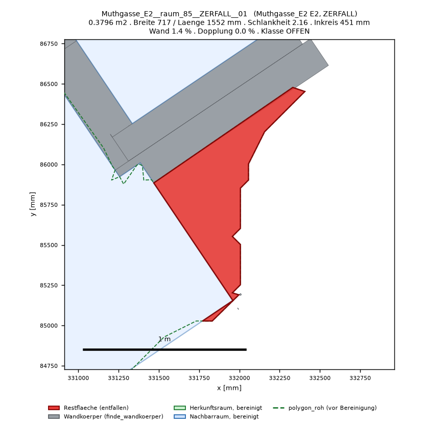

#### Muthgasse_E2__raum_85__ZERFALL__02 · ZERFALL 02 — Klasse OFFEN

| Pflichtfeld | Messwert |
|---|---|
| Plan · Geschoss | `Muthgasse_E2` · E2 (`Projekte/_eingang/Muthgasse_E2.dxf`) |
| Raum-ID vorher | `raum_85` „Wohnküche“ · Typ KÜCHE · Quelle F · Flag ok · roh 33,464 m2 → bereinigt 1,061 m2 · Liste `raeume` |
| entfernende Regel | `ZERFALL` (Buchung Nr. 2 dieses Raums in `raum.bereinigung[]`) |
| Flaeche | **0,376439 m2** (376438,7 mm2) |
| Schwerpunkt (Plan-mm) | (329553,0 / 85874,3) |
| Umriss | 59 Punkte, 0 Loecher |
| groesste Breite / Laenge | 122 mm / 3 160 mm (kleinstes umschliessendes Rechteck) |
| Schlankheitsgrad | 25,99 (Laenge/Breite) |
| freie Breite (Inkreis) | 120 mm |
| im Wandkoerper | 5,1 % (19155,5 mm2 von 376438,7 mm2) |
| in einem anderen Raum (`polygon_mm`) | 0,0 % (groesster Treffer `raum_23`) |
| Nachbarn (Abstand ≤ 10 mm) | `raum_22` „Wohnküche“ KÜCHE, Kontakt 3 178 mm, Abstand 0,0 mm · `raum_23` „Loggia“ BALKON, Kontakt 2 933 mm, Abstand 0,0 mm |
| **Klasse** | **OFFEN — nicht als zulaessig deklarierbar** |
| Begruendung | freie Breite (Inkreis) 120 mm unter meiner (c)-Schranke 500 mm. Diese 500 mm sind MEINE Setzung — das Repo definiert keine Begehbarkeitsbreite (gegrept, § 3.3). Zu schliessen mit einer Owner-Entscheidung zur Mindestbreite. |
| Bild | `bilder/zerfall_schlitz/Muthgasse_E2__raum_85__ZERFALL__02.png` — Fenster 3 279 × 3 279 mm (300 mm Umfeld), Massstab 3,94 mm/px, Stueckbreite 31 px |

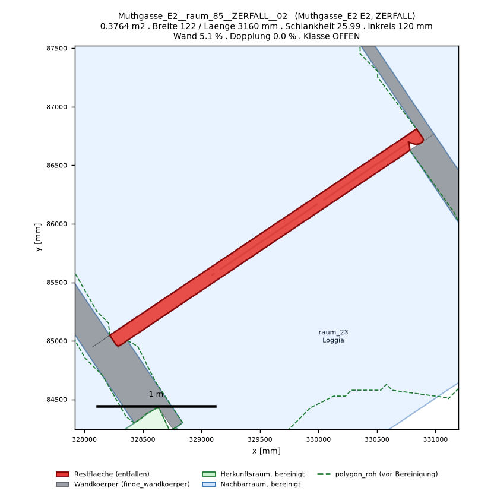

#### Muthgasse_E2__raum_82__ENTFALL__01 · ENTFALL 01 — Klasse OFFEN

| Pflichtfeld | Messwert |
|---|---|
| Plan · Geschoss | `Muthgasse_E2` · E2 (`Projekte/_eingang/Muthgasse_E2.dxf`) |
| Raum-ID vorher | `raum_82` „Wohnküche“ · Typ KÜCHE · Quelle F · Flag entfallen · roh 19,879 m2 → bereinigt 0,000 m2 · Liste `entfallen` |
| entfernende Regel | `ENTFALL` (Buchung Nr. 1 dieses Raums in `raum.bereinigung[]`) |
| Flaeche | **0,360548 m2** (360547,6 mm2) |
| Schwerpunkt (Plan-mm) | (313984,5 / 117584,2) |
| Umriss | 33 Punkte, 0 Loecher |
| groesste Breite / Laenge | 754 mm / 1 485 mm (kleinstes umschliessendes Rechteck) |
| Schlankheitsgrad | 1,97 (Laenge/Breite) |
| freie Breite (Inkreis) | 456 mm |
| im Wandkoerper | 0,0 % (125,0 mm2 von 360547,6 mm2) |
| in einem anderen Raum (`polygon_mm`) | 0,0 % — kein anderer Raum getroffen |
| Nachbarn (Abstand ≤ 10 mm) | `raum_10` „Loggia“ BALKON, Kontakt 954 mm, Abstand 0,0 mm |
| **Klasse** | **OFFEN — nicht als zulaessig deklarierbar** |
| Begruendung | freie Breite (Inkreis) 456 mm unter meiner (c)-Schranke 500 mm. Diese 500 mm sind MEINE Setzung — das Repo definiert keine Begehbarkeitsbreite (gegrept, § 3.3). Zu schliessen mit einer Owner-Entscheidung zur Mindestbreite. |
| Bild | `bilder/zerfall_schlitz/Muthgasse_E2__raum_82__ENTFALL__01.png` — Fenster 1 814 × 1 814 mm (300 mm Umfeld), Massstab 2,18 mm/px, Stueckbreite 346 px |

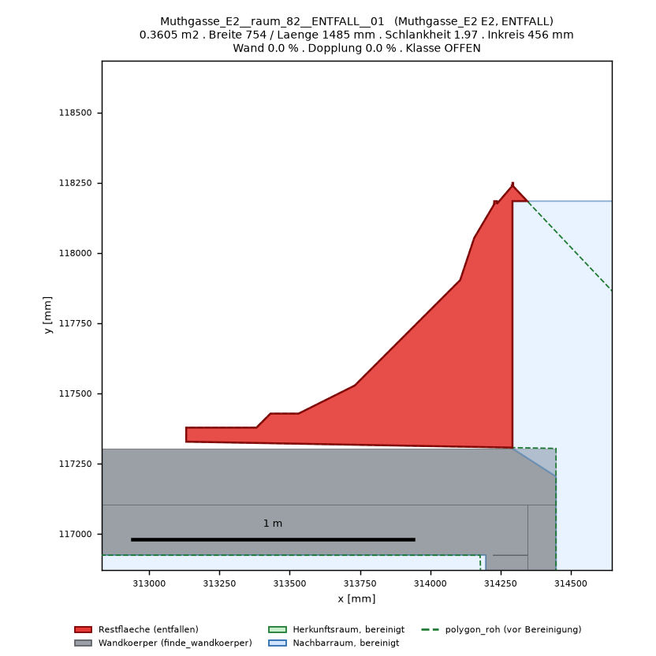

#### Muthgasse_E2__raum_82__ZERFALL__01 · ZERFALL 01 — Klasse OFFEN

| Pflichtfeld | Messwert |
|---|---|
| Plan · Geschoss | `Muthgasse_E2` · E2 (`Projekte/_eingang/Muthgasse_E2.dxf`) |
| Raum-ID vorher | `raum_82` „Wohnküche“ · Typ KÜCHE · Quelle F · Flag entfallen · roh 19,879 m2 → bereinigt 0,000 m2 · Liste `entfallen` |
| entfernende Regel | `ZERFALL` (Buchung Nr. 1 dieses Raums in `raum.bereinigung[]`) |
| Flaeche | **0,355830 m2** (355830,2 mm2) |
| Schwerpunkt (Plan-mm) | (315965,7 / 116242,9) |
| Umriss | 52 Punkte, 0 Loecher |
| groesste Breite / Laenge | 121 mm / 3 137 mm (kleinstes umschliessendes Rechteck) |
| Schlankheitsgrad | 26,01 (Laenge/Breite) |
| freie Breite (Inkreis) | 119 mm |
| im Wandkoerper | 5,4 % (19149,9 mm2 von 355830,2 mm2) |
| in einem anderen Raum (`polygon_mm`) | 0,0 % — kein anderer Raum getroffen |
| Nachbarn (Abstand ≤ 10 mm) | `raum_7` „Wohnküche“ KÜCHE, Kontakt 3 183 mm, Abstand 0,0 mm · `raum_10` „Loggia“ BALKON, Kontakt 3 052 mm, Abstand 0,0 mm |
| **Klasse** | **OFFEN — nicht als zulaessig deklarierbar** |
| Begruendung | freie Breite (Inkreis) 119 mm unter meiner (c)-Schranke 500 mm. Diese 500 mm sind MEINE Setzung — das Repo definiert keine Begehbarkeitsbreite (gegrept, § 3.3). Zu schliessen mit einer Owner-Entscheidung zur Mindestbreite. |
| Bild | `bilder/zerfall_schlitz/Muthgasse_E2__raum_82__ZERFALL__01.png` — Fenster 3 737 × 3 737 mm (300 mm Umfeld), Massstab 4,49 mm/px, Stueckbreite 27 px |

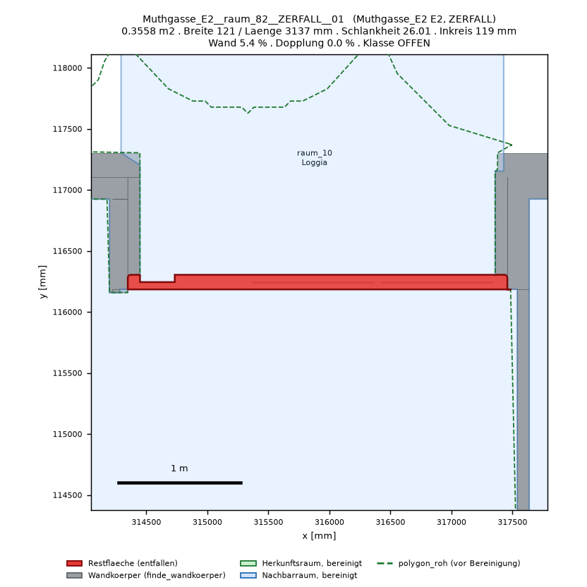

#### Barawitzka_EG__raum_43__ZERFALL__02 · ZERFALL 02 — Klasse OFFEN

| Pflichtfeld | Messwert |
|---|---|
| Plan · Geschoss | `Barawitzka_EG` · EG (`Projekte/_eingang/Barawitzka_EG.dxf`) |
| Raum-ID vorher | `raum_43` „Terrasse“ · Typ TERRASSE · Quelle F · Flag flutung_unsicher · roh 56,643 m2 → bereinigt 15,533 m2 · Liste `raeume` |
| entfernende Regel | `ZERFALL` (Buchung Nr. 2 dieses Raums in `raum.bereinigung[]`) |
| Flaeche | **0,344208 m2** (344208,3 mm2) |
| Schwerpunkt (Plan-mm) | (11836,1 / -23934,7) |
| Umriss | 78 Punkte, 0 Loecher |
| groesste Breite / Laenge | 1 196 mm / 1 834 mm (kleinstes umschliessendes Rechteck) |
| Schlankheitsgrad | 1,53 (Laenge/Breite) |
| freie Breite (Inkreis) | 310 mm |
| im Wandkoerper | 0,9 % (3109,6 mm2 von 344208,3 mm2) |
| in einem anderen Raum (`polygon_mm`) | 0,0 % — kein anderer Raum getroffen |
| Nachbarn (Abstand ≤ 10 mm) | `raum_37` „Treppenhaus 2“ STIEGENHAUS, Kontakt 4 201 mm, Abstand 0,0 mm · `raum_12` „VR“ VORRAUM, Kontakt 1 192 mm, Abstand 0,0 mm |
| **Klasse** | **OFFEN — nicht als zulaessig deklarierbar** |
| Begruendung | freie Breite (Inkreis) 310 mm unter meiner (c)-Schranke 500 mm. Diese 500 mm sind MEINE Setzung — das Repo definiert keine Begehbarkeitsbreite (gegrept, § 3.3). Zu schliessen mit einer Owner-Entscheidung zur Mindestbreite. |
| Bild | `bilder/zerfall_schlitz/Barawitzka_EG__raum_43__ZERFALL__02.png` — Fenster 2 150 × 2 150 mm (300 mm Umfeld), Massstab 2,58 mm/px, Stueckbreite 463 px |

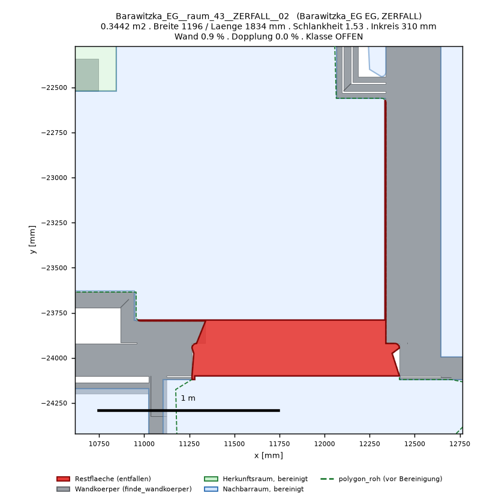

#### Muthgasse_E2__raum_90__ZERFALL__02 · ZERFALL 02 — Klasse OFFEN

| Pflichtfeld | Messwert |
|---|---|
| Plan · Geschoss | `Muthgasse_E2` · E2 (`Projekte/_eingang/Muthgasse_E2.dxf`) |
| Raum-ID vorher | `raum_90` „Zimmer“ · Typ ZIMMER · Quelle F · Flag flutung_unsicher · roh 18,952 m2 → bereinigt 3,990 m2 · Liste `raeume` |
| entfernende Regel | `ZERFALL` (Buchung Nr. 2 dieses Raums in `raum.bereinigung[]`) |
| Flaeche | **0,232560 m2** (232559,5 mm2) |
| Schwerpunkt (Plan-mm) | (351693,2 / 121885,3) |
| Umriss | 44 Punkte, 0 Loecher |
| groesste Breite / Laenge | 1 005 mm / 2 495 mm (kleinstes umschliessendes Rechteck) |
| Schlankheitsgrad | 2,48 (Laenge/Breite) |
| freie Breite (Inkreis) | 125 mm |
| im Wandkoerper | 0,4 % (1014,6 mm2 von 232559,5 mm2) |
| in einem anderen Raum (`polygon_mm`) | 0,0 % (groesster Treffer `raum_35`) |
| Nachbarn (Abstand ≤ 10 mm) | `raum_54` „Vorraum“ VORRAUM, Kontakt 3 269 mm, Abstand 0,0 mm · `raum_35` „AR“ ABSTELLRAUM, Kontakt 3 176 mm, Abstand 0,0 mm |
| **Klasse** | **OFFEN — nicht als zulaessig deklarierbar** |
| Begruendung | freie Breite (Inkreis) 125 mm unter meiner (c)-Schranke 500 mm. Diese 500 mm sind MEINE Setzung — das Repo definiert keine Begehbarkeitsbreite (gegrept, § 3.3). Zu schliessen mit einer Owner-Entscheidung zur Mindestbreite. |
| Bild | `bilder/zerfall_schlitz/Muthgasse_E2__raum_90__ZERFALL__02.png` — Fenster 2 834 × 2 834 mm (300 mm Umfeld), Massstab 3,41 mm/px, Stueckbreite 295 px |

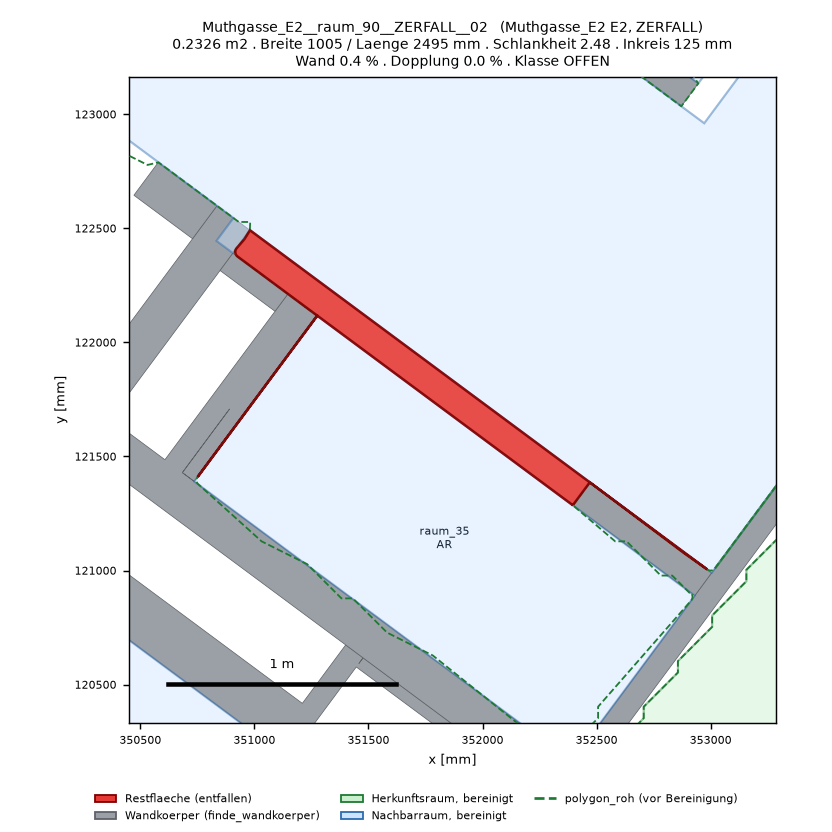

#### Barawitzka_EG__raum_44__ENTFALL__01 · ENTFALL 01 — Klasse OFFEN

| Pflichtfeld | Messwert |
|---|---|
| Plan · Geschoss | `Barawitzka_EG` · EG (`Projekte/_eingang/Barawitzka_EG.dxf`) |
| Raum-ID vorher | `raum_44` „Loggia“ · Typ BALKON · Quelle F · Flag entfallen · roh 4,879 m2 → bereinigt 0,000 m2 · Liste `entfallen` |
| entfernende Regel | `ENTFALL` (Buchung Nr. 1 dieses Raums in `raum.bereinigung[]`) |
| Flaeche | **0,224190 m2** (224190,2 mm2) |
| Schwerpunkt (Plan-mm) | (11955,0 / -32126,1) |
| Umriss | 14 Punkte, 0 Loecher |
| groesste Breite / Laenge | 229 mm / 1 546 mm (kleinstes umschliessendes Rechteck) |
| Schlankheitsgrad | 6,77 (Laenge/Breite) |
| freie Breite (Inkreis) | 225 mm |
| im Wandkoerper | 0,0 % (0,0 mm2 von 224190,2 mm2) |
| in einem anderen Raum (`polygon_mm`) | 0,0 % — kein anderer Raum getroffen |
| Nachbarn (Abstand ≤ 10 mm) | `raum_6` „tERRASSE“ BALKON, Kontakt 1 584 mm, Abstand 0,0 mm |
| **Klasse** | **OFFEN — nicht als zulaessig deklarierbar** |
| Begruendung | freie Breite (Inkreis) 225 mm unter meiner (c)-Schranke 500 mm. Diese 500 mm sind MEINE Setzung — das Repo definiert keine Begehbarkeitsbreite (gegrept, § 3.3). Zu schliessen mit einer Owner-Entscheidung zur Mindestbreite. |
| Bild | `bilder/zerfall_schlitz/Barawitzka_EG__raum_44__ENTFALL__01.png` — Fenster 2 131 × 2 131 mm (300 mm Umfeld), Massstab 2,56 mm/px, Stueckbreite 89 px |

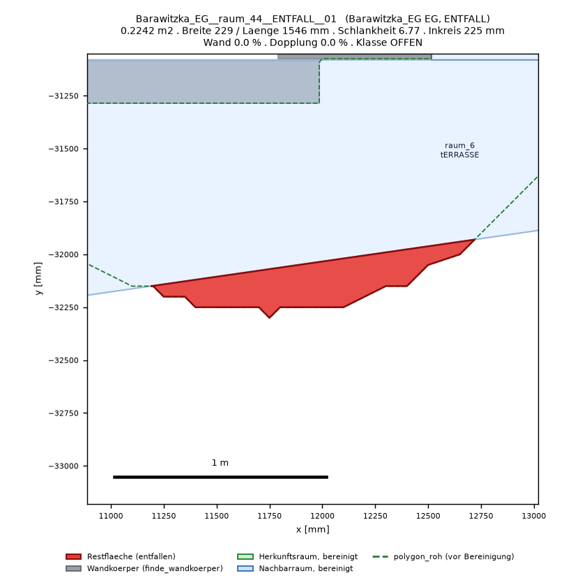

#### Muthgasse_E2__raum_87__ZERFALL__02 · ZERFALL 02 — Klasse OFFEN

| Pflichtfeld | Messwert |
|---|---|
| Plan · Geschoss | `Muthgasse_E2` · E2 (`Projekte/_eingang/Muthgasse_E2.dxf`) |
| Raum-ID vorher | `raum_87` „Wohnküche“ · Typ KÜCHE · Quelle F · Flag flutung_unsicher · roh 39,545 m2 → bereinigt 24,616 m2 · Liste `raeume` |
| entfernende Regel | `ZERFALL` (Buchung Nr. 2 dieses Raums in `raum.bereinigung[]`) |
| Flaeche | **0,205851 m2** (205850,6 mm2) |
| Schwerpunkt (Plan-mm) | (347198,7 / 107079,0) |
| Umriss | 68 Punkte, 0 Loecher |
| groesste Breite / Laenge | 474 mm / 1 463 mm (kleinstes umschliessendes Rechteck) |
| Schlankheitsgrad | 3,09 (Laenge/Breite) |
| freie Breite (Inkreis) | 271 mm |
| im Wandkoerper | 0,0 % (19,4 mm2 von 205850,6 mm2) |
| in einem anderen Raum (`polygon_mm`) | 0,0 % (groesster Treffer `raum_28`) |
| Nachbarn (Abstand ≤ 10 mm) | `raum_31` „Loggia“ BALKON, Kontakt 1 429 mm, Abstand 0,0 mm · `raum_28` „Zimmer“ ZIMMER, Kontakt 280 mm, Abstand 0,0 mm |
| **Klasse** | **OFFEN — nicht als zulaessig deklarierbar** |
| Begruendung | freie Breite (Inkreis) 271 mm unter meiner (c)-Schranke 500 mm. Diese 500 mm sind MEINE Setzung — das Repo definiert keine Begehbarkeitsbreite (gegrept, § 3.3). Zu schliessen mit einer Owner-Entscheidung zur Mindestbreite. |
| Bild | `bilder/zerfall_schlitz/Muthgasse_E2__raum_87__ZERFALL__02.png` — Fenster 2 066 × 2 066 mm (300 mm Umfeld), Massstab 2,48 mm/px, Stueckbreite 191 px |

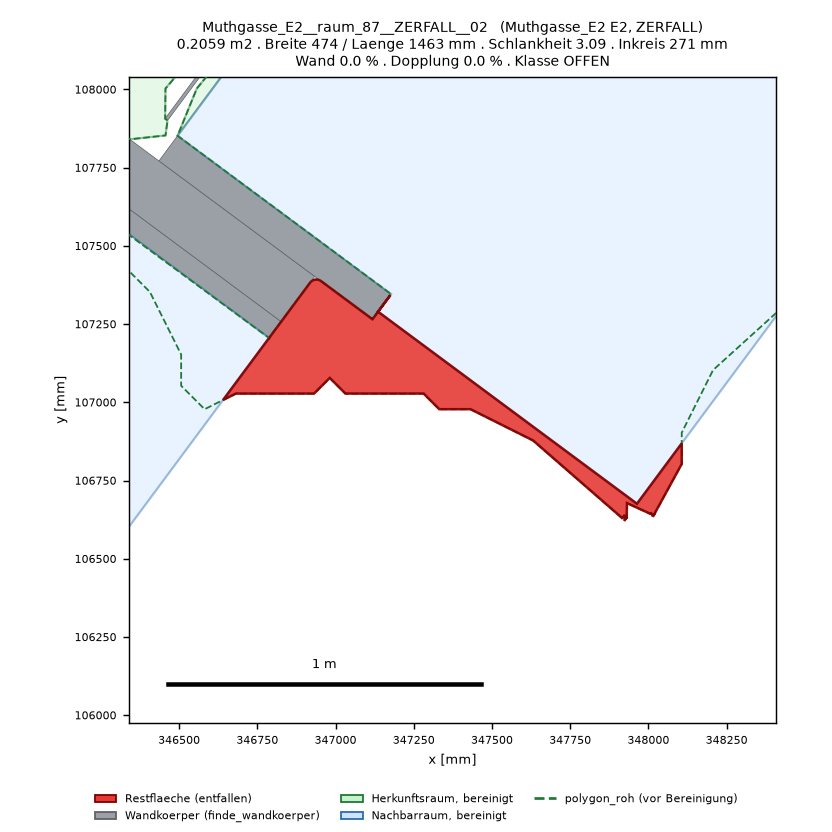

#### Muthgasse_E2__raum_90__ZERFALL__03 · ZERFALL 03 — Klasse OFFEN

| Pflichtfeld | Messwert |
|---|---|
| Plan · Geschoss | `Muthgasse_E2` · E2 (`Projekte/_eingang/Muthgasse_E2.dxf`) |
| Raum-ID vorher | `raum_90` „Zimmer“ · Typ ZIMMER · Quelle F · Flag flutung_unsicher · roh 18,952 m2 → bereinigt 3,990 m2 · Liste `raeume` |
| entfernende Regel | `ZERFALL` (Buchung Nr. 3 dieses Raums in `raum.bereinigung[]`) |
| Flaeche | **0,153677 m2** (153676,6 mm2) |
| Schwerpunkt (Plan-mm) | (353289,1 / 123491,4) |
| Umriss | 13 Punkte, 0 Loecher |
| groesste Breite / Laenge | 130 mm / 1 289 mm (kleinstes umschliessendes Rechteck) |
| Schlankheitsgrad | 9,95 (Laenge/Breite) |
| freie Breite (Inkreis) | 125 mm |
| im Wandkoerper | 0,0 % (0,0 mm2 von 153676,6 mm2) |
| in einem anderen Raum (`polygon_mm`) | 0,0 % (groesster Treffer `raum_54`) |
| Nachbarn (Abstand ≤ 10 mm) | `raum_54` „Vorraum“ VORRAUM, Kontakt 1 446 mm, Abstand 0,0 mm · `raum_36` „WC“ WC, Kontakt 1 069 mm, Abstand 0,0 mm |
| **Klasse** | **OFFEN — nicht als zulaessig deklarierbar** |
| Begruendung | freie Breite (Inkreis) 125 mm unter meiner (c)-Schranke 500 mm. Diese 500 mm sind MEINE Setzung — das Repo definiert keine Begehbarkeitsbreite (gegrept, § 3.3). Zu schliessen mit einer Owner-Entscheidung zur Mindestbreite. |
| Bild | `bilder/zerfall_schlitz/Muthgasse_E2__raum_90__ZERFALL__03.png` — Fenster 1 635 × 1 635 mm (300 mm Umfeld), Massstab 1,97 mm/px, Stueckbreite 66 px |

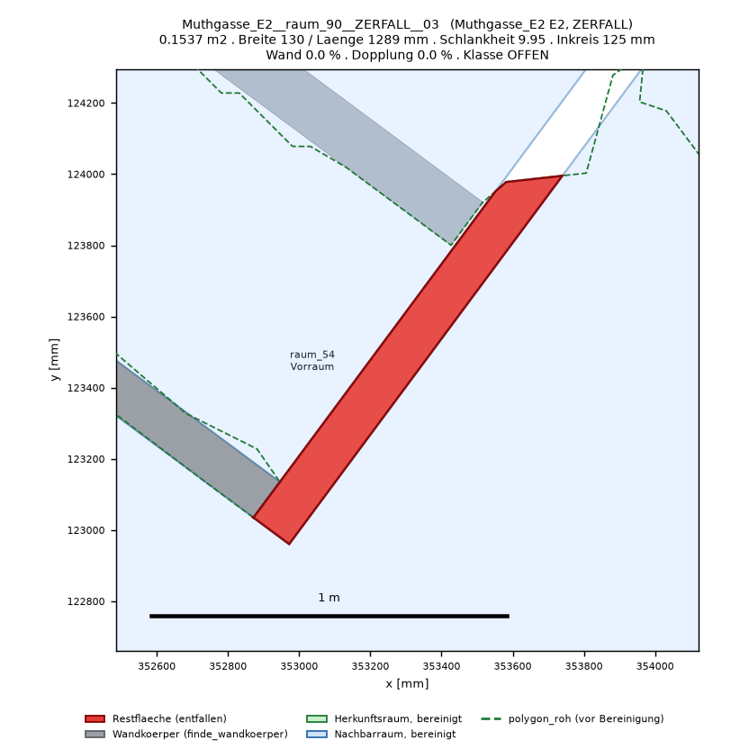

#### Muthgasse_E2__raum_86__ZERFALL__02 · ZERFALL 02 — Klasse OFFEN

| Pflichtfeld | Messwert |
|---|---|
| Plan · Geschoss | `Muthgasse_E2` · E2 (`Projekte/_eingang/Muthgasse_E2.dxf`) |
| Raum-ID vorher | `raum_86` „Wohnküche“ · Typ KÜCHE · Quelle F · Flag entfallen · roh 43,659 m2 → bereinigt 0,000 m2 · Liste `entfallen` |
| entfernende Regel | `ZERFALL` (Buchung Nr. 2 dieses Raums in `raum.bereinigung[]`) |
| Flaeche | **0,148397 m2** (148396,6 mm2) |
| Schwerpunkt (Plan-mm) | (332222,5 / 95861,9) |
| Umriss | 21 Punkte, 0 Loecher |
| groesste Breite / Laenge | 180 mm / 1 481 mm (kleinstes umschliessendes Rechteck) |
| Schlankheitsgrad | 8,23 (Laenge/Breite) |
| freie Breite (Inkreis) | 166 mm |
| im Wandkoerper | 0,0 % (0,0 mm2 von 148396,6 mm2) |
| in einem anderen Raum (`polygon_mm`) | 0,0 % (groesster Treffer `raum_76`) |
| Nachbarn (Abstand ≤ 10 mm) | `raum_76` „Bad“ BAD, Kontakt 1 502 mm, Abstand 0,0 mm · `raum_68` „Gang“ GANG, Kontakt 101 mm, Abstand 0,0 mm |
| **Klasse** | **OFFEN — nicht als zulaessig deklarierbar** |
| Begruendung | freie Breite (Inkreis) 166 mm unter meiner (c)-Schranke 500 mm. Diese 500 mm sind MEINE Setzung — das Repo definiert keine Begehbarkeitsbreite (gegrept, § 3.3). Zu schliessen mit einer Owner-Entscheidung zur Mindestbreite. |
| Bild | `bilder/zerfall_schlitz/Muthgasse_E2__raum_86__ZERFALL__02.png` — Fenster 1 864 × 1 864 mm (300 mm Umfeld), Massstab 2,24 mm/px, Stueckbreite 80 px |

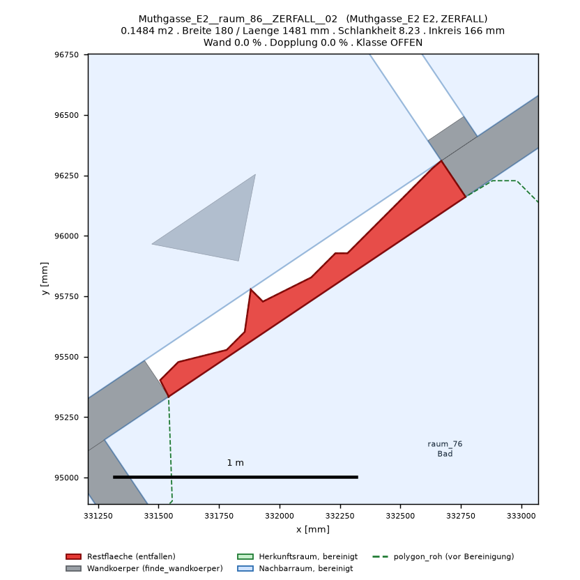

#### Muthgasse_E2__raum_92__ENTFALL__01 · ENTFALL 01 — Klasse OFFEN

| Pflichtfeld | Messwert |
|---|---|
| Plan · Geschoss | `Muthgasse_E2` · E2 (`Projekte/_eingang/Muthgasse_E2.dxf`) |
| Raum-ID vorher | `raum_92` „Wohnküche“ · Typ KÜCHE · Quelle F · Flag entfallen · roh 20,726 m2 → bereinigt 0,000 m2 · Liste `entfallen` |
| entfernende Regel | `ENTFALL` (Buchung Nr. 1 dieses Raums in `raum.bereinigung[]`) |
| Flaeche | **0,141074 m2** (141073,7 mm2) |
| Schwerpunkt (Plan-mm) | (355054,6 / 125873,7) |
| Umriss | 24 Punkte, 0 Loecher |
| groesste Breite / Laenge | 126 mm / 1 159 mm (kleinstes umschliessendes Rechteck) |
| Schlankheitsgrad | 9,23 (Laenge/Breite) |
| freie Breite (Inkreis) | 125 mm |
| im Wandkoerper | 0,0 % (0,0 mm2 von 141073,7 mm2) |
| in einem anderen Raum (`polygon_mm`) | 0,0 % (groesster Treffer `raum_54`) |
| Nachbarn (Abstand ≤ 10 mm) | `raum_54` „Vorraum“ VORRAUM, Kontakt 1 151 mm, Abstand 0,0 mm · `raum_37` „Bad“ BAD, Kontakt 1 040 mm, Abstand 0,0 mm · `raum_38` „Wohnküche“ KÜCHE, Kontakt 147 mm, Abstand 0,0 mm |
| **Klasse** | **OFFEN — nicht als zulaessig deklarierbar** |
| Begruendung | freie Breite (Inkreis) 125 mm unter meiner (c)-Schranke 500 mm. Diese 500 mm sind MEINE Setzung — das Repo definiert keine Begehbarkeitsbreite (gegrept, § 3.3). Zu schliessen mit einer Owner-Entscheidung zur Mindestbreite. |
| Bild | `bilder/zerfall_schlitz/Muthgasse_E2__raum_92__ENTFALL__01.png` — Fenster 1 606 × 1 606 mm (300 mm Umfeld), Massstab 1,93 mm/px, Stueckbreite 65 px |

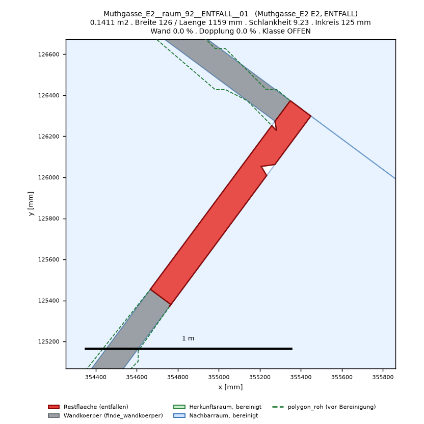

#### Muthgasse_E2__raum_86__ZERFALL__03 · ZERFALL 03 — Klasse OFFEN

| Pflichtfeld | Messwert |
|---|---|
| Plan · Geschoss | `Muthgasse_E2` · E2 (`Projekte/_eingang/Muthgasse_E2.dxf`) |
| Raum-ID vorher | `raum_86` „Wohnküche“ · Typ KÜCHE · Quelle F · Flag entfallen · roh 43,659 m2 → bereinigt 0,000 m2 · Liste `entfallen` |
| entfernende Regel | `ZERFALL` (Buchung Nr. 3 dieses Raums in `raum.bereinigung[]`) |
| Flaeche | **0,137439 m2** (137438,7 mm2) |
| Schwerpunkt (Plan-mm) | (334373,5 / 87850,0) |
| Umriss | 58 Punkte, 0 Loecher |
| groesste Breite / Laenge | 500 mm / 1 509 mm (kleinstes umschliessendes Rechteck) |
| Schlankheitsgrad | 3,02 (Laenge/Breite) |
| freie Breite (Inkreis) | 222 mm |
| im Wandkoerper | 2,0 % (2697,6 mm2 von 137438,7 mm2) |
| in einem anderen Raum (`polygon_mm`) | 0,0 % — kein anderer Raum getroffen |
| Nachbarn (Abstand ≤ 10 mm) | `raum_24` „Loggia“ BALKON, Kontakt 2 194 mm, Abstand 0,0 mm · `raum_21` „Zimmer“ ZIMMER, Kontakt 184 mm, Abstand 0,0 mm |
| **Klasse** | **OFFEN — nicht als zulaessig deklarierbar** |
| Begruendung | freie Breite (Inkreis) 222 mm unter meiner (c)-Schranke 500 mm. Diese 500 mm sind MEINE Setzung — das Repo definiert keine Begehbarkeitsbreite (gegrept, § 3.3). Zu schliessen mit einer Owner-Entscheidung zur Mindestbreite. |
| Bild | `bilder/zerfall_schlitz/Muthgasse_E2__raum_86__ZERFALL__03.png` — Fenster 1 921 × 1 921 mm (300 mm Umfeld), Massstab 2,31 mm/px, Stueckbreite 217 px |

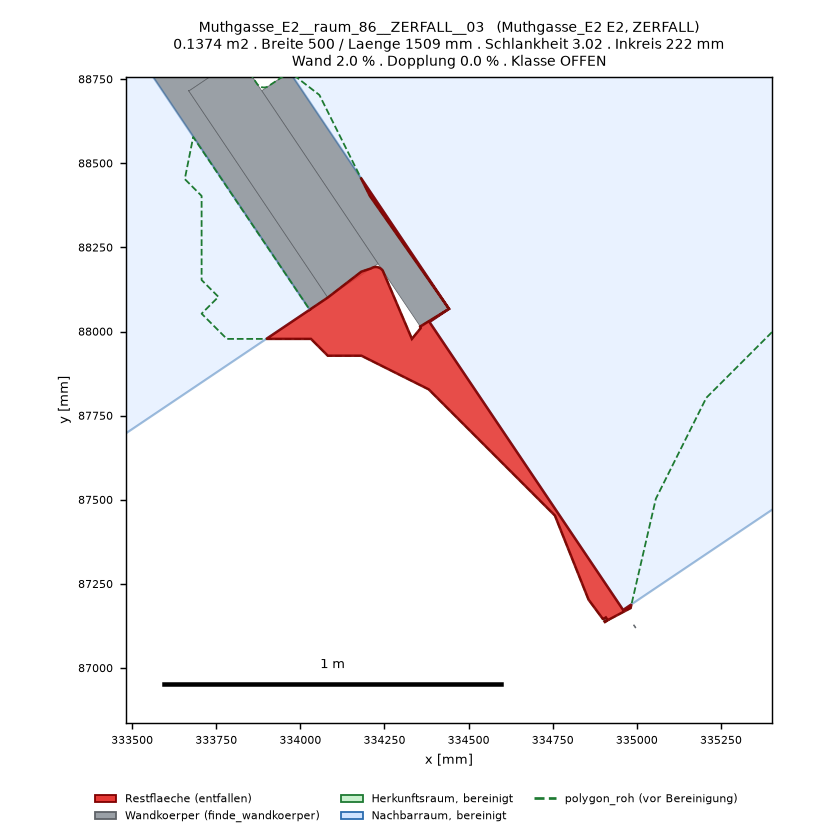

#### Barawitzka_EG__raum_43__ZERFALL__03 · ZERFALL 03 — Klasse OFFEN

| Pflichtfeld | Messwert |
|---|---|
| Plan · Geschoss | `Barawitzka_EG` · EG (`Projekte/_eingang/Barawitzka_EG.dxf`) |
| Raum-ID vorher | `raum_43` „Terrasse“ · Typ TERRASSE · Quelle F · Flag flutung_unsicher · roh 56,643 m2 → bereinigt 15,533 m2 · Liste `raeume` |
| entfernende Regel | `ZERFALL` (Buchung Nr. 3 dieses Raums in `raum.bereinigung[]`) |
| Flaeche | **0,113485 m2** (113484,5 mm2) |
| Schwerpunkt (Plan-mm) | (5336,4 / -23027,2) |
| Umriss | 29 Punkte, 0 Loecher |
| groesste Breite / Laenge | 260 mm / 959 mm (kleinstes umschliessendes Rechteck) |
| Schlankheitsgrad | 3,69 (Laenge/Breite) |
| freie Breite (Inkreis) | 259 mm |
| im Wandkoerper | 2,8 % (3163,2 mm2 von 113484,5 mm2) |
| in einem anderen Raum (`polygon_mm`) | 0,0 % — kein anderer Raum getroffen |
| Nachbarn (Abstand ≤ 10 mm) | `raum_37` „Treppenhaus 2“ STIEGENHAUS, Kontakt 908 mm, Abstand 0,0 mm |
| **Klasse** | **OFFEN — nicht als zulaessig deklarierbar** |
| Begruendung | freie Breite (Inkreis) 259 mm unter meiner (c)-Schranke 500 mm. Diese 500 mm sind MEINE Setzung — das Repo definiert keine Begehbarkeitsbreite (gegrept, § 3.3). Zu schliessen mit einer Owner-Entscheidung zur Mindestbreite. |
| Bild | `bilder/zerfall_schlitz/Barawitzka_EG__raum_43__ZERFALL__03.png` — Fenster 1 559 × 1 559 mm (300 mm Umfeld), Massstab 1,87 mm/px, Stueckbreite 139 px |

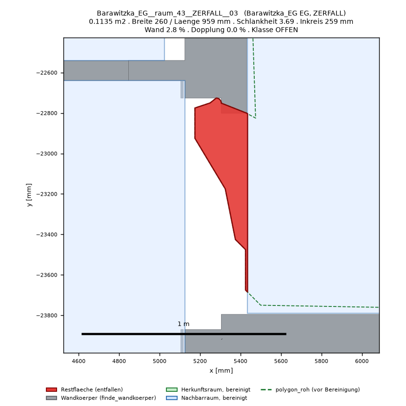

#### Muthgasse_E2__raum_90__ZERFALL__04 · ZERFALL 04 — Klasse OFFEN

| Pflichtfeld | Messwert |
|---|---|
| Plan · Geschoss | `Muthgasse_E2` · E2 (`Projekte/_eingang/Muthgasse_E2.dxf`) |
| Raum-ID vorher | `raum_90` „Zimmer“ · Typ ZIMMER · Quelle F · Flag flutung_unsicher · roh 18,952 m2 → bereinigt 3,990 m2 · Liste `raeume` |
| entfernende Regel | `ZERFALL` (Buchung Nr. 4 dieses Raums in `raum.bereinigung[]`) |
| Flaeche | **0,099363 m2** (99362,6 mm2) |
| Schwerpunkt (Plan-mm) | (354672,2 / 123155,5) |
| Umriss | 11 Punkte, 0 Loecher |
| groesste Breite / Laenge | 100 mm / 1 078 mm (kleinstes umschliessendes Rechteck) |
| Schlankheitsgrad | 10,78 (Laenge/Breite) |
| freie Breite (Inkreis) | 100 mm |
| im Wandkoerper | 0,0 % (0,0 mm2 von 99362,6 mm2) |
| in einem anderen Raum (`polygon_mm`) | 0,0 % (groesster Treffer `raum_39`) |
| Nachbarn (Abstand ≤ 10 mm) | `raum_54` „Vorraum“ VORRAUM, Kontakt 1 148 mm, Abstand 0,0 mm · `raum_39` „Zimmer“ ZIMMER, Kontakt 996 mm, Abstand 0,0 mm |
| **Klasse** | **OFFEN — nicht als zulaessig deklarierbar** |
| Begruendung | freie Breite (Inkreis) 100 mm unter meiner (c)-Schranke 500 mm. Diese 500 mm sind MEINE Setzung — das Repo definiert keine Begehbarkeitsbreite (gegrept, § 3.3). Zu schliessen mit einer Owner-Entscheidung zur Mindestbreite. |
| Bild | `bilder/zerfall_schlitz/Muthgasse_E2__raum_90__ZERFALL__04.png` — Fenster 1 484 × 1 484 mm (300 mm Umfeld), Massstab 1,78 mm/px, Stueckbreite 56 px |

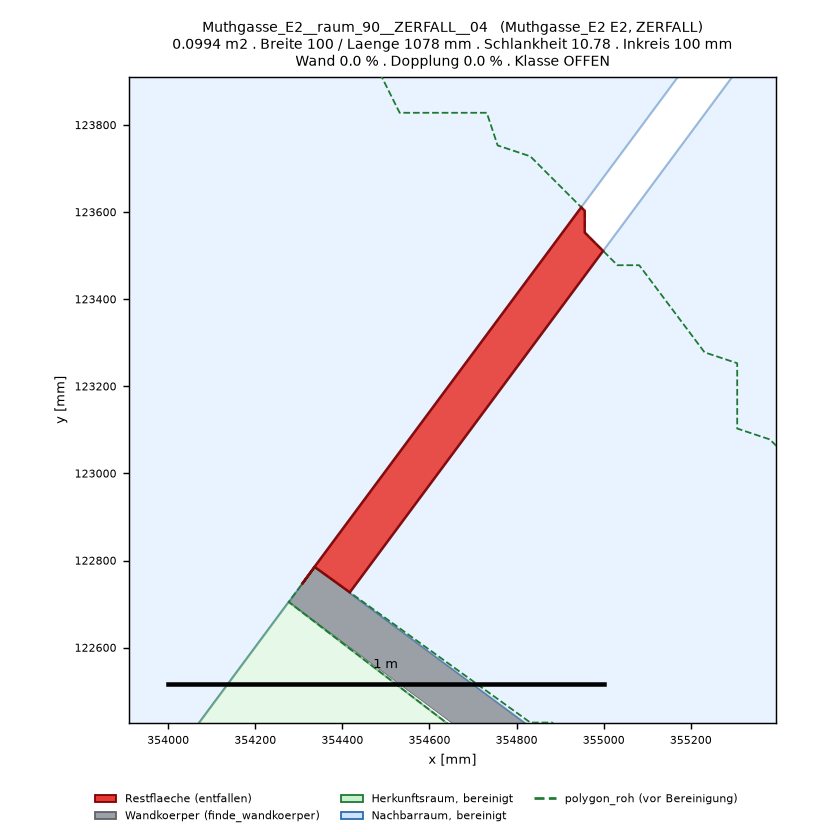

#### Muthgasse_E2__raum_85__ZERFALL__03 · ZERFALL 03 — Klasse OFFEN

| Pflichtfeld | Messwert |
|---|---|
| Plan · Geschoss | `Muthgasse_E2` · E2 (`Projekte/_eingang/Muthgasse_E2.dxf`) |
| Raum-ID vorher | `raum_85` „Wohnküche“ · Typ KÜCHE · Quelle F · Flag ok · roh 33,464 m2 → bereinigt 1,061 m2 · Liste `raeume` |
| entfernende Regel | `ZERFALL` (Buchung Nr. 3 dieses Raums in `raum.bereinigung[]`) |
| Flaeche | **0,095783 m2** (95783,4 mm2) |
| Schwerpunkt (Plan-mm) | (329805,9 / 88436,9) |
| Umriss | 15 Punkte, 0 Loecher |
| groesste Breite / Laenge | 115 mm / 1 006 mm (kleinstes umschliessendes Rechteck) |
| Schlankheitsgrad | 8,76 (Laenge/Breite) |
| freie Breite (Inkreis) | 100 mm |
| im Wandkoerper | 1,6 % (1542,8 mm2 von 95783,4 mm2) |
| in einem anderen Raum (`polygon_mm`) | 0,0 % — kein anderer Raum getroffen |
| Nachbarn (Abstand ≤ 10 mm) | `raum_22` „Wohnküche“ KÜCHE, Kontakt 1 072 mm, Abstand 0,0 mm · `raum_21` „Zimmer“ ZIMMER, Kontakt 921 mm, Abstand 0,0 mm |
| **Klasse** | **OFFEN — nicht als zulaessig deklarierbar** |
| Begruendung | freie Breite (Inkreis) 100 mm unter meiner (c)-Schranke 500 mm. Diese 500 mm sind MEINE Setzung — das Repo definiert keine Begehbarkeitsbreite (gegrept, § 3.3). Zu schliessen mit einer Owner-Entscheidung zur Mindestbreite. |
| Bild | `bilder/zerfall_schlitz/Muthgasse_E2__raum_85__ZERFALL__03.png` — Fenster 1 480 × 1 480 mm (300 mm Umfeld), Massstab 1,78 mm/px, Stueckbreite 65 px |

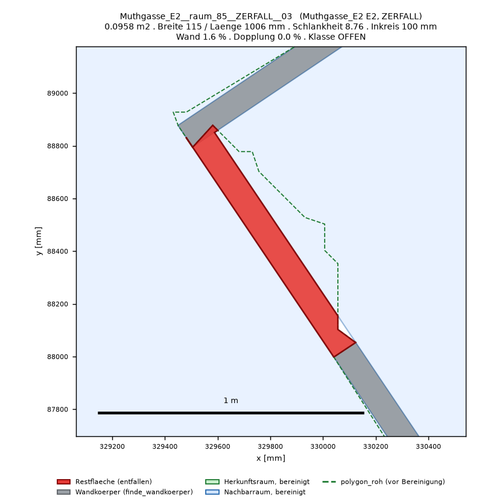

#### Muthgasse_E2__raum_85__ZERFALL__04 · ZERFALL 04 — Klasse OFFEN

| Pflichtfeld | Messwert |
|---|---|
| Plan · Geschoss | `Muthgasse_E2` · E2 (`Projekte/_eingang/Muthgasse_E2.dxf`) |
| Raum-ID vorher | `raum_85` „Wohnküche“ · Typ KÜCHE · Quelle F · Flag ok · roh 33,464 m2 → bereinigt 1,061 m2 · Liste `raeume` |
| entfernende Regel | `ZERFALL` (Buchung Nr. 4 dieses Raums in `raum.bereinigung[]`) |
| Flaeche | **0,091428 m2** (91427,6 mm2) |
| Schwerpunkt (Plan-mm) | (327864,8 / 90799,8) |
| Umriss | 13 Punkte, 0 Loecher |
| groesste Breite / Laenge | 167 mm / 704 mm (kleinstes umschliessendes Rechteck) |
| Schlankheitsgrad | 4,21 (Laenge/Breite) |
| freie Breite (Inkreis) | 162 mm |
| im Wandkoerper | 0,0 % (0,0 mm2 von 91427,6 mm2) |
| in einem anderen Raum (`polygon_mm`) | 0,0 % — kein anderer Raum getroffen |
| Nachbarn (Abstand ≤ 10 mm) | `raum_22` „Wohnküche“ KÜCHE, Kontakt 725 mm, Abstand 0,0 mm |
| **Klasse** | **OFFEN — nicht als zulaessig deklarierbar** |
| Begruendung | freie Breite (Inkreis) 162 mm unter meiner (c)-Schranke 500 mm. Diese 500 mm sind MEINE Setzung — das Repo definiert keine Begehbarkeitsbreite (gegrept, § 3.3). Zu schliessen mit einer Owner-Entscheidung zur Mindestbreite. |
| Bild | `bilder/zerfall_schlitz/Muthgasse_E2__raum_85__ZERFALL__04.png` — Fenster 1 240 × 1 240 mm (300 mm Umfeld), Massstab 1,49 mm/px, Stueckbreite 112 px |

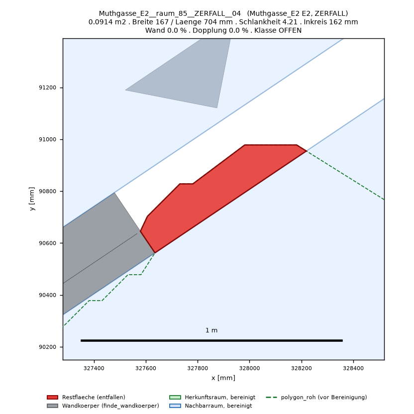

#### Muthgasse_E2__raum_92__ZERFALL__01 · ZERFALL 01 — Klasse OFFEN

| Pflichtfeld | Messwert |
|---|---|
| Plan · Geschoss | `Muthgasse_E2` · E2 (`Projekte/_eingang/Muthgasse_E2.dxf`) |
| Raum-ID vorher | `raum_92` „Wohnküche“ · Typ KÜCHE · Quelle F · Flag entfallen · roh 20,726 m2 → bereinigt 0,000 m2 · Liste `entfallen` |
| entfernende Regel | `ZERFALL` (Buchung Nr. 1 dieses Raums in `raum.bereinigung[]`) |
| Flaeche | **0,085584 m2** (85583,6 mm2) |
| Schwerpunkt (Plan-mm) | (355223,8 / 123897,3) |
| Umriss | 10 Punkte, 0 Loecher |
| groesste Breite / Laenge | 100 mm / 873 mm (kleinstes umschliessendes Rechteck) |
| Schlankheitsgrad | 8,73 (Laenge/Breite) |
| freie Breite (Inkreis) | 100 mm |
| im Wandkoerper | 0,0 % (0,0 mm2 von 85583,6 mm2) |
| in einem anderen Raum (`polygon_mm`) | 0,0 % (groesster Treffer `raum_54`) |
| Nachbarn (Abstand ≤ 10 mm) | `raum_39` „Zimmer“ ZIMMER, Kontakt 894 mm, Abstand 0,0 mm · `raum_54` „Vorraum“ VORRAUM, Kontakt 843 mm, Abstand 0,0 mm |
| **Klasse** | **OFFEN — nicht als zulaessig deklarierbar** |
| Begruendung | freie Breite (Inkreis) 100 mm unter meiner (c)-Schranke 500 mm. Diese 500 mm sind MEINE Setzung — das Repo definiert keine Begehbarkeitsbreite (gegrept, § 3.3). Zu schliessen mit einer Owner-Entscheidung zur Mindestbreite. |
| Bild | `bilder/zerfall_schlitz/Muthgasse_E2__raum_92__ZERFALL__01.png` — Fenster 1 361 × 1 361 mm (300 mm Umfeld), Massstab 1,64 mm/px, Stueckbreite 61 px |

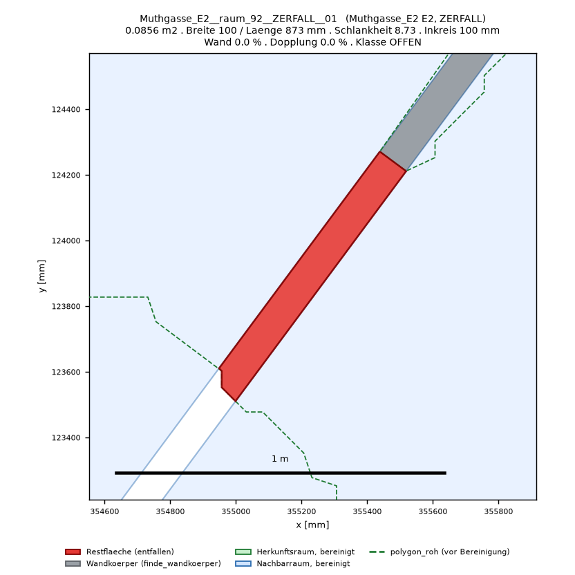

#### Muthgasse_E2__raum_93__ENTFALL__01 · ENTFALL 01 — Klasse OFFEN

| Pflichtfeld | Messwert |
|---|---|
| Plan · Geschoss | `Muthgasse_E2` · E2 (`Projekte/_eingang/Muthgasse_E2.dxf`) |
| Raum-ID vorher | `raum_93` „Wohnküche“ · Typ KÜCHE · Quelle F · Flag entfallen · roh 8,039 m2 → bereinigt 0,000 m2 · Liste `entfallen` |
| entfernende Regel | `ENTFALL` (Buchung Nr. 1 dieses Raums in `raum.bereinigung[]`) |
| Flaeche | **0,085077 m2** (85077,0 mm2) |
| Schwerpunkt (Plan-mm) | (361307,7 / 126789,9) |
| Umriss | 18 Punkte, 0 Loecher |
| groesste Breite / Laenge | 325 mm / 519 mm (kleinstes umschliessendes Rechteck) |
| Schlankheitsgrad | 1,60 (Laenge/Breite) |
| freie Breite (Inkreis) | 238 mm |
| im Wandkoerper | 1,5 % (1239,8 mm2 von 85077,0 mm2) |
| in einem anderen Raum (`polygon_mm`) | 0,0 % (groesster Treffer `raum_38`) |
| Nachbarn (Abstand ≤ 10 mm) | `raum_38` „Wohnküche“ KÜCHE, Kontakt 528 mm, Abstand 0,0 mm |
| **Klasse** | **OFFEN — nicht als zulaessig deklarierbar** |
| Begruendung | freie Breite (Inkreis) 238 mm unter meiner (c)-Schranke 500 mm. Diese 500 mm sind MEINE Setzung — das Repo definiert keine Begehbarkeitsbreite (gegrept, § 3.3). Zu schliessen mit einer Owner-Entscheidung zur Mindestbreite. |
| Bild | `bilder/zerfall_schlitz/Muthgasse_E2__raum_93__ENTFALL__01.png` — Fenster 1 208 × 1 208 mm (300 mm Umfeld), Massstab 1,45 mm/px, Stueckbreite 224 px |

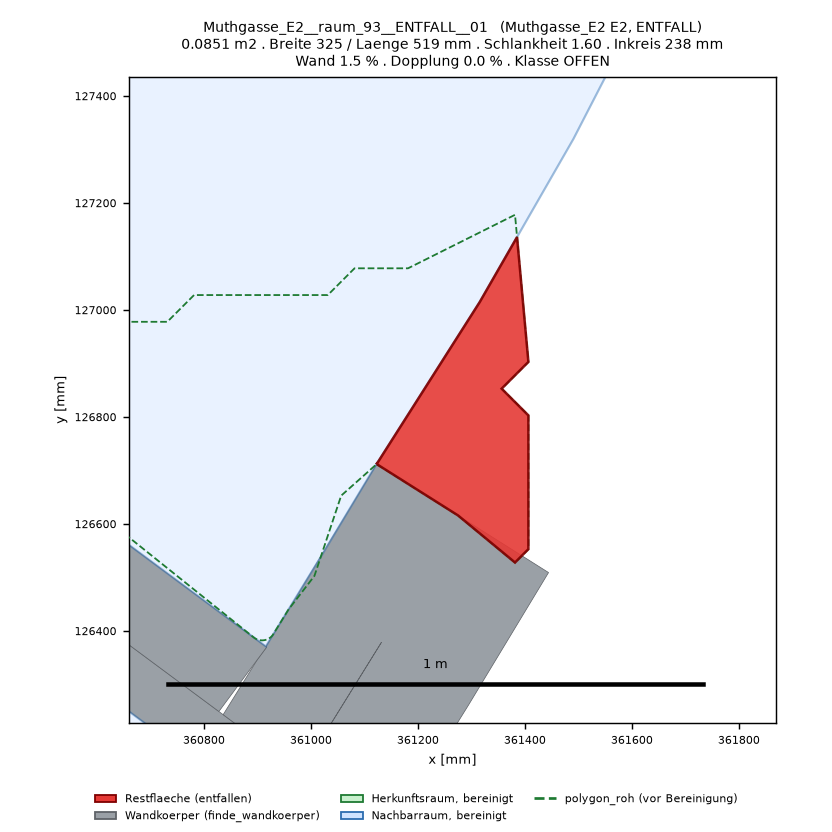

#### Muthgasse_E2__raum_86__ZERFALL__04 · ZERFALL 04 — Klasse OFFEN

| Pflichtfeld | Messwert |
|---|---|
| Plan · Geschoss | `Muthgasse_E2` · E2 (`Projekte/_eingang/Muthgasse_E2.dxf`) |
| Raum-ID vorher | `raum_86` „Wohnküche“ · Typ KÜCHE · Quelle F · Flag entfallen · roh 43,659 m2 → bereinigt 0,000 m2 · Liste `entfallen` |
| entfernende Regel | `ZERFALL` (Buchung Nr. 4 dieses Raums in `raum.bereinigung[]`) |
| Flaeche | **0,081948 m2** (81947,8 mm2) |
| Schwerpunkt (Plan-mm) | (336663,7 / 91223,8) |
| Umriss | 17 Punkte, 0 Loecher |
| groesste Breite / Laenge | 100 mm / 921 mm (kleinstes umschliessendes Rechteck) |
| Schlankheitsgrad | 9,21 (Laenge/Breite) |
| freie Breite (Inkreis) | 100 mm |
| im Wandkoerper | 0,0 % (0,0 mm2 von 81947,8 mm2) |
| in einem anderen Raum (`polygon_mm`) | 0,0 % — kein anderer Raum getroffen |
| Nachbarn (Abstand ≤ 10 mm) | `raum_25` „Zimmer“ ZIMMER, Kontakt 1 042 mm, Abstand 0,0 mm · `raum_26` „Wohnküche“ KÜCHE, Kontakt 840 mm, Abstand 0,0 mm |
| **Klasse** | **OFFEN — nicht als zulaessig deklarierbar** |
| Begruendung | freie Breite (Inkreis) 100 mm unter meiner (c)-Schranke 500 mm. Diese 500 mm sind MEINE Setzung — das Repo definiert keine Begehbarkeitsbreite (gegrept, § 3.3). Zu schliessen mit einer Owner-Entscheidung zur Mindestbreite. |
| Bild | `bilder/zerfall_schlitz/Muthgasse_E2__raum_86__ZERFALL__04.png` — Fenster 1 364 × 1 364 mm (300 mm Umfeld), Massstab 1,64 mm/px, Stueckbreite 61 px |

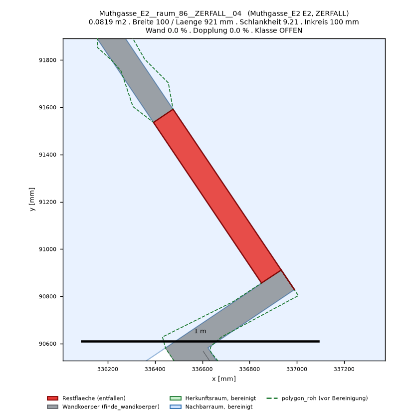

#### Muthgasse_E2__raum_93__ZERFALL__01 · ZERFALL 01 — Klasse OFFEN

| Pflichtfeld | Messwert |
|---|---|
| Plan · Geschoss | `Muthgasse_E2` · E2 (`Projekte/_eingang/Muthgasse_E2.dxf`) |
| Raum-ID vorher | `raum_93` „Wohnküche“ · Typ KÜCHE · Quelle F · Flag entfallen · roh 8,039 m2 → bereinigt 0,000 m2 · Liste `entfallen` |
| entfernende Regel | `ZERFALL` (Buchung Nr. 1 dieses Raums in `raum.bereinigung[]`) |
| Flaeche | **0,081856 m2** (81856,1 mm2) |
| Schwerpunkt (Plan-mm) | (359947,0 / 126129,4) |
| Umriss | 43 Punkte, 0 Loecher |
| groesste Breite / Laenge | 121 mm / 1 513 mm (kleinstes umschliessendes Rechteck) |
| Schlankheitsgrad | 12,52 (Laenge/Breite) |
| freie Breite (Inkreis) | 120 mm |
| im Wandkoerper | 2,8 % (2316,4 mm2 von 81856,1 mm2) |
| in einem anderen Raum (`polygon_mm`) | 0,0 % (groesster Treffer `raum_40`) |
| Nachbarn (Abstand ≤ 10 mm) | `raum_38` „Wohnküche“ KÜCHE, Kontakt 1 583 mm, Abstand 0,0 mm · `raum_40` „Loggia“ BALKON, Kontakt 22 mm, Abstand 0,0 mm |
| **Klasse** | **OFFEN — nicht als zulaessig deklarierbar** |
| Begruendung | freie Breite (Inkreis) 120 mm unter meiner (c)-Schranke 500 mm. Diese 500 mm sind MEINE Setzung — das Repo definiert keine Begehbarkeitsbreite (gegrept, § 3.3). Zu schliessen mit einer Owner-Entscheidung zur Mindestbreite. |
| Bild | `bilder/zerfall_schlitz/Muthgasse_E2__raum_93__ZERFALL__01.png` — Fenster 1 809 × 1 809 mm (300 mm Umfeld), Massstab 2,17 mm/px, Stueckbreite 56 px |

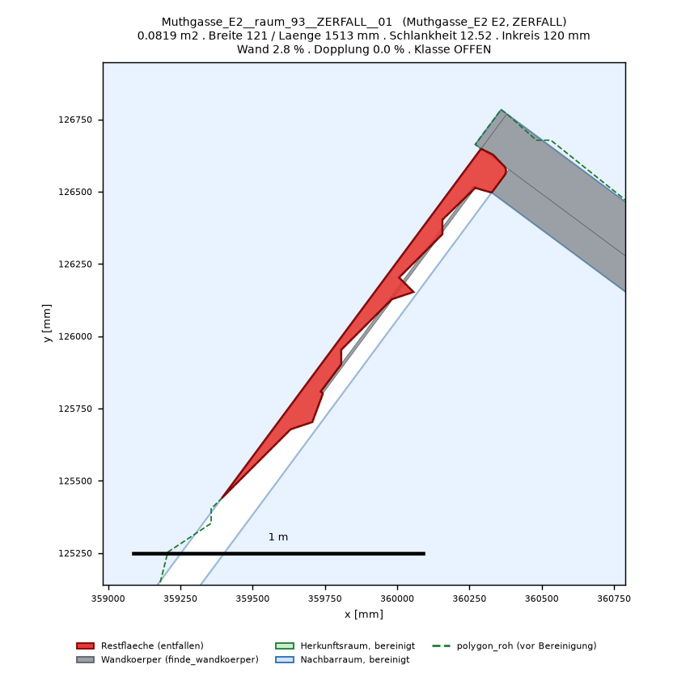

#### Muthgasse_E2__raum_88__ZERFALL__03 · ZERFALL 03 — Klasse OFFEN

| Pflichtfeld | Messwert |
|---|---|
| Plan · Geschoss | `Muthgasse_E2` · E2 (`Projekte/_eingang/Muthgasse_E2.dxf`) |
| Raum-ID vorher | `raum_88` „STGH“ · Typ STIEGENHAUS · Quelle F · Flag flutung_unsicher · roh 20,675 m2 → bereinigt 3,820 m2 · Liste `raeume` |
| entfernende Regel | `ZERFALL` (Buchung Nr. 3 dieses Raums in `raum.bereinigung[]`) |
| Flaeche | **0,078919 m2** (78918,7 mm2) |
| Schwerpunkt (Plan-mm) | (331816,4 / 95676,9) |
| Umriss | 15 Punkte, 0 Loecher |
| groesste Breite / Laenge | 154 mm / 923 mm (kleinstes umschliessendes Rechteck) |
| Schlankheitsgrad | 6,01 (Laenge/Breite) |
| freie Breite (Inkreis) | 149 mm |
| im Wandkoerper | 0,0 % (0,0 mm2 von 78918,7 mm2) |
| in einem anderen Raum (`polygon_mm`) | 0,0 % — kein anderer Raum getroffen |
| Nachbarn (Abstand ≤ 10 mm) | `raum_68` „Gang“ GANG, Kontakt 965 mm, Abstand 0,0 mm |
| **Klasse** | **OFFEN — nicht als zulaessig deklarierbar** |
| Begruendung | freie Breite (Inkreis) 149 mm unter meiner (c)-Schranke 500 mm. Diese 500 mm sind MEINE Setzung — das Repo definiert keine Begehbarkeitsbreite (gegrept, § 3.3). Zu schliessen mit einer Owner-Entscheidung zur Mindestbreite. |
| Bild | `bilder/zerfall_schlitz/Muthgasse_E2__raum_88__ZERFALL__03.png` — Fenster 1 366 × 1 366 mm (300 mm Umfeld), Massstab 1,64 mm/px, Stueckbreite 94 px |

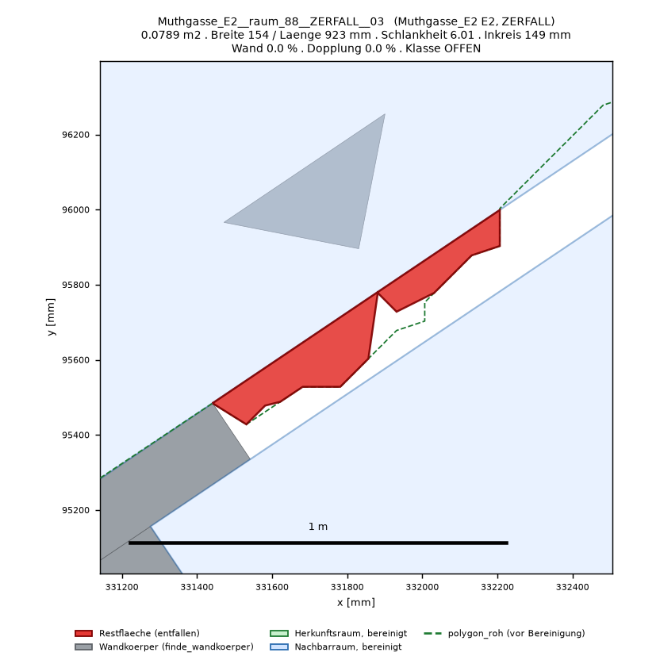

#### Muthgasse_E2__raum_93__ZERFALL__02 · ZERFALL 02 — Klasse OFFEN

| Pflichtfeld | Messwert |
|---|---|
| Plan · Geschoss | `Muthgasse_E2` · E2 (`Projekte/_eingang/Muthgasse_E2.dxf`) |
| Raum-ID vorher | `raum_93` „Wohnküche“ · Typ KÜCHE · Quelle F · Flag entfallen · roh 8,039 m2 → bereinigt 0,000 m2 · Liste `entfallen` |
| entfernende Regel | `ZERFALL` (Buchung Nr. 2 dieses Raums in `raum.bereinigung[]`) |
| Flaeche | **0,073651 m2** (73650,7 mm2) |
| Schwerpunkt (Plan-mm) | (358788,2 / 124569,1) |
| Umriss | 53 Punkte, 0 Loecher |
| groesste Breite / Laenge | 121 mm / 1 305 mm (kleinstes umschliessendes Rechteck) |
| Schlankheitsgrad | 10,78 (Laenge/Breite) |
| freie Breite (Inkreis) | 118 mm |
| im Wandkoerper | 3,5 % (2569,6 mm2 von 73650,7 mm2) |
| in einem anderen Raum (`polygon_mm`) | 0,0 % (groesster Treffer `raum_38`) |
| Nachbarn (Abstand ≤ 10 mm) | `raum_38` „Wohnküche“ KÜCHE, Kontakt 1 343 mm, Abstand 0,0 mm · `raum_40` „Loggia“ BALKON, Kontakt 22 mm, Abstand 0,0 mm |
| **Klasse** | **OFFEN — nicht als zulaessig deklarierbar** |
| Begruendung | freie Breite (Inkreis) 118 mm unter meiner (c)-Schranke 500 mm. Diese 500 mm sind MEINE Setzung — das Repo definiert keine Begehbarkeitsbreite (gegrept, § 3.3). Zu schliessen mit einer Owner-Entscheidung zur Mindestbreite. |
| Bild | `bilder/zerfall_schlitz/Muthgasse_E2__raum_93__ZERFALL__02.png` — Fenster 1 710 × 1 710 mm (300 mm Umfeld), Massstab 2,05 mm/px, Stueckbreite 59 px |

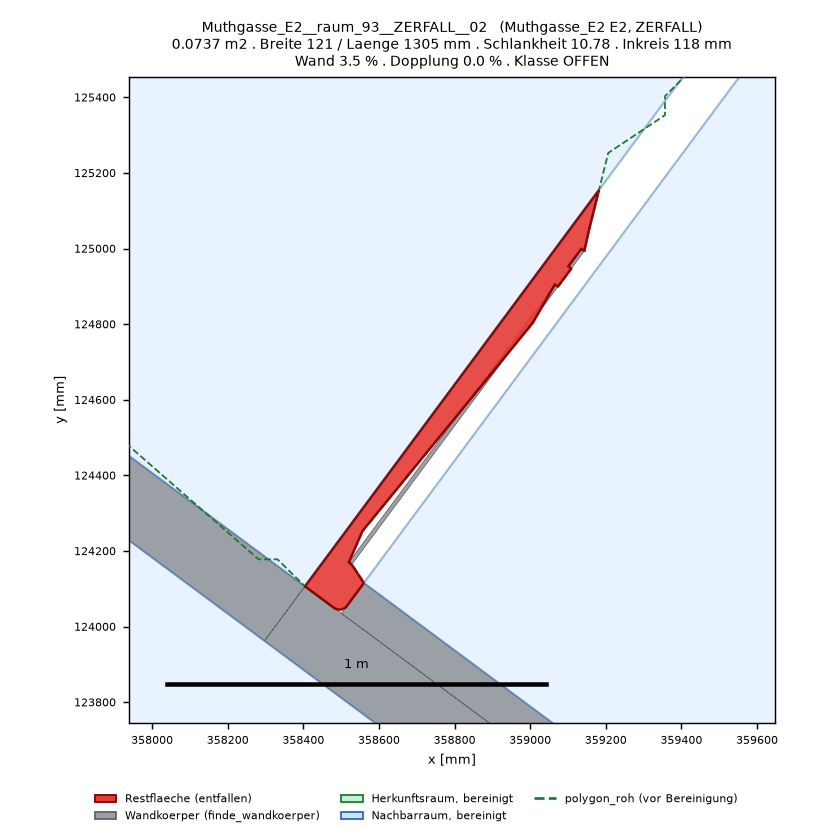

#### Muthgasse_E2__raum_86__ZERFALL__05 · ZERFALL 05 — Klasse OFFEN

| Pflichtfeld | Messwert |
|---|---|
| Plan · Geschoss | `Muthgasse_E2` · E2 (`Projekte/_eingang/Muthgasse_E2.dxf`) |
| Raum-ID vorher | `raum_86` „Wohnküche“ · Typ KÜCHE · Quelle F · Flag entfallen · roh 43,659 m2 → bereinigt 0,000 m2 · Liste `entfallen` |
| entfernende Regel | `ZERFALL` (Buchung Nr. 5 dieses Raums in `raum.bereinigung[]`) |
| Flaeche | **0,055551 m2** (55550,9 mm2) |
| Schwerpunkt (Plan-mm) | (334271,4 / 94820,1) |
| Umriss | 53 Punkte, 0 Loecher |
| groesste Breite / Laenge | 125 mm / 1 010 mm (kleinstes umschliessendes Rechteck) |
| Schlankheitsgrad | 8,08 (Laenge/Breite) |
| freie Breite (Inkreis) | 125 mm |
| im Wandkoerper | 40,7 % (22604,7 mm2 von 55550,9 mm2) |
| in einem anderen Raum (`polygon_mm`) | 0,0 % (groesster Treffer `raum_76`) |
| Nachbarn (Abstand ≤ 10 mm) | `raum_26` „Wohnküche“ KÜCHE, Kontakt 1 544 mm, Abstand 0,0 mm · `raum_20` „Bad“ BAD, Kontakt 757 mm, Abstand 0,0 mm · `raum_76` „Bad“ BAD, Kontakt 169 mm, Abstand 0,0 mm |
| **Klasse** | **OFFEN — nicht als zulaessig deklarierbar** |
| Begruendung | liegt zu 40,7 % im Wandkoerper — zu viel fuer „ausserhalb der Wand“, zu wenig fuer (a) (Schranke 90 %). Zu schliessen mit einer Owner-Schranke fuer den Wandanteil. freie Breite (Inkreis) 125 mm unter meiner (c)-Schranke 500 mm. Diese 500 mm sind MEINE Setzung — das Repo definiert keine Begehbarkeitsbreite (gegrept, § 3.3). Zu schliessen mit einer Owner-Entscheidung zur Mindestbreite. |
| Bild | `bilder/zerfall_schlitz/Muthgasse_E2__raum_86__ZERFALL__05.png` — Fenster 1 438 × 1 438 mm (300 mm Umfeld), Massstab 1,73 mm/px, Stueckbreite 72 px |

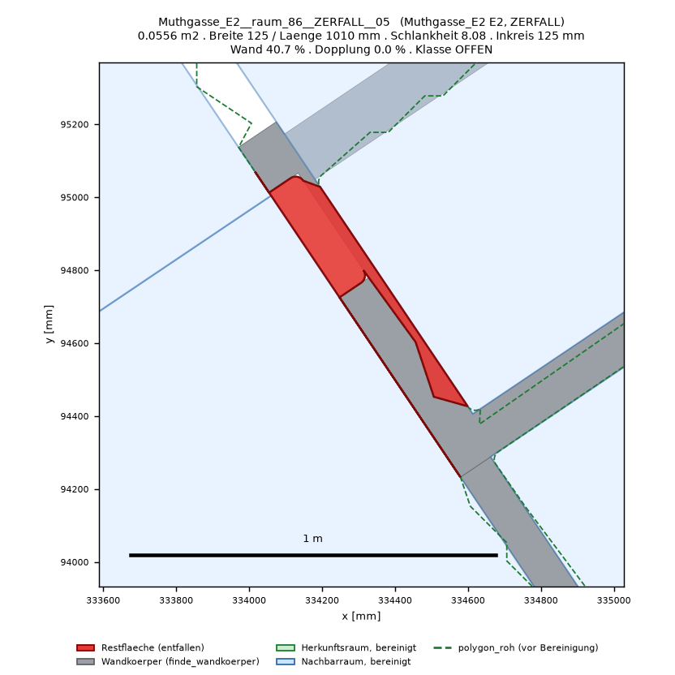

#### Muthgasse_E2__raum_88__ZERFALL__04 · ZERFALL 04 — Klasse OFFEN

| Pflichtfeld | Messwert |
|---|---|
| Plan · Geschoss | `Muthgasse_E2` · E2 (`Projekte/_eingang/Muthgasse_E2.dxf`) |
| Raum-ID vorher | `raum_88` „STGH“ · Typ STIEGENHAUS · Quelle F · Flag flutung_unsicher · roh 20,675 m2 → bereinigt 3,820 m2 · Liste `raeume` |
| entfernende Regel | `ZERFALL` (Buchung Nr. 4 dieses Raums in `raum.bereinigung[]`) |
| Flaeche | **0,053280 m2** (53280,4 mm2) |
| Schwerpunkt (Plan-mm) | (333274,6 / 101500,3) |
| Umriss | 9 Punkte, 0 Loecher |
| groesste Breite / Laenge | 180 mm / 523 mm (kleinstes umschliessendes Rechteck) |
| Schlankheitsgrad | 2,90 (Laenge/Breite) |
| freie Breite (Inkreis) | 176 mm |
| im Wandkoerper | 0,0 % (0,0 mm2 von 53280,4 mm2) |
| in einem anderen Raum (`polygon_mm`) | 0,0 % — kein anderer Raum getroffen |
| Nachbarn (Abstand ≤ 10 mm) | `raum_79` „FW-Aufzug“ LIFT, Kontakt 551 mm, Abstand 0,0 mm |
| **Klasse** | **OFFEN — nicht als zulaessig deklarierbar** |
| Begruendung | freie Breite (Inkreis) 176 mm unter meiner (c)-Schranke 500 mm. Diese 500 mm sind MEINE Setzung — das Repo definiert keine Begehbarkeitsbreite (gegrept, § 3.3). Zu schliessen mit einer Owner-Entscheidung zur Mindestbreite. |
| Bild | `bilder/zerfall_schlitz/Muthgasse_E2__raum_88__ZERFALL__04.png` — Fenster 1 097 × 1 097 mm (300 mm Umfeld), Massstab 1,32 mm/px, Stueckbreite 137 px |

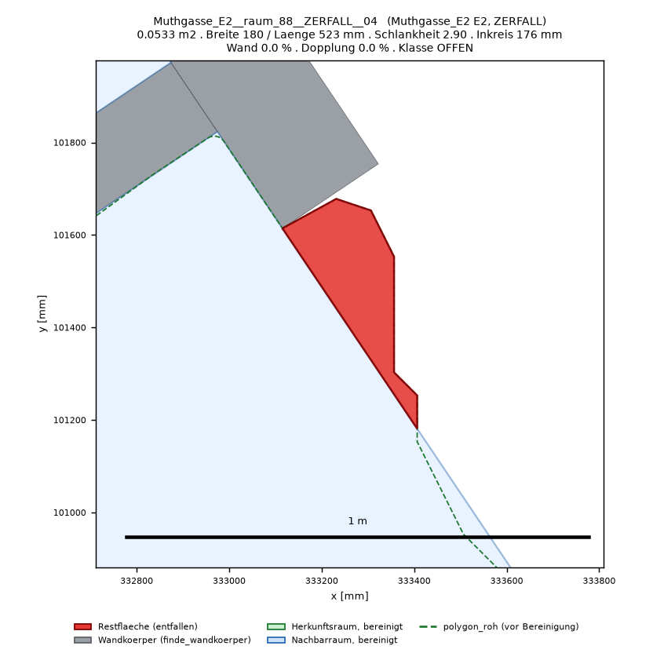

#### Muthgasse_E2__raum_85__ZERFALL__05 · ZERFALL 05 — Klasse OFFEN

| Pflichtfeld | Messwert |
|---|---|
| Plan · Geschoss | `Muthgasse_E2` · E2 (`Projekte/_eingang/Muthgasse_E2.dxf`) |
| Raum-ID vorher | `raum_85` „Wohnküche“ · Typ KÜCHE · Quelle F · Flag ok · roh 33,464 m2 → bereinigt 1,061 m2 · Liste `raeume` |
| entfernende Regel | `ZERFALL` (Buchung Nr. 5 dieses Raums in `raum.bereinigung[]`) |
| Flaeche | **0,045330 m2** (45330,3 mm2) |
| Schwerpunkt (Plan-mm) | (329433,6 / 89977,0) — liegt bei dieser konkaven Form NICHT im Stueck; Punkt IM Stueck: (329560,5 / 89811,0) |
| Umriss | 35 Punkte, 0 Loecher |
| groesste Breite / Laenge | 96 mm / 1 625 mm (kleinstes umschliessendes Rechteck) |
| Schlankheitsgrad | 16,91 (Laenge/Breite) |
| freie Breite (Inkreis) | 96 mm |
| im Wandkoerper | 0,0 % (9,4 mm2 von 45330,3 mm2) |
| in einem anderen Raum (`polygon_mm`) | 0,0 % (groesster Treffer `raum_22`) |
| Nachbarn (Abstand ≤ 10 mm) | `raum_22` „Wohnküche“ KÜCHE, Kontakt 2 419 mm, Abstand 0,0 mm |
| **Klasse** | **OFFEN — nicht als zulaessig deklarierbar** |
| Begruendung | freie Breite (Inkreis) 96 mm unter meiner (c)-Schranke 500 mm. Diese 500 mm sind MEINE Setzung — das Repo definiert keine Begehbarkeitsbreite (gegrept, § 3.3). Zu schliessen mit einer Owner-Entscheidung zur Mindestbreite. |
| Bild | `bilder/zerfall_schlitz/Muthgasse_E2__raum_85__ZERFALL__05.png` — Fenster 1 948 × 1 948 mm (300 mm Umfeld), Massstab 2,34 mm/px, Stueckbreite 41 px |

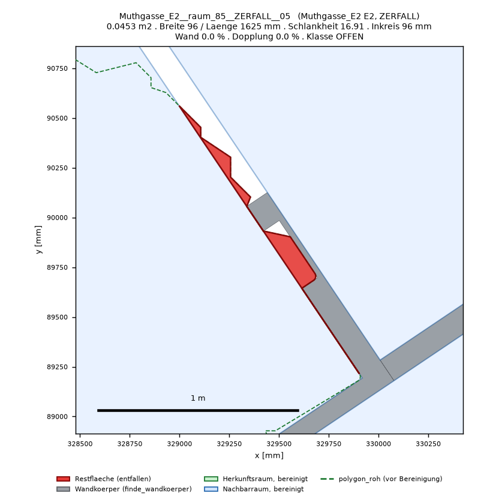

#### Muthgasse_E2__raum_92__ZERFALL__02 · ZERFALL 02 — Klasse OFFEN

| Pflichtfeld | Messwert |
|---|---|
| Plan · Geschoss | `Muthgasse_E2` · E2 (`Projekte/_eingang/Muthgasse_E2.dxf`) |
| Raum-ID vorher | `raum_92` „Wohnküche“ · Typ KÜCHE · Quelle F · Flag entfallen · roh 20,726 m2 → bereinigt 0,000 m2 · Liste `entfallen` |
| entfernende Regel | `ZERFALL` (Buchung Nr. 2 dieses Raums in `raum.bereinigung[]`) |
| Flaeche | **0,038292 m2** (38292,4 mm2) |
| Schwerpunkt (Plan-mm) | (357744,1 / 121837,2) |
| Umriss | 18 Punkte, 0 Loecher |
| groesste Breite / Laenge | 223 mm / 265 mm (kleinstes umschliessendes Rechteck) |
| Schlankheitsgrad | 1,19 (Laenge/Breite) |
| freie Breite (Inkreis) | 158 mm |
| im Wandkoerper | 0,4 % (172,1 mm2 von 38292,4 mm2) |
| in einem anderen Raum (`polygon_mm`) | 0,0 % — kein anderer Raum getroffen |
| Nachbarn (Abstand ≤ 10 mm) | `raum_39` „Zimmer“ ZIMMER, Kontakt 282 mm, Abstand 0,0 mm |
| **Klasse** | **OFFEN — nicht als zulaessig deklarierbar** |
| Begruendung | freie Breite (Inkreis) 158 mm unter meiner (c)-Schranke 500 mm. Diese 500 mm sind MEINE Setzung — das Repo definiert keine Begehbarkeitsbreite (gegrept, § 3.3). Zu schliessen mit einer Owner-Entscheidung zur Mindestbreite. |
| Bild | `bilder/zerfall_schlitz/Muthgasse_E2__raum_92__ZERFALL__02.png` — Fenster 905 × 905 mm (300 mm Umfeld), Massstab 1,09 mm/px, Stueckbreite 204 px |

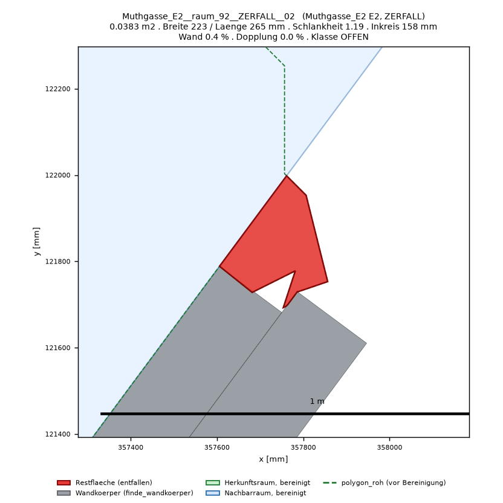

#### Muthgasse_E2__raum_87__ZERFALL__03 · ZERFALL 03 — Klasse OFFEN

| Pflichtfeld | Messwert |
|---|---|
| Plan · Geschoss | `Muthgasse_E2` · E2 (`Projekte/_eingang/Muthgasse_E2.dxf`) |
| Raum-ID vorher | `raum_87` „Wohnküche“ · Typ KÜCHE · Quelle F · Flag flutung_unsicher · roh 39,545 m2 → bereinigt 24,616 m2 · Liste `raeume` |
| entfernende Regel | `ZERFALL` (Buchung Nr. 3 dieses Raums in `raum.bereinigung[]`) |
| Flaeche | **0,038002 m2** (38002,3 mm2) |
| Schwerpunkt (Plan-mm) | (345375,0 / 115002,8) |
| Umriss | 5 Punkte, 0 Loecher |
| groesste Breite / Laenge | 99 mm / 548 mm (kleinstes umschliessendes Rechteck) |
| Schlankheitsgrad | 5,54 (Laenge/Breite) |
| freie Breite (Inkreis) | 97 mm |
| im Wandkoerper | 0,0 % (0,0 mm2 von 38002,3 mm2) |
| in einem anderen Raum (`polygon_mm`) | 0,0 % — kein anderer Raum getroffen |
| Nachbarn (Abstand ≤ 10 mm) | `raum_57` „Zimmer“ ZIMMER, Kontakt 582 mm, Abstand 0,0 mm · `raum_94` „Gang“ GANG, Kontakt 358 mm, Abstand 0,0 mm |
| **Klasse** | **OFFEN — nicht als zulaessig deklarierbar** |
| Begruendung | freie Breite (Inkreis) 97 mm unter meiner (c)-Schranke 500 mm. Diese 500 mm sind MEINE Setzung — das Repo definiert keine Begehbarkeitsbreite (gegrept, § 3.3). Zu schliessen mit einer Owner-Entscheidung zur Mindestbreite. |
| Bild | `bilder/zerfall_schlitz/Muthgasse_E2__raum_87__ZERFALL__03.png` — Fenster 1 049 × 1 049 mm (300 mm Umfeld), Massstab 1,26 mm/px, Stueckbreite 79 px |

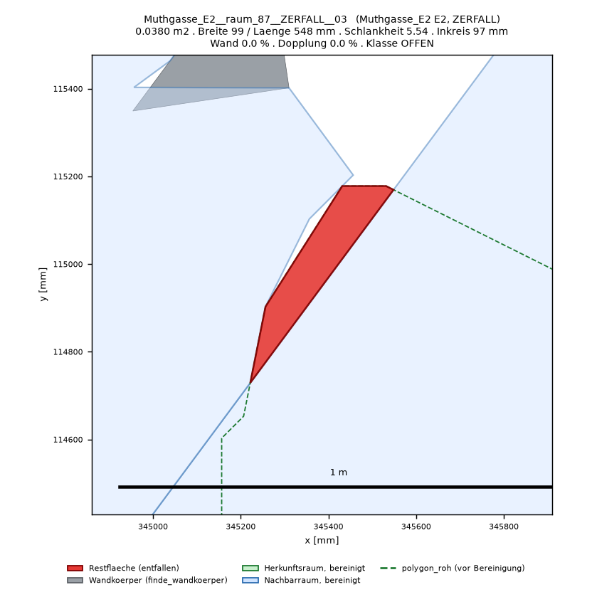

#### Muthgasse_E2__raum_87__ZERFALL__04 · ZERFALL 04 — Klasse OFFEN

| Pflichtfeld | Messwert |
|---|---|
| Plan · Geschoss | `Muthgasse_E2` · E2 (`Projekte/_eingang/Muthgasse_E2.dxf`) |
| Raum-ID vorher | `raum_87` „Wohnküche“ · Typ KÜCHE · Quelle F · Flag flutung_unsicher · roh 39,545 m2 → bereinigt 24,616 m2 · Liste `raeume` |
| entfernende Regel | `ZERFALL` (Buchung Nr. 4 dieses Raums in `raum.bereinigung[]`) |
| Flaeche | **0,032515 m2** (32515,3 mm2) |
| Schwerpunkt (Plan-mm) | (347317,4 / 114485,4) |
| Umriss | 45 Punkte, 0 Loecher |
| groesste Breite / Laenge | 109 mm / 347 mm (kleinstes umschliessendes Rechteck) |
| Schlankheitsgrad | 3,18 (Laenge/Breite) |
| freie Breite (Inkreis) | 105 mm |
| im Wandkoerper | 2,0 % (664,6 mm2 von 32515,3 mm2) |
| in einem anderen Raum (`polygon_mm`) | 0,0 % — kein anderer Raum getroffen |
| Nachbarn (Abstand ≤ 10 mm) | `raum_57` „Zimmer“ ZIMMER, Kontakt 368 mm, Abstand 0,0 mm |
| **Klasse** | **OFFEN — nicht als zulaessig deklarierbar** |
| Begruendung | freie Breite (Inkreis) 105 mm unter meiner (c)-Schranke 500 mm. Diese 500 mm sind MEINE Setzung — das Repo definiert keine Begehbarkeitsbreite (gegrept, § 3.3). Zu schliessen mit einer Owner-Entscheidung zur Mindestbreite. |
| Bild | `bilder/zerfall_schlitz/Muthgasse_E2__raum_87__ZERFALL__04.png` — Fenster 926 × 926 mm (300 mm Umfeld), Massstab 1,11 mm/px, Stueckbreite 98 px |

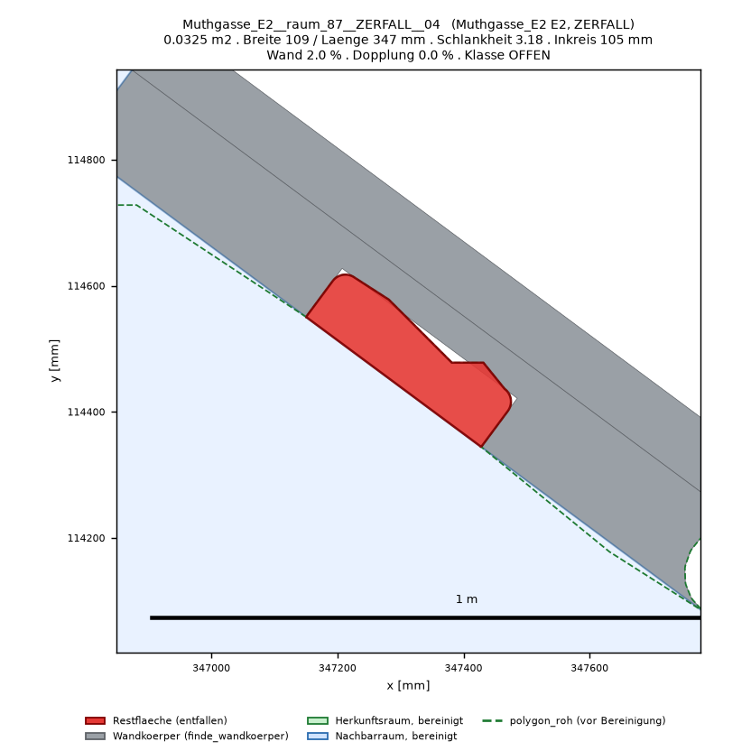

#### Barawitzka_EG__raum_43__ZERFALL__04 · ZERFALL 04 — Klasse OFFEN

| Pflichtfeld | Messwert |
|---|---|
| Plan · Geschoss | `Barawitzka_EG` · EG (`Projekte/_eingang/Barawitzka_EG.dxf`) |
| Raum-ID vorher | `raum_43` „Terrasse“ · Typ TERRASSE · Quelle F · Flag flutung_unsicher · roh 56,643 m2 → bereinigt 15,533 m2 · Liste `raeume` |
| entfernende Regel | `ZERFALL` (Buchung Nr. 4 dieses Raums in `raum.bereinigung[]`) |
| Flaeche | **0,030295 m2** (30295,5 mm2) |
| Schwerpunkt (Plan-mm) | (6910,5 / -15857,4) |
| Umriss | 5 Punkte, 0 Loecher |
| groesste Breite / Laenge | 50 mm / 635 mm (kleinstes umschliessendes Rechteck) |
| Schlankheitsgrad | 12,71 (Laenge/Breite) |
| freie Breite (Inkreis) | 50 mm |
| im Wandkoerper | 0,0 % (0,0 mm2 von 30295,5 mm2) |
| in einem anderen Raum (`polygon_mm`) | 0,0 % — kein anderer Raum getroffen |
| Nachbarn (Abstand ≤ 10 mm) | `raum_39` „Terrasse“ TERRASSE, Kontakt 659 mm, Abstand 0,0 mm · `raum_38` „Terrasse“ TERRASSE, Kontakt 592 mm, Abstand 0,0 mm |
| **Klasse** | **OFFEN — nicht als zulaessig deklarierbar** |
| Begruendung | freie Breite (Inkreis) 50 mm unter meiner (c)-Schranke 500 mm. Diese 500 mm sind MEINE Setzung — das Repo definiert keine Begehbarkeitsbreite (gegrept, § 3.3). Zu schliessen mit einer Owner-Entscheidung zur Mindestbreite. |
| Bild | `bilder/zerfall_schlitz/Barawitzka_EG__raum_43__ZERFALL__04.png` — Fenster 1 235 × 1 235 mm (300 mm Umfeld), Massstab 1,48 mm/px, Stueckbreite 34 px |

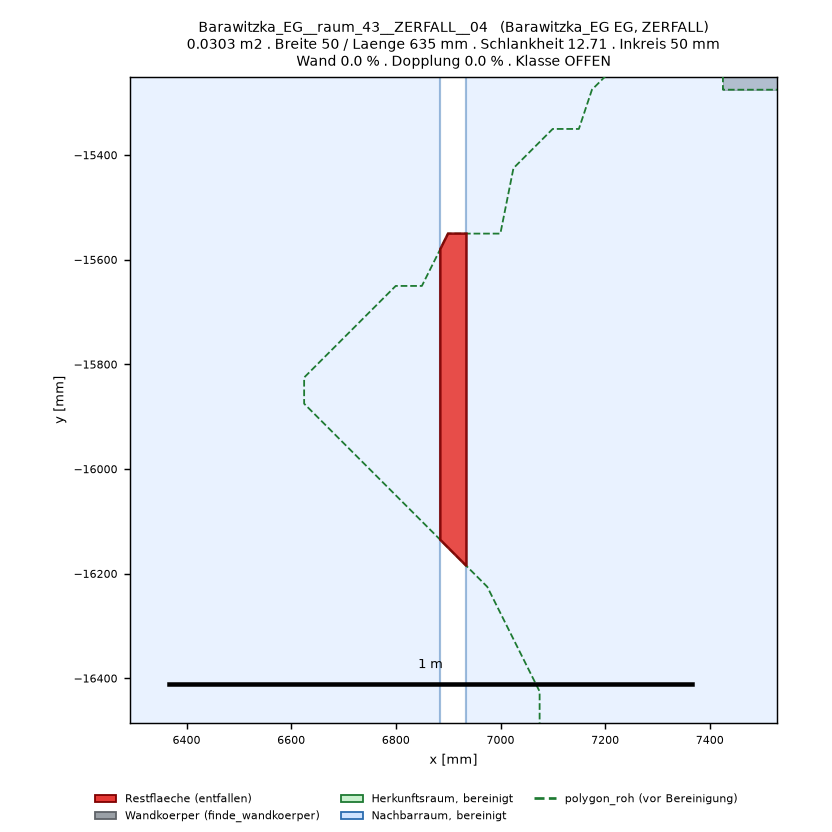

#### Muthgasse_E2__raum_87__ZERFALL__05 · ZERFALL 05 — Klasse OFFEN

| Pflichtfeld | Messwert |
|---|---|
| Plan · Geschoss | `Muthgasse_E2` · E2 (`Projekte/_eingang/Muthgasse_E2.dxf`) |
| Raum-ID vorher | `raum_87` „Wohnküche“ · Typ KÜCHE · Quelle F · Flag flutung_unsicher · roh 39,545 m2 → bereinigt 24,616 m2 · Liste `raeume` |
| entfernende Regel | `ZERFALL` (Buchung Nr. 5 dieses Raums in `raum.bereinigung[]`) |
| Flaeche | **0,019314 m2** (19314,0 mm2) |
| Schwerpunkt (Plan-mm) | (347829,1 / 114132,6) |
| Umriss | 85 Punkte, 0 Loecher |
| groesste Breite / Laenge | 149 mm / 216 mm (kleinstes umschliessendes Rechteck) |
| Schlankheitsgrad | 1,45 (Laenge/Breite) |
| freie Breite (Inkreis) | 136 mm |
| im Wandkoerper | 13,9 % (2692,7 mm2 von 19314,0 mm2) |
| in einem anderen Raum (`polygon_mm`) | 0,0 % — kein anderer Raum getroffen |
| Nachbarn (Abstand ≤ 10 mm) | `raum_57` „Zimmer“ ZIMMER, Kontakt 273 mm, Abstand 0,0 mm |
| **Klasse** | **OFFEN — nicht als zulaessig deklarierbar** |
| Begruendung | liegt zu 13,9 % im Wandkoerper — zu viel fuer „ausserhalb der Wand“, zu wenig fuer (a) (Schranke 90 %). Zu schliessen mit einer Owner-Schranke fuer den Wandanteil. freie Breite (Inkreis) 136 mm unter meiner (c)-Schranke 500 mm. Diese 500 mm sind MEINE Setzung — das Repo definiert keine Begehbarkeitsbreite (gegrept, § 3.3). Zu schliessen mit einer Owner-Entscheidung zur Mindestbreite. |
| Bild | `bilder/zerfall_schlitz/Muthgasse_E2__raum_87__ZERFALL__05.png` — Fenster 819 × 819 mm (300 mm Umfeld), Massstab 0,98 mm/px, Stueckbreite 151 px |

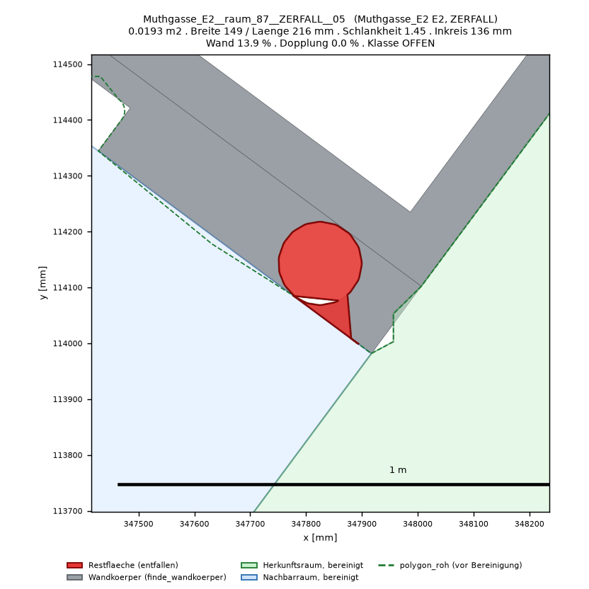

#### Muthgasse_E2__raum_86__ZERFALL__08 · ZERFALL 08 — Klasse OFFEN

| Pflichtfeld | Messwert |
|---|---|
| Plan · Geschoss | `Muthgasse_E2` · E2 (`Projekte/_eingang/Muthgasse_E2.dxf`) |
| Raum-ID vorher | `raum_86` „Wohnküche“ · Typ KÜCHE · Quelle F · Flag entfallen · roh 43,659 m2 → bereinigt 0,000 m2 · Liste `entfallen` |
| entfernende Regel | `ZERFALL` (Buchung Nr. 8 dieses Raums in `raum.bereinigung[]`) |
| Flaeche | **0,016519 m2** (16519,3 mm2) |
| Schwerpunkt (Plan-mm) | (336778,4 / 88368,4) |
| Umriss | 15 Punkte, 0 Loecher |
| groesste Breite / Laenge | 65 mm / 473 mm (kleinstes umschliessendes Rechteck) |
| Schlankheitsgrad | 7,31 (Laenge/Breite) |
| freie Breite (Inkreis) | 63 mm |
| im Wandkoerper | 0,0 % (1,5 mm2 von 16519,3 mm2) |
| in einem anderen Raum (`polygon_mm`) | 0,0 % — kein anderer Raum getroffen |
| Nachbarn (Abstand ≤ 10 mm) | `raum_24` „Loggia“ BALKON, Kontakt 543 mm, Abstand 0,0 mm |
| **Klasse** | **OFFEN — nicht als zulaessig deklarierbar** |
| Begruendung | freie Breite (Inkreis) 63 mm unter meiner (c)-Schranke 500 mm. Diese 500 mm sind MEINE Setzung — das Repo definiert keine Begehbarkeitsbreite (gegrept, § 3.3). Zu schliessen mit einer Owner-Entscheidung zur Mindestbreite. |
| Bild | `bilder/zerfall_schlitz/Muthgasse_E2__raum_86__ZERFALL__08.png` — Fenster 992 × 992 mm (300 mm Umfeld), Massstab 1,19 mm/px, Stueckbreite 54 px |

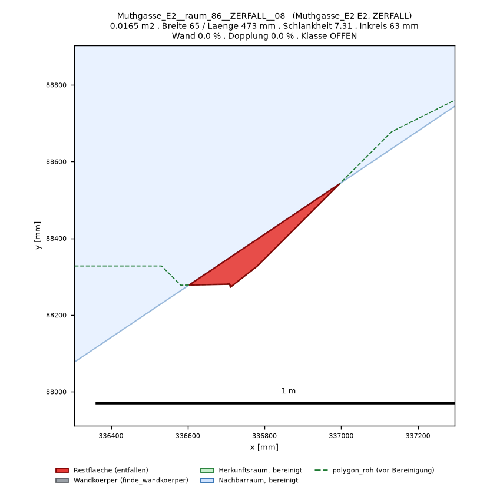

#### Muthgasse_E2__raum_85__ZERFALL__06 · ZERFALL 06 — Klasse OFFEN

| Pflichtfeld | Messwert |
|---|---|
| Plan · Geschoss | `Muthgasse_E2` · E2 (`Projekte/_eingang/Muthgasse_E2.dxf`) |
| Raum-ID vorher | `raum_85` „Wohnküche“ · Typ KÜCHE · Quelle F · Flag ok · roh 33,464 m2 → bereinigt 1,061 m2 · Liste `raeume` |
| entfernende Regel | `ZERFALL` (Buchung Nr. 6 dieses Raums in `raum.bereinigung[]`) |
| Flaeche | **0,012477 m2** (12477,4 mm2) |
| Schwerpunkt (Plan-mm) | (331162,5 / 84593,2) |
| Umriss | 14 Punkte, 0 Loecher |
| groesste Breite / Laenge | 65 mm / 392 mm (kleinstes umschliessendes Rechteck) |
| Schlankheitsgrad | 6,03 (Laenge/Breite) |
| freie Breite (Inkreis) | 61 mm |
| im Wandkoerper | 0,0 % (1,7 mm2 von 12477,4 mm2) |
| in einem anderen Raum (`polygon_mm`) | 0,0 % — kein anderer Raum getroffen |
| Nachbarn (Abstand ≤ 10 mm) | `raum_23` „Loggia“ BALKON, Kontakt 458 mm, Abstand 0,0 mm |
| **Klasse** | **OFFEN — nicht als zulaessig deklarierbar** |
| Begruendung | freie Breite (Inkreis) 61 mm unter meiner (c)-Schranke 500 mm. Diese 500 mm sind MEINE Setzung — das Repo definiert keine Begehbarkeitsbreite (gegrept, § 3.3). Zu schliessen mit einer Owner-Entscheidung zur Mindestbreite. |
| Bild | `bilder/zerfall_schlitz/Muthgasse_E2__raum_85__ZERFALL__06.png` — Fenster 925 × 925 mm (300 mm Umfeld), Massstab 1,11 mm/px, Stueckbreite 58 px |

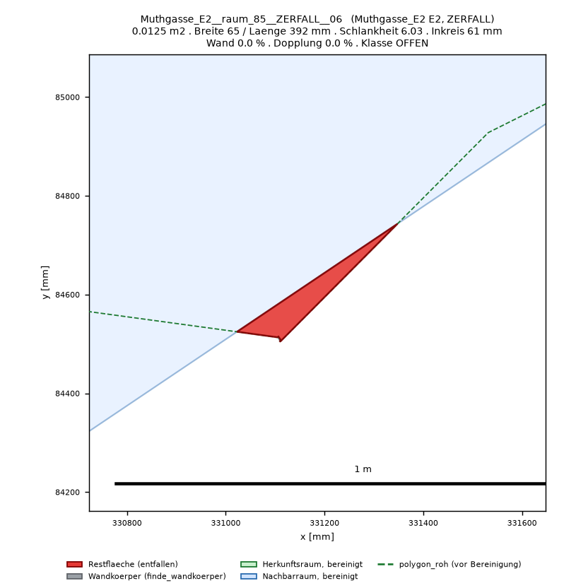

#### Muthgasse_E2__raum_87__ZERFALL__06 · ZERFALL 06 — Klasse OFFEN

| Pflichtfeld | Messwert |
|---|---|
| Plan · Geschoss | `Muthgasse_E2` · E2 (`Projekte/_eingang/Muthgasse_E2.dxf`) |
| Raum-ID vorher | `raum_87` „Wohnküche“ · Typ KÜCHE · Quelle F · Flag flutung_unsicher · roh 39,545 m2 → bereinigt 24,616 m2 · Liste `raeume` |
| entfernende Regel | `ZERFALL` (Buchung Nr. 6 dieses Raums in `raum.bereinigung[]`) |
| Flaeche | **0,010035 m2** (10034,8 mm2) |
| Schwerpunkt (Plan-mm) | (348573,5 / 107465,9) |
| Umriss | 15 Punkte, 0 Loecher |
| groesste Breite / Laenge | 65 mm / 347 mm (kleinstes umschliessendes Rechteck) |
| Schlankheitsgrad | 5,34 (Laenge/Breite) |
| freie Breite (Inkreis) | 55 mm |
| im Wandkoerper | 0,1 % (12,5 mm2 von 10034,8 mm2) |
| in einem anderen Raum (`polygon_mm`) | 0,0 % — kein anderer Raum getroffen |
| Nachbarn (Abstand ≤ 10 mm) | `raum_31` „Loggia“ BALKON, Kontakt 413 mm, Abstand 0,0 mm |
| **Klasse** | **OFFEN — nicht als zulaessig deklarierbar** |
| Begruendung | freie Breite (Inkreis) 55 mm unter meiner (c)-Schranke 500 mm. Diese 500 mm sind MEINE Setzung — das Repo definiert keine Begehbarkeitsbreite (gegrept, § 3.3). Zu schliessen mit einer Owner-Entscheidung zur Mindestbreite. |
| Bild | `bilder/zerfall_schlitz/Muthgasse_E2__raum_87__ZERFALL__06.png` — Fenster 879 × 879 mm (300 mm Umfeld), Massstab 1,06 mm/px, Stueckbreite 62 px |

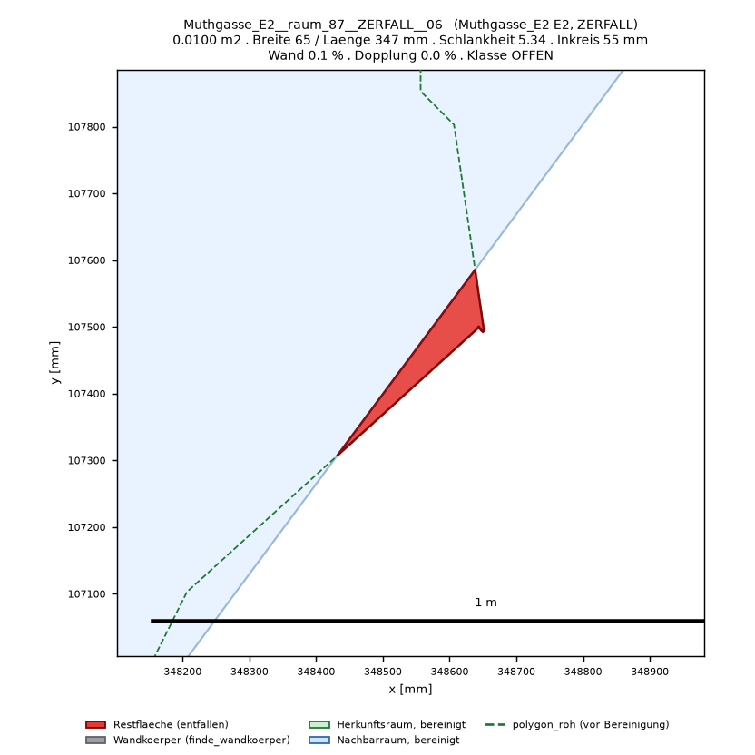

## 5. Die Restflaechen unter 0,01 m2 (167 Stueck, 0,138298 m2 = 0,8 % der Menge)

### 5.1 Warum hier kein Einzelbild steht — mit Massstab statt Behauptung

Ein Planausschnitt mit den beauftragten 300 mm Umfeld hat ein Fenster von mindestens ~600 mm Breite. Bei 6,4 Zoll und 130 dpi (832 px) sind das ~0,75 mm/px. Ein Stueck von 100 mm2 (z. B. 10 × 10 mm) ist darin **13 px** gross, ein Stueck von 1 mm2 **1 px**, die 58 Stuecke unter 1 mm2 sind **unsichtbar**. Deshalb: fuer jedes dieser Stuecke steht die **Lage im Uebersichtsbild seines Herkunftsraums** (§ 5.3), dort mit Kreis-Marker, wo das Stueck schmaler als 3 px waere — plus die vollstaendige Messzeile in § 5.2. Leere Bilder liefere ich nicht.

### 5.2 Vollstaendige Messtabelle (eine Zeile je Restflaeche)

| Stueck | Regel | m2 | Schwerpunkt x / y (mm) | Pkt | Breite | Laenge | schlank | Inkreis | Wand % | Dopplung % | Klasse | Grund |
|---|---|--:|---|--:|--:|--:|--:|--:|--:|--:|---|---|
| `Barawitzka_EG__raum_43__ZERFALL__05` | ZERFALL | 0,005276 | 10427,8 / -23642,8 | 17 | 154,9 | 910,0 | 5,87 | 5,3 | 0,0 | 0,0 | OFFEN | Inkreis 5 mm < 500 mm |
| `Barawitzka_EG__raum_43__ZERFALL__06` | ZERFALL | 0,000069 | 7403,6 / -15068,1 | 9 | 5,0 | 22,1 | 4,43 | 5,0 | 0,0 | 0,0 | OFFEN | Inkreis 5 mm < 500 mm |
| `Barawitzka_EG__raum_43__ZERFALL__07` | ZERFALL | 0,000000 | 12068,7 / -22559,9 | 6 | 0,6 | 250,0 | 407,83 | 0,0 | 0,0 | 0,0 | OFFEN | unter Rauschschwelle 1 mm2 |
| `Barawitzka_EG__raum_43__ZERFALL__08` | ZERFALL | 0,000000 | 12561,3 / -24120,0 | 5 | 0,0 | 282,5 | 0,00 | 0,0 | 0,0 | 0,0 | OFFEN | unter Rauschschwelle 1 mm2 |
| `Barawitzka_EG__raum_44__ZERFALL__01` | ZERFALL | 0,006653 | 12413,8 / -30783,4 | 32 | 520,0 | 895,0 | 1,72 | 5,0 | 0,0 | 0,0 | OFFEN | Inkreis 5 mm < 500 mm |
| `Barawitzka_EG__raum_44__ZERFALL__02` | ZERFALL | 0,006122 | 9719,7 / -32392,1 | 4 | 76,5 | 141,8 | 1,85 | 65,6 | 0,0 | 0,0 | OFFEN | Inkreis 66 mm < 500 mm |
| `Barawitzka_EG__raum_44__ZERFALL__03` | ZERFALL | 0,004527 | 15127,5 / -30177,5 | 16 | 5,0 | 914,9 | 182,98 | 5,0 | 0,0 | 0,0 | OFFEN | Inkreis 5 mm < 500 mm |
| `Barawitzka_EG__raum_44__ZERFALL__04` | ZERFALL | 0,003049 | 9662,6 / -31398,6 | 11 | 5,0 | 734,2 | 146,85 | 5,0 | 0,0 | 0,0 | OFFEN | Inkreis 5 mm < 500 mm |
| `Barawitzka_EG__raum_44__ZERFALL__05` | ZERFALL | 0,001977 | 9872,5 / -31077,5 | 16 | 5,0 | 404,9 | 80,98 | 5,0 | 0,0 | 0,0 | OFFEN | Inkreis 5 mm < 500 mm |
| `Barawitzka_EG__raum_44__ZERFALL__06` | ZERFALL | 0,001102 | 12635,0 / -30177,5 | 16 | 5,0 | 229,9 | 45,98 | 5,0 | 0,0 | 0,0 | OFFEN | Inkreis 5 mm < 500 mm |
| `Mollgasse_EG__raum_32__ZERFALL__01` | ZERFALL | 0,000000 | 2687980,1 / 1522730,3 | 3 | 0,4 | 0,9 | 2,21 | 0,3 | 100,0 | 0,0 | (a) | 100,0 % in der Wand |
| `Mollgasse_EG__raum_41__ZERFALL__01` | ZERFALL | 0,000000 | 2661384,8 / 1538327,3 | 3 | 0,4 | 0,9 | 2,21 | 0,3 | 100,0 | 0,0 | (a) | 100,0 % in der Wand |
| `Mollgasse_EG__raum_43__ZERFALL__01` | ZERFALL | 0,000000 | 2684013,5 / 1545472,7 | 3 | 0,4 | 0,9 | 2,21 | 0,3 | 100,0 | 0,0 | (a) | 100,0 % in der Wand |
| `Mollgasse_EG__raum_51__SCHLITZ__01` | SCHLITZ | 0,002115 | 2699448,0 / 1521890,0 | 8 | 2115,5 | 3491,4 | 1,65 | 1,0 | 0,0 | 0,0 | OFFEN | Inkreis 1 mm < 500 mm |
| `Muthgasse_E2__raum_82__ZERFALL__02` | ZERFALL | 0,006309 | 316383,7 / 118210,3 | 21 | 65,0 | 146,1 | 2,25 | 61,4 | 0,0 | 0,0 | OFFEN | Inkreis 61 mm < 500 mm |
| `Muthgasse_E2__raum_82__ZERFALL__03` | ZERFALL | 0,001954 | 317449,9 / 117364,6 | 14 | 58,7 | 65,0 | 1,11 | 38,1 | 2,9 | 0,0 | OFFEN | Inkreis 38 mm < 500 mm |
| `Muthgasse_E2__raum_82__ZERFALL__04` | ZERFALL | 0,000000 | 315267,8 / 113794,0 | 7 | 0,6 | 2245,0 | 3656,35 | 0,0 | 0,0 | 0,0 | OFFEN | unter Rauschschwelle 1 mm2 |
| `Muthgasse_E2__raum_82__ZERFALL__05` | ZERFALL | 0,000000 | 314197,8 / 116159,5 | 4 | 0,4 | 0,9 | 2,00 | 0,0 | 0,0 | 0,0 | OFFEN | unter Rauschschwelle 1 mm2 |
| `Muthgasse_E2__raum_82__ZERFALL__06` | ZERFALL | 0,000000 | 317357,7 / 117154,0 | 4 | 0,1 | 0,6 | 4,95 | 0,0 | 0,0 | 0,0 | OFFEN | unter Rauschschwelle 1 mm2 |
| `Muthgasse_E2__raum_82__ZERFALL__07` | ZERFALL | 0,000000 | 313224,3 / 116924,1 | 3 | 0,0 | 1354,8 | 0,00 | 0,0 | 0,0 | 0,0 | OFFEN | unter Rauschschwelle 1 mm2 |
| `Muthgasse_E2__raum_82__ZERFALL__08` | ZERFALL | 0,000000 | 317537,7 / 113819,1 | 3 | 0,0 | 0,0 | 0,00 | 0,0 | 0,0 | 0,0 | OFFEN | unter Rauschschwelle 1 mm2 |
| `Muthgasse_E2__raum_84__ZERFALL__01` | ZERFALL | 0,000678 | 320896,1 / 87903,6 | 3 | 12,5 | 108,7 | 8,72 | 12,3 | 100,0 | 0,0 | (a) | 100,0 % in der Wand |
| `Muthgasse_E2__raum_84__ZERFALL__02` | ZERFALL | 0,000000 | 320631,0 / 88290,7 | 4 | 0,4 | 0,9 | 2,12 | 0,3 | 95,4 | 0,0 | (a) | 95,4 % in der Wand |
| `Muthgasse_E2__raum_85__ZERFALL__07` | ZERFALL | 0,006811 | 331049,8 / 86240,5 | 3 | 17,7 | 767,8 | 43,28 | 17,6 | 100,0 | 0,0 | (a) | 100,0 % in der Wand |
| `Muthgasse_E2__raum_85__ZERFALL__08` | ZERFALL | 0,001242 | 324476,9 / 84344,6 | 6 | 18,3 | 133,2 | 7,28 | 17,9 | 0,0 | 0,0 | OFFEN | Inkreis 18 mm < 500 mm |
| `Muthgasse_E2__raum_85__ZERFALL__09` | ZERFALL | 0,000717 | 324057,4 / 84974,1 | 4 | 8,5 | 151,5 | 17,77 | 8,4 | 0,0 | 0,0 | OFFEN | Inkreis 8 mm < 500 mm |
| `Muthgasse_E2__raum_85__ZERFALL__10` | ZERFALL | 0,000044 | 325863,2 / 88546,0 | 3 | 2,5 | 36,0 | 14,59 | 2,4 | 99,6 | 0,0 | (a) | 99,6 % in der Wand |
| `Muthgasse_E2__raum_85__ZERFALL__11` | ZERFALL | 0,000042 | 328158,7 / 84697,3 | 3 | 2,1 | 39,6 | 18,78 | 2,1 | 100,0 | 0,0 | (a) | 100,0 % in der Wand |
| `Muthgasse_E2__raum_85__ZERFALL__12` | ZERFALL | 0,000001 | 331364,5 / 85996,1 | 4 | 0,2 | 3,8 | 16,71 | 0,2 | 0,0 | 0,0 | OFFEN | unter Rauschschwelle 1 mm2 |
| `Muthgasse_E2__raum_85__ZERFALL__13` | ZERFALL | 0,000000 | 331256,2 / 85923,3 | 5 | 0,6 | 0,6 | 1,00 | 0,0 | 0,0 | 0,0 | OFFEN | unter Rauschschwelle 1 mm2 |
| `Muthgasse_E2__raum_85__ZERFALL__14` | ZERFALL | 0,000000 | 329449,6 / 88877,8 | 5 | 0,6 | 0,6 | 1,00 | 0,0 | 0,0 | 0,0 | OFFEN | unter Rauschschwelle 1 mm2 |
| `Muthgasse_E2__raum_85__ZERFALL__15` | ZERFALL | 0,000000 | 328840,8 / 84299,9 | 5 | 0,6 | 0,6 | 1,00 | 0,0 | 0,0 | 0,0 | OFFEN | unter Rauschschwelle 1 mm2 |
| `Muthgasse_E2__raum_85__ZERFALL__16` | ZERFALL | 0,000000 | 331222,4 / 85973,3 | 3 | 0,0 | 31,3 | 0,00 | 0,0 | 0,0 | 0,0 | OFFEN | unter Rauschschwelle 1 mm2 |
| `Muthgasse_E2__raum_85__ZERFALL__17` | ZERFALL | 0,000000 | 325496,3 / 89093,0 | 3 | 0,0 | 0,3 | 43,17 | 0,0 | 0,0 | 0,0 | OFFEN | unter Rauschschwelle 1 mm2 |
| `Muthgasse_E2__raum_85__ZERFALL__18` | ZERFALL | 0,000000 | 329897,5 / 89179,2 | 3 | 0,0 | 0,0 | 0,00 | 0,0 | 0,0 | 0,0 | OFFEN | unter Rauschschwelle 1 mm2 |
| `Muthgasse_E2__raum_85__ZERFALL__19` | ZERFALL | 0,000000 | 324477,0 / 85412,5 | 3 | 0,0 | 0,0 | 0,00 | 0,0 | 0,0 | 0,6 | OFFEN | unter Rauschschwelle 1 mm2 |
| `Muthgasse_E2__raum_85__ZERFALL__20` | ZERFALL | 0,000000 | 325503,0 / 89127,7 | 3 | 0,0 | 0,0 | 0,00 | 0,0 | 0,0 | 5,8 | OFFEN | unter Rauschschwelle 1 mm2 |
| `Muthgasse_E2__raum_85__ZERFALL__21` | ZERFALL | 0,000000 | 326277,5 / 86623,7 | 4 | 0,0 | 0,0 | 0,00 | 0,0 | 0,0 | 0,0 | OFFEN | unter Rauschschwelle 1 mm2 |
| `Muthgasse_E2__raum_85__ZERFALL__22` | ZERFALL | 0,000000 | 325755,2 / 82500,0 | 3 | 0,0 | 0,0 | 0,00 | 0,0 | 0,0 | 80,0 | OFFEN | unter Rauschschwelle 1 mm2 |
| `Muthgasse_E2__raum_86__ZERFALL__09` | ZERFALL | 0,006483 | 333946,5 / 95213,1 | 5 | 66,2 | 196,2 | 2,96 | 58,3 | 0,0 | 0,0 | OFFEN | Inkreis 58 mm < 500 mm |
| `Muthgasse_E2__raum_86__ZERFALL__10` | ZERFALL | 0,005573 | 333817,7 / 95397,1 | 3 | 53,4 | 208,9 | 3,91 | 50,1 | 0,0 | 0,0 | OFFEN | Inkreis 50 mm < 500 mm |
| `Muthgasse_E2__raum_86__ZERFALL__11` | ZERFALL | 0,002061 | 335251,1 / 94686,2 | 4 | 4,0 | 1031,1 | 257,90 | 4,0 | 100,0 | 0,0 | (a) | 100,0 % in der Wand |
| `Muthgasse_E2__raum_86__ZERFALL__12` | ZERFALL | 0,001203 | 331677,0 / 93284,3 | 3 | 8,8 | 272,6 | 30,88 | 8,8 | 100,0 | 0,0 | (a) | 100,0 % in der Wand |
| `Muthgasse_E2__raum_86__ZERFALL__13` | ZERFALL | 0,001027 | 336915,3 / 95808,4 | 4 | 10,9 | 189,1 | 17,42 | 10,7 | 100,0 | 0,0 | (a) | 100,0 % in der Wand |
| `Muthgasse_E2__raum_86__ZERFALL__14` | ZERFALL | 0,000771 | 336611,8 / 95604,8 | 6 | 12,4 | 124,8 | 10,10 | 12,1 | 100,0 | 0,0 | (a) | 100,0 % in der Wand |
| `Muthgasse_E2__raum_86__ZERFALL__15` | ZERFALL | 0,000602 | 335439,9 / 92961,6 | 3 | 13,5 | 89,1 | 6,60 | 13,1 | 100,0 | 0,0 | (a) | 100,0 % in der Wand |
| `Muthgasse_E2__raum_86__ZERFALL__16` | ZERFALL | 0,000539 | 331472,2 / 92295,0 | 3 | 12,8 | 84,3 | 6,60 | 12,4 | 99,9 | 0,0 | (a) | 99,9 % in der Wand |
| `Muthgasse_E2__raum_86__ZERFALL__17` | ZERFALL | 0,000537 | 335540,9 / 92811,1 | 3 | 12,8 | 84,2 | 6,60 | 12,4 | 100,0 | 0,0 | (a) | 100,0 % in der Wand |
| `Muthgasse_E2__raum_86__ZERFALL__18` | ZERFALL | 0,000525 | 333691,0 / 95561,0 | 3 | 12,6 | 83,2 | 6,60 | 12,2 | 0,0 | 0,0 | OFFEN | Inkreis 12 mm < 500 mm |
| `Muthgasse_E2__raum_86__ZERFALL__19` | ZERFALL | 0,000476 | 335641,8 / 92660,6 | 3 | 12,0 | 79,2 | 6,60 | 11,6 | 100,0 | 0,0 | (a) | 100,0 % in der Wand |
| `Muthgasse_E2__raum_86__ZERFALL__20` | ZERFALL | 0,000419 | 335742,7 / 92510,1 | 3 | 11,3 | 74,3 | 6,60 | 10,9 | 100,0 | 0,0 | (a) | 100,0 % in der Wand |
| `Muthgasse_E2__raum_86__ZERFALL__21` | ZERFALL | 0,000365 | 335843,6 / 92359,7 | 3 | 10,5 | 69,4 | 6,60 | 10,2 | 100,0 | 0,0 | (a) | 100,0 % in der Wand |
| `Muthgasse_E2__raum_86__ZERFALL__22` | ZERFALL | 0,000348 | 331129,3 / 92917,1 | 4 | 11,8 | 59,0 | 4,99 | 11,3 | 100,0 | 0,0 | (a) | 100,0 % in der Wand |
| `Muthgasse_E2__raum_86__ZERFALL__23` | ZERFALL | 0,000329 | 336246,2 / 91759,4 | 3 | 7,5 | 87,4 | 11,61 | 7,5 | 100,0 | 0,0 | (a) | 100,0 % in der Wand |
| `Muthgasse_E2__raum_86__ZERFALL__24` | ZERFALL | 0,000328 | 336687,3 / 90627,1 | 3 | 6,0 | 109,1 | 18,17 | 6,0 | 100,0 | 0,0 | (a) | 100,0 % in der Wand |
| `Muthgasse_E2__raum_86__ZERFALL__25` | ZERFALL | 0,000315 | 335944,5 / 92209,2 | 3 | 9,8 | 64,5 | 6,60 | 9,5 | 100,0 | 0,0 | (a) | 100,0 % in der Wand |
| `Muthgasse_E2__raum_86__ZERFALL__26` | ZERFALL | 0,000269 | 336045,4 / 92058,7 | 3 | 9,0 | 59,5 | 6,60 | 8,7 | 100,0 | 0,0 | (a) | 100,0 % in der Wand |
| `Muthgasse_E2__raum_86__ZERFALL__27` | ZERFALL | 0,000226 | 336146,4 / 91908,3 | 3 | 8,3 | 54,6 | 6,60 | 8,0 | 100,0 | 0,0 | (a) | 100,0 % in der Wand |
| `Muthgasse_E2__raum_86__ZERFALL__28` | ZERFALL | 0,000220 | 337044,5 / 95812,8 | 3 | 6,8 | 64,8 | 9,52 | 6,6 | 100,0 | 0,0 | (a) | 100,0 % in der Wand |
| `Muthgasse_E2__raum_86__ZERFALL__29` | ZERFALL | 0,000121 | 337149,1 / 95656,9 | 3 | 6,1 | 39,9 | 6,60 | 5,9 | 100,0 | 0,0 | (a) | 100,0 % in der Wand |
| `Muthgasse_E2__raum_86__ZERFALL__30` | ZERFALL | 0,000116 | 332413,8 / 90899,3 | 3 | 5,9 | 39,1 | 6,60 | 5,7 | 99,9 | 0,0 | (a) | 99,9 % in der Wand |
| `Muthgasse_E2__raum_86__ZERFALL__31` | ZERFALL | 0,000093 | 337250,0 / 95506,4 | 3 | 5,3 | 35,0 | 6,60 | 5,1 | 100,0 | 0,0 | (a) | 100,0 % in der Wand |
| `Muthgasse_E2__raum_86__ZERFALL__32` | ZERFALL | 0,000088 | 334700,2 / 94056,3 | 3 | 5,2 | 34,0 | 6,60 | 5,0 | 100,0 | 0,0 | (a) | 100,0 % in der Wand |
| `Muthgasse_E2__raum_86__ZERFALL__33` | ZERFALL | 0,000069 | 337350,9 / 95355,9 | 3 | 4,6 | 30,1 | 6,60 | 4,4 | 100,0 | 0,0 | (a) | 100,0 % in der Wand |
| `Muthgasse_E2__raum_86__ZERFALL__34` | ZERFALL | 0,000068 | 336812,1 / 90300,2 | 3 | 4,5 | 29,9 | 6,60 | 4,4 | 100,0 | 0,0 | (a) | 100,0 % in der Wand |
| `Muthgasse_E2__raum_86__ZERFALL__35` | ZERFALL | 0,000064 | 334801,1 / 93905,8 | 3 | 4,4 | 29,1 | 6,60 | 4,3 | 100,0 | 0,0 | (a) | 100,0 % in der Wand |
| `Muthgasse_E2__raum_86__ZERFALL__36` | ZERFALL | 0,000048 | 337451,8 / 95205,4 | 3 | 3,8 | 25,2 | 6,60 | 3,7 | 100,0 | 0,0 | (a) | 100,0 % in der Wand |
| `Muthgasse_E2__raum_86__ZERFALL__37` | ZERFALL | 0,000044 | 334902,0 / 93755,3 | 3 | 3,7 | 24,1 | 6,60 | 3,5 | 100,0 | 0,0 | (a) | 100,0 % in der Wand |
| `Muthgasse_E2__raum_86__ZERFALL__38` | ZERFALL | 0,000044 | 335108,8 / 93447,1 | 3 | 2,2 | 40,7 | 18,78 | 2,1 | 100,0 | 0,0 | (a) | 100,0 % in der Wand |
| `Muthgasse_E2__raum_86__ZERFALL__39` | ZERFALL | 0,000035 | 335679,5 / 94974,1 | 3 | 3,3 | 21,4 | 6,60 | 3,1 | 100,0 | 0,0 | (a) | 100,0 % in der Wand |
| `Muthgasse_E2__raum_86__ZERFALL__40` | ZERFALL | 0,000031 | 337552,8 / 95055,0 | 3 | 3,1 | 20,2 | 6,60 | 3,0 | 100,0 | 0,0 | (a) | 100,0 % in der Wand |
| `Muthgasse_E2__raum_86__ZERFALL__41` | ZERFALL | 0,000028 | 335002,9 / 93604,9 | 3 | 2,9 | 19,2 | 6,60 | 2,8 | 100,0 | 0,0 | (a) | 100,0 % in der Wand |
| `Muthgasse_E2__raum_86__ZERFALL__42` | ZERFALL | 0,000021 | 335829,9 / 95075,0 | 3 | 2,5 | 16,5 | 6,60 | 2,4 | 100,0 | 0,0 | (a) | 100,0 % in der Wand |
| `Muthgasse_E2__raum_86__ZERFALL__43` | ZERFALL | 0,000018 | 337653,7 / 94904,5 | 3 | 2,3 | 15,3 | 6,60 | 2,2 | 100,0 | 0,0 | (a) | 100,0 % in der Wand |
| `Muthgasse_E2__raum_86__ZERFALL__44` | ZERFALL | 0,000010 | 335980,4 / 95175,9 | 3 | 1,8 | 11,6 | 6,60 | 1,7 | 100,0 | 0,0 | (a) | 100,0 % in der Wand |
| `Muthgasse_E2__raum_86__ZERFALL__45` | ZERFALL | 0,000008 | 337754,6 / 94754,0 | 3 | 1,6 | 10,4 | 6,60 | 1,5 | 100,0 | 0,0 | (a) | 100,0 % in der Wand |
| `Muthgasse_E2__raum_86__ZERFALL__46` | ZERFALL | 0,000003 | 336130,9 / 95276,8 | 3 | 1,0 | 6,7 | 6,59 | 1,0 | 100,0 | 0,0 | (a) | 100,0 % in der Wand |
| `Muthgasse_E2__raum_86__ZERFALL__47` | ZERFALL | 0,000002 | 337855,5 / 94603,6 | 3 | 0,8 | 5,5 | 6,60 | 0,8 | 100,0 | 0,0 | (a) | 100,0 % in der Wand |
| `Muthgasse_E2__raum_86__ZERFALL__48` | ZERFALL | 0,000000 | 336281,4 / 95377,7 | 3 | 0,3 | 1,7 | 6,60 | 0,3 | 100,0 | 0,0 | (a) | 100,0 % in der Wand |
| `Muthgasse_E2__raum_86__ZERFALL__49` | ZERFALL | 0,000000 | 332935,8 / 94202,2 | 11 | 100,0 | 237,0 | 2,37 | 0,0 | 0,0 | 0,0 | OFFEN | unter Rauschschwelle 1 mm2 |
| `Muthgasse_E2__raum_86__ZERFALL__50` | ZERFALL | 0,000000 | 337956,4 / 94453,1 | 3 | 0,1 | 0,5 | 6,59 | 0,1 | 100,0 | 0,0 | (a) | 100,0 % in der Wand |
| `Muthgasse_E2__raum_86__ZERFALL__51` | ZERFALL | 0,000000 | 332134,6 / 94318,8 | 4 | 0,4 | 0,9 | 2,00 | 0,0 | 0,0 | 0,0 | OFFEN | unter Rauschschwelle 1 mm2 |
| `Muthgasse_E2__raum_86__ZERFALL__52` | ZERFALL | 0,000000 | 331097,0 / 92860,4 | 3 | 0,0 | 0,4 | 60,67 | 0,0 | 0,0 | 0,0 | OFFEN | unter Rauschschwelle 1 mm2 |
| `Muthgasse_E2__raum_86__ZERFALL__53` | ZERFALL | 0,000000 | 332316,2 / 94049,2 | 4 | 0,0 | 456,1 | 0,00 | 0,0 | 8,5 | 0,8 | OFFEN | unter Rauschschwelle 1 mm2 |
| `Muthgasse_E2__raum_86__ZERFALL__54` | ZERFALL | 0,000000 | 332518,3 / 93846,7 | 5 | 0,0 | 155,8 | 0,00 | 0,0 | 29,3 | 0,0 | OFFEN | unter Rauschschwelle 1 mm2 |
| `Muthgasse_E2__raum_87__ZERFALL__07` | ZERFALL | 0,004153 | 348504,8 / 109989,6 | 3 | 11,9 | 697,2 | 58,53 | 11,9 | 100,0 | 0,0 | (a) | 100,0 % in der Wand |
| `Muthgasse_E2__raum_87__ZERFALL__08` | ZERFALL | 0,002874 | 346320,7 / 112868,7 | 6 | 7,4 | 795,0 | 107,74 | 7,3 | 100,0 | 0,0 | (a) | 100,0 % in der Wand |
| `Muthgasse_E2__raum_87__ZERFALL__09` | ZERFALL | 0,000408 | 350471,0 / 112394,2 | 3 | 10,0 | 81,3 | 8,10 | 9,8 | 100,0 | 0,0 | (a) | 100,0 % in der Wand |
| `Muthgasse_E2__raum_87__ZERFALL__10` | ZERFALL | 0,000387 | 346841,2 / 112693,6 | 4 | 10,0 | 77,2 | 7,70 | 9,7 | 100,0 | 0,0 | (a) | 100,0 % in der Wand |
| `Muthgasse_E2__raum_87__ZERFALL__11` | ZERFALL | 0,000308 | 350272,4 / 112542,1 | 3 | 8,7 | 70,7 | 8,10 | 8,5 | 100,0 | 0,0 | (a) | 100,0 % in der Wand |
| `Muthgasse_E2__raum_87__ZERFALL__12` | ZERFALL | 0,000223 | 350073,7 / 112690,0 | 3 | 7,4 | 60,1 | 8,10 | 7,2 | 100,0 | 0,0 | (a) | 100,0 % in der Wand |
| `Muthgasse_E2__raum_87__ZERFALL__13` | ZERFALL | 0,000151 | 349875,1 / 112837,9 | 3 | 6,1 | 49,5 | 8,10 | 5,9 | 100,0 | 0,0 | (a) | 100,0 % in der Wand |
| `Muthgasse_E2__raum_87__ZERFALL__14` | ZERFALL | 0,000093 | 349676,5 / 112985,8 | 3 | 4,8 | 38,9 | 8,09 | 4,7 | 100,0 | 0,0 | (a) | 100,0 % in der Wand |
| `Muthgasse_E2__raum_87__ZERFALL__15` | ZERFALL | 0,000001 | 350682,5 / 116392,3 | 5 | 0,6 | 4,0 | 6,96 | 0,5 | 100,0 | 0,0 | (a) | 100,0 % in der Wand |
| `Muthgasse_E2__raum_87__ZERFALL__16` | ZERFALL | 0,000000 | 347177,4 / 107345,9 | 4 | 0,6 | 0,6 | 1,00 | 0,0 | 0,0 | 0,0 | OFFEN | unter Rauschschwelle 1 mm2 |
| `Muthgasse_E2__raum_87__ZERFALL__17` | ZERFALL | 0,000000 | 347153,1 / 113119,5 | 5 | 0,4 | 0,9 | 2,00 | 0,0 | 0,0 | 0,0 | OFFEN | unter Rauschschwelle 1 mm2 |
| `Muthgasse_E2__raum_87__ZERFALL__18` | ZERFALL | 0,000000 | 346784,8 / 114821,8 | 5 | 0,4 | 0,9 | 2,00 | 0,0 | 0,0 | 0,0 | OFFEN | unter Rauschschwelle 1 mm2 |
| `Muthgasse_E2__raum_87__ZERFALL__19` | ZERFALL | 0,000000 | 350361,7 / 115959,4 | 5 | 0,0 | 0,9 | 41,73 | 0,0 | 0,0 | 0,0 | OFFEN | unter Rauschschwelle 1 mm2 |
| `Muthgasse_E2__raum_87__ZERFALL__20` | ZERFALL | 0,000000 | 346775,5 / 112652,7 | 3 | 0,0 | 0,1 | 65,00 | 0,0 | 0,0 | 0,0 | OFFEN | unter Rauschschwelle 1 mm2 |
| `Muthgasse_E2__raum_87__ZERFALL__21` | ZERFALL | 0,000000 | 346444,3 / 112164,3 | 4 | 0,0 | 925,0 | 0,00 | 0,0 | 0,0 | 0,0 | OFFEN | unter Rauschschwelle 1 mm2 |
| `Muthgasse_E2__raum_87__ZERFALL__22` | ZERFALL | 0,000000 | 348711,4 / 113734,9 | 3 | 0,0 | 0,0 | 0,00 | 0,0 | 0,0 | 0,0 | OFFEN | unter Rauschschwelle 1 mm2 |
| `Muthgasse_E2__raum_87__ZERFALL__23` | ZERFALL | 0,000000 | 348716,5 / 113699,9 | 3 | 0,0 | 0,0 | 0,00 | 0,0 | 0,0 | 0,0 | OFFEN | unter Rauschschwelle 1 mm2 |
| `Muthgasse_E2__raum_87__ZERFALL__24` | ZERFALL | 0,000000 | 346135,1 / 111789,3 | 3 | 0,0 | 0,0 | 0,00 | 0,0 | 2,4 | 0,0 | OFFEN | unter Rauschschwelle 1 mm2 |
| `Muthgasse_E2__raum_88__ZERFALL__05` | ZERFALL | 0,006210 | 331165,1 / 97889,6 | 27 | 73,1 | 141,8 | 1,94 | 65,9 | 0,0 | 0,0 | OFFEN | Inkreis 66 mm < 500 mm |
| `Muthgasse_E2__raum_88__ZERFALL__06` | ZERFALL | 0,001095 | 332954,1 / 96499,0 | 4 | 7,2 | 303,0 | 41,91 | 7,2 | 100,0 | 0,0 | (a) | 100,0 % in der Wand |
| `Muthgasse_E2__raum_88__ZERFALL__07` | ZERFALL | 0,000584 | 331033,4 / 100317,4 | 3 | 3,6 | 325,2 | 90,51 | 3,5 | 100,0 | 0,0 | (a) | 100,0 % in der Wand |
| `Muthgasse_E2__raum_88__ZERFALL__08` | ZERFALL | 0,000361 | 331820,5 / 99143,6 | 3 | 9,6 | 75,4 | 7,88 | 9,3 | 100,0 | 0,0 | (a) | 100,0 % in der Wand |
| `Muthgasse_E2__raum_88__ZERFALL__09` | ZERFALL | 0,000344 | 333538,0 / 96890,6 | 3 | 10,2 | 67,4 | 6,60 | 9,9 | 100,0 | 0,0 | (a) | 100,0 % in der Wand |
| `Muthgasse_E2__raum_88__ZERFALL__10` | ZERFALL | 0,000064 | 332866,6 / 101751,0 | 4 | 0,8 | 167,9 | 219,74 | 0,7 | 100,0 | 0,0 | (a) | 100,0 % in der Wand |
| `Muthgasse_E2__raum_88__ZERFALL__11` | ZERFALL | 0,000053 | 332229,0 / 101323,1 | 3 | 4,0 | 26,4 | 6,60 | 3,9 | 100,0 | 0,0 | (a) | 100,0 % in der Wand |
| `Muthgasse_E2__raum_88__ZERFALL__12` | ZERFALL | 0,000023 | 334365,0 / 97450,9 | 4 | 0,4 | 122,8 | 331,90 | 0,4 | 100,0 | 0,0 | (a) | 100,0 % in der Wand |
| `Muthgasse_E2__raum_88__ZERFALL__13` | ZERFALL | 0,000000 | 330962,9 / 100469,2 | 3 | 0,0 | 1,8 | 45,80 | 0,0 | 0,0 | 0,0 | OFFEN | unter Rauschschwelle 1 mm2 |
| `Muthgasse_E2__raum_88__ZERFALL__14` | ZERFALL | 0,000000 | 331026,5 / 95205,2 | 4 | 0,4 | 0,9 | 2,00 | 0,0 | 0,0 | 0,0 | OFFEN | unter Rauschschwelle 1 mm2 |
| `Muthgasse_E2__raum_88__ZERFALL__15` | ZERFALL | 0,000000 | 331337,0 / 97583,8 | 5 | 0,0 | 0,6 | 15,00 | 0,0 | 0,0 | 0,0 | OFFEN | unter Rauschschwelle 1 mm2 |
| `Muthgasse_E2__raum_88__ZERFALL__16` | ZERFALL | 0,000000 | 331481,3 / 100818,2 | 3 | 0,1 | 0,2 | 2,45 | 0,1 | 0,0 | 0,0 | OFFEN | unter Rauschschwelle 1 mm2 |
| `Muthgasse_E2__raum_88__ZERFALL__17` | ZERFALL | 0,000000 | 331110,0 / 95080,7 | 3 | 0,0 | 90,0 | 0,00 | 0,0 | 0,0 | 0,0 | OFFEN | unter Rauschschwelle 1 mm2 |
| `Muthgasse_E2__raum_88__ZERFALL__18` | ZERFALL | 0,000000 | 331347,5 / 97590,6 | 3 | 0,0 | 0,0 | 0,00 | 0,0 | 0,0 | 0,0 | OFFEN | unter Rauschschwelle 1 mm2 |
| `Muthgasse_E2__raum_88__ZERFALL__19` | ZERFALL | 0,000000 | 331240,9 / 97726,7 | 3 | 0,0 | 111,1 | 0,00 | 0,0 | 15,8 | 17,1 | OFFEN | unter Rauschschwelle 1 mm2 |
| `Muthgasse_E2__raum_88__ZERFALL__20` | ZERFALL | 0,000000 | 332803,6 / 96433,7 | 3 | 0,0 | 7,2 | 0,00 | 0,0 | 0,0 | 0,0 | OFFEN | unter Rauschschwelle 1 mm2 |
| `Muthgasse_E2__raum_90__ZERFALL__05` | ZERFALL | 0,009904 | 350999,8 / 121180,6 | 3 | 35,0 | 566,7 | 16,21 | 34,6 | 100,0 | 0,0 | (a) | 100,0 % in der Wand |
| `Muthgasse_E2__raum_90__ZERFALL__06` | ZERFALL | 0,006819 | 353902,4 / 124248,4 | 7 | 54,3 | 209,8 | 3,86 | 52,7 | 0,1 | 0,0 | OFFEN | Inkreis 53 mm < 500 mm |
| `Muthgasse_E2__raum_90__ZERFALL__07` | ZERFALL | 0,005049 | 351584,6 / 120749,4 | 4 | 28,5 | 354,1 | 12,42 | 28,3 | 100,0 | 0,0 | (a) | 100,0 % in der Wand |
| `Muthgasse_E2__raum_90__ZERFALL__08` | ZERFALL | 0,003746 | 351509,4 / 124194,7 | 4 | 15,8 | 472,7 | 29,83 | 15,7 | 100,0 | 0,0 | (a) | 100,0 % in der Wand |
| `Muthgasse_E2__raum_90__ZERFALL__09` | ZERFALL | 0,002997 | 351353,0 / 120921,8 | 3 | 27,2 | 220,3 | 8,10 | 26,4 | 100,0 | 0,0 | (a) | 100,0 % in der Wand |
| `Muthgasse_E2__raum_90__ZERFALL__10` | ZERFALL | 0,002439 | 352195,8 / 120302,4 | 3 | 13,0 | 374,5 | 28,75 | 12,8 | 100,0 | 0,0 | (a) | 100,0 % in der Wand |
| `Muthgasse_E2__raum_90__ZERFALL__11` | ZERFALL | 0,001533 | 350721,2 / 124636,5 | 3 | 14,6 | 209,3 | 14,29 | 14,4 | 100,0 | 0,0 | (a) | 100,0 % in der Wand |
| `Muthgasse_E2__raum_90__ZERFALL__12` | ZERFALL | 0,000720 | 352645,5 / 121106,6 | 3 | 13,3 | 107,9 | 8,10 | 13,0 | 100,0 | 0,0 | (a) | 100,0 % in der Wand |
| `Muthgasse_E2__raum_90__ZERFALL__13` | ZERFALL | 0,000585 | 352844,1 / 120958,7 | 3 | 12,0 | 97,3 | 8,10 | 11,7 | 100,0 | 0,0 | (a) | 100,0 % in der Wand |
| `Muthgasse_E2__raum_90__ZERFALL__14` | ZERFALL | 0,000550 | 352132,5 / 123735,1 | 3 | 9,4 | 116,9 | 12,42 | 9,3 | 100,0 | 0,0 | (a) | 100,0 % in der Wand |
| `Muthgasse_E2__raum_90__ZERFALL__15` | ZERFALL | 0,000458 | 352564,1 / 123264,4 | 3 | 2,9 | 320,3 | 111,93 | 2,8 | 100,0 | 0,0 | (a) | 100,0 % in der Wand |
| `Muthgasse_E2__raum_90__ZERFALL__16` | ZERFALL | 0,000266 | 351923,0 / 123891,1 | 3 | 8,1 | 65,6 | 8,09 | 7,9 | 100,0 | 0,0 | (a) | 100,0 % in der Wand |
| `Muthgasse_E2__raum_90__ZERFALL__17` | ZERFALL | 0,000108 | 352281,1 / 123474,9 | 3 | 4,2 | 51,8 | 12,42 | 4,1 | 100,0 | 0,0 | (a) | 100,0 % in der Wand |
| `Muthgasse_E2__raum_90__ZERFALL__18` | ZERFALL | 0,000088 | 352675,9 / 123334,7 | 3 | 3,0 | 59,1 | 19,86 | 3,0 | 100,0 | 0,0 | (a) | 100,0 % in der Wand |
| `Muthgasse_E2__raum_90__ZERFALL__19` | ZERFALL | 0,000000 | 350991,5 / 124429,9 | 6 | 0,0 | 163,6 | 18172,78 | 0,0 | 0,0 | 0,0 | OFFEN | unter Rauschschwelle 1 mm2 |
| `Muthgasse_E2__raum_90__ZERFALL__20` | ZERFALL | 0,000000 | 352915,4 / 120869,7 | 3 | 0,0 | 0,0 | 0,00 | 0,0 | 0,0 | 0,0 | OFFEN | unter Rauschschwelle 1 mm2 |
| `Muthgasse_E2__raum_90__ZERFALL__21` | ZERFALL | 0,000000 | 351278,3 / 124403,9 | 3 | 0,0 | 0,0 | 0,00 | 0,0 | 82,4 | 0,0 | OFFEN | unter Rauschschwelle 1 mm2 |
| `Muthgasse_E2__raum_92__ZERFALL__04` | ZERFALL | 0,002732 | 355204,3 / 126469,8 | 3 | 26,0 | 210,3 | 8,10 | 25,2 | 100,0 | 0,0 | (a) | 100,0 % in der Wand |
| `Muthgasse_E2__raum_92__ZERFALL__05` | ZERFALL | 0,000987 | 352031,6 / 126569,4 | 3 | 15,6 | 126,4 | 8,10 | 15,2 | 100,0 | 0,0 | (a) | 100,0 % in der Wand |
| `Muthgasse_E2__raum_92__ZERFALL__06` | ZERFALL | 0,000862 | 353156,3 / 128141,3 | 3 | 10,3 | 167,6 | 16,28 | 10,2 | 100,0 | 0,0 | (a) | 100,0 % in der Wand |
| `Muthgasse_E2__raum_92__ZERFALL__07` | ZERFALL | 0,000828 | 354966,5 / 126651,0 | 3 | 14,3 | 115,8 | 8,10 | 13,9 | 100,0 | 0,0 | (a) | 100,0 % in der Wand |
| `Muthgasse_E2__raum_92__ZERFALL__08` | ZERFALL | 0,000684 | 354767,9 / 126798,9 | 3 | 13,0 | 105,2 | 8,10 | 12,6 | 100,0 | 0,0 | (a) | 100,0 % in der Wand |
| `Muthgasse_E2__raum_92__ZERFALL__09` | ZERFALL | 0,000553 | 354569,3 / 126946,8 | 3 | 11,7 | 94,6 | 8,10 | 11,4 | 100,0 | 0,0 | (a) | 100,0 % in der Wand |
| `Muthgasse_E2__raum_92__ZERFALL__10` | ZERFALL | 0,000327 | 353321,0 / 128362,5 | 3 | 9,0 | 72,7 | 8,10 | 8,7 | 100,0 | 0,0 | (a) | 100,0 % in der Wand |
| `Muthgasse_E2__raum_92__ZERFALL__11` | ZERFALL | 0,000238 | 353468,9 / 128561,1 | 3 | 7,7 | 62,1 | 8,10 | 7,5 | 100,0 | 0,0 | (a) | 100,0 % in der Wand |
| `Muthgasse_E2__raum_92__ZERFALL__12` | ZERFALL | 0,000164 | 353616,7 / 128759,7 | 3 | 6,4 | 51,5 | 8,10 | 6,2 | 100,0 | 0,0 | (a) | 100,0 % in der Wand |
| `Muthgasse_E2__raum_92__ZERFALL__13` | ZERFALL | 0,000103 | 353764,6 / 128958,3 | 3 | 5,1 | 40,9 | 8,09 | 4,9 | 100,0 | 0,0 | (a) | 100,0 % in der Wand |
| `Muthgasse_E2__raum_92__ZERFALL__14` | ZERFALL | 0,000042 | 352931,8 / 125380,0 | 3 | 2,6 | 32,4 | 12,42 | 2,6 | 100,0 | 0,0 | (a) | 100,0 % in der Wand |
| `Muthgasse_E2__raum_92__ZERFALL__15` | ZERFALL | 0,000007 | 352730,2 / 125530,1 | 3 | 1,3 | 10,5 | 8,09 | 1,3 | 100,0 | 0,0 | (a) | 100,0 % in der Wand |
| `Muthgasse_E2__raum_92__ZERFALL__16` | ZERFALL | 0,000004 | 358887,9 / 123524,1 | 4 | 0,6 | 12,9 | 22,11 | 0,6 | 100,0 | 0,0 | (a) | 100,0 % in der Wand |
| `Muthgasse_E2__raum_92__ZERFALL__17` | ZERFALL | 0,000000 | 353966,5 / 124301,8 | 5 | 0,6 | 1,6 | 2,67 | 0,5 | 0,0 | 0,0 | OFFEN | unter Rauschschwelle 1 mm2 |
| `Muthgasse_E2__raum_92__ZERFALL__18` | ZERFALL | 0,000000 | 357159,8 / 121187,4 | 3 | 0,0 | 1121,9 | 0,00 | 0,0 | 0,0 | 0,0 | OFFEN | unter Rauschschwelle 1 mm2 |
| `Muthgasse_E2__raum_92__ZERFALL__19` | ZERFALL | 0,000000 | 354331,5 / 127128,1 | 3 | 0,0 | 0,1 | 7,82 | 0,0 | 100,0 | 0,0 | (a) | 100,0 % in der Wand |
| `Muthgasse_E2__raum_92__ZERFALL__20` | ZERFALL | 0,000000 | 358365,2 / 123911,6 | 4 | 0,0 | 726,9 | 242308,67 | 0,0 | 0,0 | 0,0 | OFFEN | unter Rauschschwelle 1 mm2 |
| `Muthgasse_E2__raum_92__ZERFALL__21` | ZERFALL | 0,000000 | 354030,3 / 124597,3 | 3 | 0,0 | 0,1 | 21,50 | 0,0 | 0,0 | 0,0 | OFFEN | unter Rauschschwelle 1 mm2 |
| `Muthgasse_E2__raum_93__ZERFALL__03` | ZERFALL | 0,001725 | 358241,0 / 124221,3 | 3 | 15,8 | 217,7 | 13,73 | 15,6 | 99,5 | 0,0 | (a) | 99,5 % in der Wand |
| `Muthgasse_E2__raum_93__ZERFALL__04` | ZERFALL | 0,001595 | 355237,5 / 126041,5 | 3 | 47,7 | 66,9 | 1,40 | 34,3 | 0,0 | 0,0 | OFFEN | Inkreis 34 mm < 500 mm |
| `Muthgasse_E2__raum_93__ZERFALL__05` | ZERFALL | 0,001010 | 359338,4 / 125353,3 | 3 | 22,1 | 91,4 | 4,13 | 20,8 | 0,0 | 0,0 | OFFEN | Inkreis 21 mm < 500 mm |
| `Muthgasse_E2__raum_93__ZERFALL__06` | ZERFALL | 0,000936 | 360454,3 / 126708,4 | 12 | 150,0 | 177,7 | 1,18 | 11,9 | 100,0 | 0,0 | (a) | 100,0 % in der Wand |
| `Muthgasse_E2__raum_93__ZERFALL__07` | ZERFALL | 0,000487 | 360994,2 / 126493,8 | 3 | 8,4 | 115,5 | 13,70 | 8,3 | 100,0 | 0,0 | (a) | 100,0 % in der Wand |
| `Muthgasse_E2__raum_93__ZERFALL__08` | ZERFALL | 0,000156 | 356339,3 / 125483,8 | 9 | 3,6 | 86,9 | 24,13 | 3,5 | 92,7 | 0,0 | (a) | 92,7 % in der Wand |
| `Muthgasse_E2__raum_93__ZERFALL__09` | ZERFALL | 0,000033 | 357828,5 / 124532,6 | 3 | 2,9 | 23,2 | 8,10 | 2,8 | 91,6 | 0,0 | (a) | 91,6 % in der Wand |
| `Muthgasse_E2__raum_93__ZERFALL__10` | ZERFALL | 0,000010 | 357629,9 / 124680,5 | 3 | 1,6 | 12,6 | 8,09 | 1,5 | 79,8 | 0,0 | OFFEN | Wandanteil zwischen den Schranken |
| `Muthgasse_E2__raum_93__ZERFALL__11` | ZERFALL | 0,000008 | 356421,5 / 125577,4 | 8 | 1,3 | 34,7 | 26,24 | 0,4 | 0,0 | 0,0 | OFFEN | Inkreis 0 mm < 500 mm |
| `Muthgasse_E2__raum_93__ZERFALL__12` | ZERFALL | 0,000000 | 357431,3 / 124828,4 | 3 | 0,2 | 2,0 | 8,10 | 0,2 | 1,9 | 0,0 | OFFEN | unter Rauschschwelle 1 mm2 |
| `Muthgasse_E2__raum_93__ZERFALL__13` | ZERFALL | 0,000000 | 360893,8 / 126387,5 | 3 | 0,0 | 0,0 | 0,00 | 0,0 | 0,0 | 0,0 | OFFEN | unter Rauschschwelle 1 mm2 |
| `Muthgasse_E2__raum_93__ZERFALL__14` | ZERFALL | 0,000000 | 360957,8 / 126439,8 | 3 | 0,0 | 0,0 | 0,00 | 0,0 | 0,0 | 0,0 | OFFEN | unter Rauschschwelle 1 mm2 |
| `Muthgasse_E2__raum_93__ZERFALL__15` | ZERFALL | 0,000000 | 355740,2 / 126082,5 | 3 | 0,0 | 759,7 | 0,00 | 0,0 | 0,0 | 35,9 | OFFEN | unter Rauschschwelle 1 mm2 |

### 5.3 Uebersichtsbilder je Herkunftsraum (17 Stueck)

Jedes Bild zeigt **alle** Restflaechen eines Herkunftsraums, den Raum vor (`polygon_roh`, gestrichelt) und nach der Bereinigung, die Wandkoerper und die Nachbarraeume. Stuecke, die schmaler als 3 px waeren, tragen einen Kreis-Marker an einem Punkt, der im Stueck liegt.

| Herkunftsraum | Stuecke | m2 | davon ≥ 0,01 m2 | Massstab | Bild |
|---|--:|--:|--:|--:|---|
| `Barawitzka_EG` / `raum_43` (EG) | 8 | 3,488385 | 4 | 13,52 mm/px | [`uebersicht__Barawitzka_EG__raum_43.png`](bilder/zerfall_schlitz/uebersicht__Barawitzka_EG__raum_43.png) |
| `Barawitzka_EG` / `raum_44` (EG) | 7 | 0,247619 | 1 | 7,85 mm/px | [`uebersicht__Barawitzka_EG__raum_44.png`](bilder/zerfall_schlitz/uebersicht__Barawitzka_EG__raum_44.png) |
| `Mollgasse_EG` / `raum_18` (EG) | 1 | 1,134652 | 1 | 9,62 mm/px | [`uebersicht__Mollgasse_EG__raum_18.png`](bilder/zerfall_schlitz/uebersicht__Mollgasse_EG__raum_18.png) |
| `Mollgasse_EG` / `raum_25` (EG) | 1 | 1,938377 | 1 | 10,46 mm/px | [`uebersicht__Mollgasse_EG__raum_25.png`](bilder/zerfall_schlitz/uebersicht__Mollgasse_EG__raum_25.png) |
| `Mollgasse_EG` / `raum_32` (EG) | 1 | 0,000000 | 0 | 3,20 mm/px | [`uebersicht__Mollgasse_EG__raum_32.png`](bilder/zerfall_schlitz/uebersicht__Mollgasse_EG__raum_32.png) |
| `Mollgasse_EG` / `raum_41` (EG) | 1 | 0,000000 | 0 | 30,39 mm/px | [`uebersicht__Mollgasse_EG__raum_41.png`](bilder/zerfall_schlitz/uebersicht__Mollgasse_EG__raum_41.png) |
| `Mollgasse_EG` / `raum_43` (EG) | 1 | 0,000000 | 0 | 12,98 mm/px | [`uebersicht__Mollgasse_EG__raum_43.png`](bilder/zerfall_schlitz/uebersicht__Mollgasse_EG__raum_43.png) |
| `Mollgasse_EG` / `raum_51` (EG) | 1 | 0,002115 | 0 | 29,75 mm/px | [`uebersicht__Mollgasse_EG__raum_51.png`](bilder/zerfall_schlitz/uebersicht__Mollgasse_EG__raum_51.png) |
| `Muthgasse_E2` / `raum_82` (E2) | 9 | 0,724641 | 2 | 7,18 mm/px | [`uebersicht__Muthgasse_E2__raum_82.png`](bilder/zerfall_schlitz/uebersicht__Muthgasse_E2__raum_82.png) |
| `Muthgasse_E2` / `raum_84` (E2) | 2 | 0,000678 | 0 | 6,45 mm/px | [`uebersicht__Muthgasse_E2__raum_84.png`](bilder/zerfall_schlitz/uebersicht__Muthgasse_E2__raum_84.png) |
| `Muthgasse_E2` / `raum_85` (E2) | 22 | 1,009901 | 6 | 10,92 mm/px | [`uebersicht__Muthgasse_E2__raum_85.png`](bilder/zerfall_schlitz/uebersicht__Muthgasse_E2__raum_85.png) |
| `Muthgasse_E2` / `raum_86` (E2) | 55 | 1,881744 | 9 | 11,75 mm/px | [`uebersicht__Muthgasse_E2__raum_86.png`](bilder/zerfall_schlitz/uebersicht__Muthgasse_E2__raum_86.png) |
| `Muthgasse_E2` / `raum_87` (E2) | 24 | 0,752057 | 6 | 12,46 mm/px | [`uebersicht__Muthgasse_E2__raum_87.png`](bilder/zerfall_schlitz/uebersicht__Muthgasse_E2__raum_87.png) |
| `Muthgasse_E2` / `raum_88` (E2) | 20 | 2,799537 | 4 | 10,14 mm/px | [`uebersicht__Muthgasse_E2__raum_88.png`](bilder/zerfall_schlitz/uebersicht__Muthgasse_E2__raum_88.png) |
| `Muthgasse_E2` / `raum_90` (E2) | 21 | 2,028278 | 4 | 10,22 mm/px | [`uebersicht__Muthgasse_E2__raum_90.png`](bilder/zerfall_schlitz/uebersicht__Muthgasse_E2__raum_90.png) |
| `Muthgasse_E2` / `raum_92` (E2) | 22 | 0,295765 | 4 | 10,70 mm/px | [`uebersicht__Muthgasse_E2__raum_92.png`](bilder/zerfall_schlitz/uebersicht__Muthgasse_E2__raum_92.png) |
| `Muthgasse_E2` / `raum_93` (E2) | 16 | 0,246543 | 3 | 8,17 mm/px | [`uebersicht__Muthgasse_E2__raum_93.png`](bilder/zerfall_schlitz/uebersicht__Muthgasse_E2__raum_93.png) |

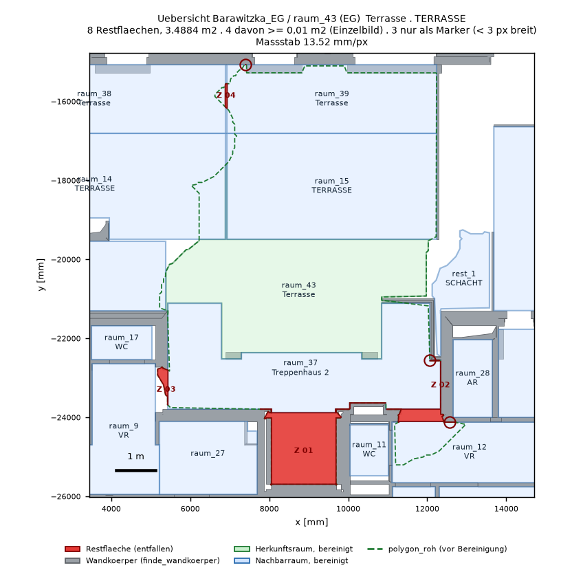

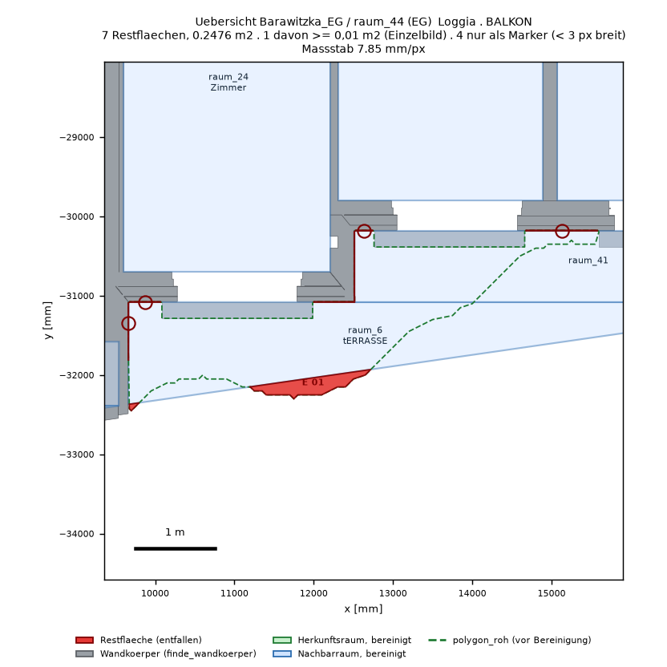

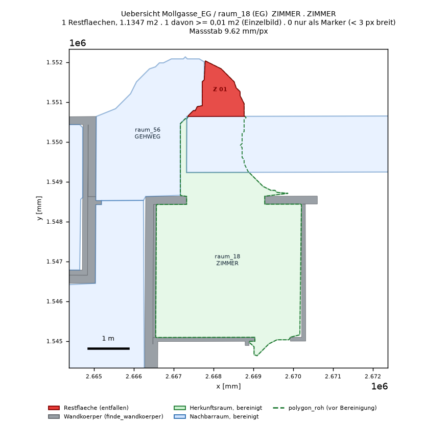

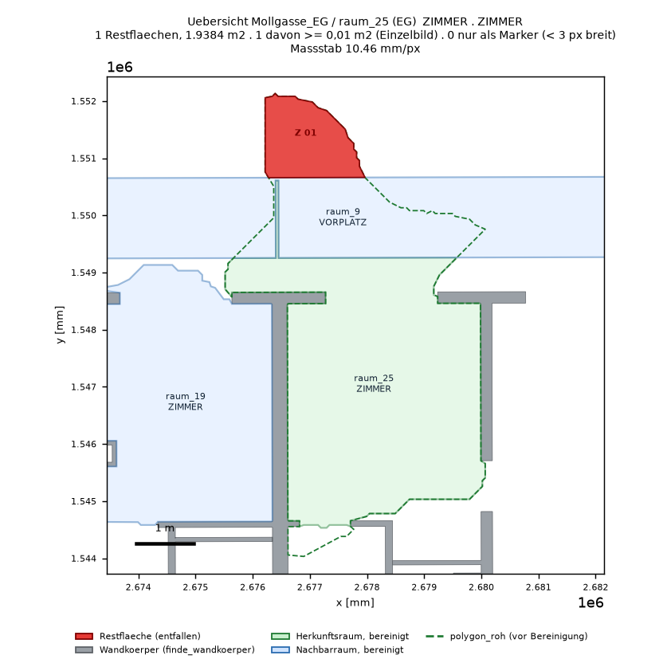

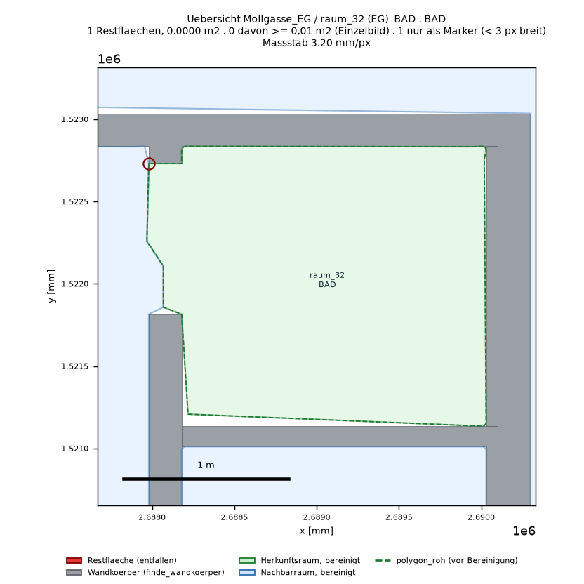


## 6. Der SCHLITZ — der Einzelfall, auf den keine der drei Klassen passt

### Mollgasse_EG__raum_51__SCHLITZ__01 · SCHLITZ 01 — Klasse OFFEN

| Pflichtfeld | Messwert |
|---|---|
| Plan · Geschoss | `Mollgasse_EG` · EG (`Projekte/_eingang/Mollgasse_EG.dxf`) |
| Raum-ID vorher | `raum_51` „PODEST“ · Typ — · Quelle F · Flag flutung_unsicher · roh 137,505 m2 → bereinigt 125,704 m2 · Liste `raeume` |
| entfernende Regel | `SCHLITZ` (Buchung Nr. 1 dieses Raums in `raum.bereinigung[]`) |
| Flaeche | **0,002115 m2** (2115,2 mm2) |
| Schwerpunkt (Plan-mm) | (2699448,0 / 1521890,0) |
| Umriss | 8 Punkte, 0 Loecher |
| groesste Breite / Laenge | 2 115 mm / 3 491 mm (kleinstes umschliessendes Rechteck) |
| Schlankheitsgrad | 1,65 (Laenge/Breite) |
| freie Breite (Inkreis) | 1 mm |
| im Wandkoerper | 0,0 % (0,0 mm2 von 2115,2 mm2) |
| in einem anderen Raum (`polygon_mm`) | 0,0 % — kein anderer Raum getroffen |
| Nachbarn (Abstand ≤ 10 mm) | nicht gemessen (nur fuer Stuecke >= 0,01 m2) |
| **Klasse** | **OFFEN — nicht als zulaessig deklarierbar** |
| Begruendung | freie Breite (Inkreis) 1 mm unter meiner (c)-Schranke 500 mm. Diese 500 mm sind MEINE Setzung — das Repo definiert keine Begehbarkeitsbreite (gegrept, § 3.3). Zu schliessen mit einer Owner-Entscheidung zur Mindestbreite. |
| Bild | kein Einzelbild (Flaeche < 0,01 m2) — Lage im Uebersichtsbild `bilder/zerfall_schlitz/uebersicht__Mollgasse_EG__raum_51.png` |

`SCHLITZ` ist kein Planbereich, sondern der Flaechenverlust der **1-mm-Loch-Kodierung** (`SCHLITZ_MM` = 1 mm in `bereinigung.py`): ein Loch im Raumpolygon wird als 1 mm breiter Schnitt zum Aussenrand kodiert. Die Flaeche liegt zu 0,0 % in der Wand (also nicht (a)), ueberschneidet keinen anderen Raum (also nicht (b)) und ist mit 1 mm freier Breite keine Nutzflaeche (also nicht (c)). Deshalb **OFFEN** — und zwar bewusst: die drei Auftragsklassen haben fuer ein Kodierartefakt keinen Platz. Vorschlag an den Owner: eigene Klasse „Kodierartefakt“, sonst bleibt dieses Stueck dauerhaft OFFEN.

**Zur Zeile „groesste Breite / Laenge“ in diesem Block**: das kleinste umschliessende Rechteck misst 2 115 × 3 491 mm — es umschliesst den um eine Ecke gefuehrten 1-mm-Streifen und sagt ueber dessen Breite nichts. Tragendes Mass ist hier die freie Breite (Inkreis) = 1 mm: die Stueckflaeche von 2115,2 mm2 sind 0,029 % der Rechteckflaeche. Der Schlankheitsgrad 1,65 ist aus demselben Grund die Schlankheit des Rechtecks, nicht die des Streifens (effektiv 3 491 mm Laenge zu 1 mm Breite).

Zum Bild: bei 1,0 mm Breite im 24 750-mm-Fenster ist das Stueck **0,03 px** breit — es erscheint als Linie, nicht als Flaeche. Ein sichtbarer Schlitz braeuchte ein ~20-mm-Fenster, dann fehlt jedes beauftragte Umfeld. Der Massstab steht hier statt eines leeren Bildes.

## 7. Zusammenfassung (ersetzt die Einzelaufstellung nicht)

| Frage des Auftrags | Antwort am Plan |
|---|---|
| 5,72 m2 pruefen | Zahl im Repo nicht reproduzierbar (§ 1); geprueft wurde die volle Menge 16,550292 m2 in 212 Restflaechen |
| (a) Wandschlitz, entfaellt zulaessig | 97 Stuecke / 0,162431 m2 = 1,0 % — belegt ueber ≥ 90 % Wandueberdeckung, groesstes Einzelstueck 0,045960 m2 |
| (b) Dopplung, entfaellt zulaessig | gegen `polygon_mm`: **0 Stuecke / 0,000000 m2**. Gegen `polygon_roh` — die sachlich richtige Bezugsgroesse: **3 Stuecke / 0,001751 m2** (§ 8.4) |
| (c) echte Nutzflaeche, darf nicht entfallen | 5 Stuecke / 9,471117 m2 = 57,2 % |
| nicht eindeutig belegbar | OFFEN: 110 Stuecke / 6,916744 m2 = 41,8 % (davon 51 Rauschsplitter < 1 mm2) |

**Kernbefund:** „rechnerisch dokumentiert heisst nicht am Plan zulaessig“ trifft zu. Von 16,550 m2 entfallener Flaeche sind 0,162 m2 als Wandschlitz belegt zulaessig, 0,000 m2 als Dopplung, **9,471 m2 (57,2 %) belegbar echte Nutzflaeche, die nicht entfallen darf**, und 6,917 m2 (41,8 %) offen. Die Auftragsfrage laesst sich mit „zulaessig“ nicht beantworten.

## 8. Was offen bleibt und welche Messung es schliesst

**8.1 Die 5,72 m2.** Herkunft unbekannt (§ 1). Fehlt: die Quelle der Zahl.

**8.2 59 OFFEN-Stuecke ≥ 1 mm2 / 6,916743 m2 haengen an einer Owner-Schranke**, nicht an einer fehlenden Messung. Spannen ueber genau diese 59 Stuecke: Wandanteil 0,0–79,8 % (zu niedrig fuer (a)), Dopplung 0 % (nie (b)), Flaeche 7,6 mm2 bis 0,938508 m2 bei Inkreis 0–575 mm (unter meiner (c)-Schranke). Gebraucht wird **eine** Aussage: ab welcher freien Breite und ab welcher Flaeche ist ein Restkoerper Nutzflaeche? Das Repo definiert das nicht (§ 3.3), und ich erfinde es nicht.

**8.3 Ein Grenzfall, der nur an meiner Schranke haengt.** `Muthgasse_E2__raum_86__ENTFALL__01`: 0,938508 m2, Inkreis 559 mm, Wand 2,1 %, Kontakt 6 211 mm zu `raum_24`. Inhaltlich sieht das wie (c) aus (Streifen plus Keil, kein Wandschlitz); formal OFFEN, weil 0,94 m2 < 1,00 m2. Eine Owner-Entscheidung kippt ihn in (c) und die (c)-Summe auf **10,410 m2**.

**8.4 Klasse (b) — korrigiert 2026-09-13. Die Urfassung war zu stark.**

Die Urfassung lautete: *„Klasse (b) ist strukturell nicht belegbar — das ist ein Befund, kein
Messfehler. Die Bereinigung zieht das Gewinner-Polygon ab, also liegt jeder Rest per Konstruktion
ausserhalb. Die Begruendung ‚entfaellt zulaessig, war schon in einem anderen Raum‘ traegt fuer
**keine** der 212 Flaechen.“* Das strukturelle Argument stimmt — aber nur fuer `polygon_mm`, und
gemessen war auch nur dagegen. Der Auftragswortlaut „war schon in einem anderen Raum“ trifft
`polygon_roh` direkter: das ist der Raum, **wie er vor der Bereinigung war**.

Gegen `polygon_roh` nachgemessen (eigener Lauf `_p2_nacharbeit.py`, `3d91a2c`), alle 212 Stuecke,
jeweils gegen jeden ANDEREN Raum aus `raeume` und `entfallen`:

| Stueck | Flaeche | in `polygon_roh` von | Anteil | gegen `polygon_mm` |
|---|--:|---|--:|--:|
| `Muthgasse_E2__raum_93__ZERFALL__04` | 1 595 mm2 | `raum_92` | **100,0 %** | 0,0 % |
| `Muthgasse_E2__raum_93__ZERFALL__08` | 156 mm2 | `raum_92` | **100,0 %** | 0,0 % |
| `Muthgasse_E2__raum_93__ZERFALL__15` | < 1 mm2 | `raum_92` | **100,0 %** | 35,8 % |

**Klasse (b) ist also belegbar, aber marginal: 3 Stuecke / 0,001751 m2 = 0,01 % der Menge**, alle
drei aus `raum_93` in `raum_92` (beide „Wohnkueche“, Muthgasse). Die Bilanz aendert das nicht — die
Richtung der Aussage schon: „traegt fuer keine der 212 Flaechen“ ist falsch, richtig ist „traegt
fuer 3 von 212, mit 0,01 % der Flaeche“.

Verteilung ueber alle 212: 3 Stuecke ≥ 90 % · 0 Stuecke zwischen 10 % und 90 % · 4 Stuecke mit
Spuren unter 10 % (1,289874 m2) · 205 Stuecke exakt 0,0 %.

**Die harte Grenze dieser Messung, und sie ist gross:** `polygon_roh` existiert nur, wo ein Raum
ueberhaupt bereinigt wurde. Das sind **37 von 248 Raeumen** (Barawitzka 2 von 49, Mollgasse 24 von
85, Muthgasse 11 von 114). Gegen die anderen 211 Raeume ist (b) im Sinne von *war vorher schon dort*
**nicht messbar** — dort gibt es nur `polygon_mm`, und dafuer gilt das strukturelle Argument der
Urfassung. Eine vollstaendige (b)-Aussage braucht die Roh-Polygone aller Raeume; die stehen in
`raeume.json` nicht.

**Abweichung zur Gegenpruefung, aufgeklaert.** Die Gegenpruefung meldet fuer 5 Stuecke einen
roh-Anteil, wo mein Lauf 0,0 % misst — den groessten mit 80,0 % fuer
`Muthgasse_E2__raum_85__ZERFALL__22` gegen `raum_17`. Ursache: `raum_17`, `raum_22`, `raum_68` und
`raum_76` haben **0 Bereinigungsbuchungen und damit kein `polygon_roh`**; dort faellt die
Gegenpruefung auf `polygon_mm` zurueck, mein Lauf ueberspringt sie. Keiner der 5 Faelle erreicht
90 %, die Klassenbilanz ist in beiden Rechnungen dieselbe. Fuer die restlichen 207 Stuecke stimmen
beide Laeufe auf 0,5 Prozentpunkte ueberein.

**8.5 Eine Grenze, die ich nicht schliessen kann.** Raeume, die erst NACH der Bereinigung entstehen (`stiegenhaus_*`, `lift_*` aus `typisiere_geometrisch` / `finde_lifte`), stehen nicht in `raeume.json`; gegen die ist (b) nicht messbar. Die Berichte nennen dafuer Rest-Ueberlappung im RaumModell: Muthgasse 13 Ueberlapper / 40,835 m2, Barawitzka 4 / 7,131 m2, Mollgasse und Rennweg 0. Dort **koennte** eine hier als (c) gefuehrte Flaeche doch gedoppelt sein. Das braucht einen Lauf gegen das Provider-Modell, nicht gegen `raeume.json`.

**8.6 Teilweise im Wandkoerper** — *fuer (c) erledigt durch die Sensitivitaetsmessung in § 3.3:
die (c)-Menge ist von 2 % bis 50 % Wand-Schranke unveraendert, eine Owner-Schranke fuer den
Wandanteil aendert dort nichts. Offen bleibt sie nur fuer die Einordnung dieser vier Einzelstuecke
zwischen (a) und OFFEN, zusammen 0,074875 m2.* — weder (a) noch klar ausserhalb: `Muthgasse_E2__raum_86__ZERFALL__05` 0,055551 m2 / 40,7 %, `Muthgasse_E2__raum_87__ZERFALL__05` 0,019314 m2 / 13,9 %, `Muthgasse_E2__raum_93__ZERFALL__10` 0,000010 m2 / 79,8 %, `Muthgasse_E2__raum_88__ZERFALL__19` 0,000000 m2 / 15,8 %. Braucht eine Owner-Schranke fuer den Wandanteil.

**8.7 Der SCHLITZ passt in keine Klasse** (§ 6). Vorschlag: eigene Klasse „Kodierartefakt“.

**8.8 58 Stuecke unter 1 mm2** (Σ 0,0000027 m2) habe ich **nicht** einzeln am Plan geprueft und nenne sie deshalb Rechenrauschen, nicht „zulaessig entfallen“. Sie sind gebucht und in der Bilanz, liegen aber unter der eigenen Rauschschwelle des Moduls; ein Planausschnitt ist bei dieser Groesse nicht darstellbar (§ 5.1).

**8.9 Querverbindung zu einer schon offenen Frage.** Die (c)-Flaeche `Muthgasse_E2__raum_88__ZERFALL__01` (1,895620 m2) beruehrt `raum_67` „Schl.“ auf 3 686 mm — das ist der offene SCHLEUSE-Fall `E2-VF-11b` aus `docs/OFFENE_FRAGEN.md`. Wem diese Flaeche zugeschlagen wird, haengt an dieser Entscheidung.

**8.10 Sieben (a)-Stuecke unter 1 mm2 — Owner-Entscheidung, ob sie als „zulaessig entfallen“ zaehlen duerfen.**
Von den 97 (a)-Stuecken liegen 7 unter der Rauschschwelle des Moduls selbst (`RAUSCH_MM2` = 1,0),
zusammen **0,945 mm2**. Ihr Wandanteil ist 95,4 bis 100,0 %, also formal klar (a) — aber jedes hat
3 oder 4 Punkte und einen Inkreis von 0,01 bis 0,35 mm. Das sind Dreiecke im Bereich der
Rechengenauigkeit, keine Wandschlitze, die man am Plan zeigen koennte (§ 5.1: bei dieser Groesse
ist kein Planausschnitt darstellbar). Konsequent waere, sie wie die 58 OFFEN-Splitter unter 1 mm2
als Rechenrauschen zu fuehren statt als belegt zulaessig; dann sind es **90 (a)-Stuecke /
0,162430 m2**. Ich entscheide das nicht, weil es dieselbe Rauschschwellen-Frage ist wie in § 8.8.

| Stueck | Flaeche | Wand | Inkreis | Punkte |
|---|--:|--:|--:|--:|
| `Muthgasse_E2__raum_86__ZERFALL__48` | 0,2318 mm2 | 100,0 % | 0,26 mm | 3 |
| `Muthgasse_E2__raum_84__ZERFALL__02` | 0,1790 mm2 | 95,4 % | 0,35 mm | 4 |
| `Mollgasse_EG__raum_41__ZERFALL__01` | 0,1707 mm2 | 100,0 % | 0,33 mm | 3 |
| `Mollgasse_EG__raum_43__ZERFALL__01` | 0,1707 mm2 | 100,0 % | 0,33 mm | 3 |
| `Mollgasse_EG__raum_32__ZERFALL__01` | 0,1707 mm2 | 100,0 % | 0,33 mm | 3 |
| `Muthgasse_E2__raum_86__ZERFALL__50` | 0,0221 mm2 | 100,0 % | 0,08 mm | 3 |
| `Muthgasse_E2__raum_92__ZERFALL__19` | 0,0005 mm2 | 100,0 % | 0,01 mm | 3 |

Zum Vergleich: das kleinste (a)-Stueck oberhalb der Schwelle hat 1,19 mm2. Die Grenze ist also
nicht willkuerlich gezogen, sie trennt eine erkennbare Gruppe ab.

**8.11 Was diese Pruefung NICHT getan hat, obwohl der Auftrag es fordert.** Fuer Klasse (c) sagt der
Auftrag woertlich: „darf nicht entfallen, muss einem Raum zugeschlagen werden“. Zugeschlagen wurde
**nichts** — das waere eine Aenderung in `bereinigung.py` und gehoert nicht in einen Pruefauftrag.
Die 5 Flaechen / 9,471117 m2 sind damit weiterhin entfallen. Fuer
`Muthgasse_E2__raum_88__ZERFALL__01` haengt der Zielraum ausserdem am offenen SCHLEUSE-Fall
`E2-VF-11b` (§ 8.9), ist also noch nicht entscheidbar.

## 9. Laeufe dieser Pruefung (Wegwerf-Skripte im Scratchpad)

| Lauf | was er misst | Laufzeit |
|---|---|--:|
| `_inventar.py` | Buchungs-Inventar ueber **alle fuenf** Plaene, Flaechenbilanz, Suche nach 5,72 m2 | 0,61 s |
| `_wandkoerper_cache2.py` | Wandkoerper aus der DXF, `finde_wandkoerper` + `wand_union` | 25,38 s |
| `_rekonstruktion.py` | Buchungskette je Raum nachgefahren → die 212 Einzelkoerper, Masse je Stueck | 2,03 s |
| `_klassifikation.py` | Wandueberdeckung, Dopplung, Kalibrierung, Klassen | 1,89 s |
| `_nachbar.py` | Nachbarraeume und Kontaktlaengen | 1,66 s |
| `_validitaet.py` | Gueltigkeit aller Polygone, Dopplung nach `buffer(0)`-Reparatur | 7,07 s |
| `_punkt.py` | Schwerpunkt im Stueck? sonst Punkt im Stueck | 0,50 s |
| `_bilder_repo.py` | die 62 PNG in `docs/bilder/zerfall_schlitz/` | 28,08 s |
| `_doku.py` | dieses Dokument | 1,82 s |
| `_p2_nacharbeit.py` | Nachtrag 2026-09-13: Dopplung gegen `polygon_roh`, Sensitivitaet der Wand-Schranke, Randabdeckungs-Gegenprobe, Abgleich mit der Gegenpruefung | 96 s |
| `_p2_doku_nachtrag.py` | die Nachtraege in dieses Dokument | < 1 s |

Gelesen wurde ausschliesslich: `Projekte/_ergebnis/<Plan>/raeume.json` (Stand `3d91a2c`), `Projekte/_eingang/<Plan>.dxf`, die Berichte und `src/`. Geschrieben wurde ausschliesslich: diese Datei und `docs/bilder/zerfall_schlitz/`.

